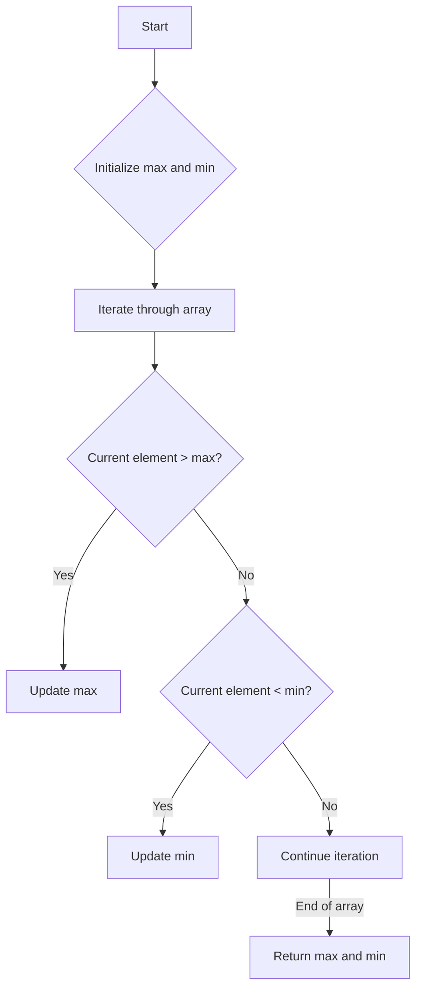

# Find Max Min in Array

## Problem Understanding
The problem is asking to find the maximum and minimum values in a given array. The key constraint is to achieve this in a single pass through the array, and the implication of this constraint is that we must keep track of the maximum and minimum values seen so far as we iterate through the array. What makes this problem non-trivial is that a naive approach might involve sorting the array first, which would require multiple passes through the array and increase the time complexity. However, the given constraint of a single pass requires a more efficient approach.

## Approach
The algorithm strategy is to iterate through the array and update the maximum and minimum values as we encounter each element. The intuition behind this approach is that we can keep track of the maximum and minimum values seen so far in constant space, and update them as needed. We use two variables, `max` and `min`, to store the maximum and minimum values, and we initialize them with the first element of the array. We then iterate through the rest of the array, updating `max` and `min` whenever we encounter a value that is greater than `max` or less than `min`. This approach works because we are guaranteed to see every element in the array exactly once, and we can update `max` and `min` accordingly.

## Complexity Analysis
| Metric | Value | Detailed Reason |
|--------|-------|----------------|
| Time   | O(n)  | The algorithm iterates through the array once, where n is the number of elements in the array. The iteration is done in a single pass, and the operations inside the loop (comparisons and assignments) take constant time. Therefore, the time complexity is linear with respect to the size of the input array. |
| Space  | O(1)  | The algorithm uses a constant amount of space to store the `max` and `min` variables, regardless of the size of the input array. This is because we only need to keep track of two values, and we do not use any data structures that grow with the size of the input. |

## Algorithm Walkthrough
```
Input: array = [10, 20, 30, 40, 50]
Step 1: max = 10, min = 10 (initialize with first element)
Step 2: i = 1, array[i] = 20, max = 20 (update max), min = 10
Step 3: i = 2, array[i] = 30, max = 30 (update max), min = 10
Step 4: i = 3, array[i] = 40, max = 40 (update max), min = 10
Step 5: i = 4, array[i] = 50, max = 50 (update max), min = 10
Output: max = 50, min = 10
```
This walkthrough shows how the algorithm iterates through the array and updates the `max` and `min` values accordingly.

## Visual Flow

This flowchart shows the decision flow of the algorithm, including the initialization of `max` and `min`, the iteration through the array, and the updates to `max` and `min` based on the current element.

## Key Insight
> **Tip:** The key insight is to initialize `max` and `min` with the first element of the array, and then update them as needed as we iterate through the rest of the array.

## Edge Cases
- **Empty array**: In this case, the algorithm returns `INT_MIN` for `max` and `INT_MAX` for `min`, which are the smallest and largest possible integer values, respectively. This is because an empty array has no maximum or minimum value, and these values are used as a convention to indicate this.
- **Single element**: In this case, the algorithm returns the single element as both `max` and `min`, which is correct because a single-element array has only one value, which is both the maximum and minimum.
- **Array with duplicates**: In this case, the algorithm ignores duplicates and returns the maximum and minimum values of the unique elements in the array. For example, if the array is `[10, 10, 20, 20, 30]`, the algorithm returns `max = 30` and `min = 10`, which are the maximum and minimum values of the unique elements in the array.

## Common Mistakes
- **Mistake 1**: Not initializing `max` and `min` with the first element of the array. To avoid this, make sure to initialize `max` and `min` with the first element of the array before iterating through the rest of the array.
- **Mistake 2**: Not updating `max` and `min` correctly. To avoid this, make sure to update `max` and `min` based on the current element, and use the correct comparison operators (`>` for `max` and `<` for `min`).

## Interview Follow-ups
> **Interview:** These are the exact follow-up questions interviewers ask:
- "What if the input is sorted?" → In this case, the algorithm still works correctly, but it can be optimized to take advantage of the fact that the input is sorted. For example, we can simply return the first element as `min` and the last element as `max`.
- "Can you do it in O(1) space?" → This is not possible, because we need to store at least two values (`max` and `min`) to solve the problem.
- "What if there are duplicates?" → As mentioned earlier, the algorithm ignores duplicates and returns the maximum and minimum values of the unique elements in the array.

## C Solution

```c
// Problem: Find Max Min in Array
// Language: C
// Difficulty: Easy
// Time Complexity: O(n) — single pass through array to find max and min
// Space Complexity: O(1) — constant space used to store max and min
// Approach: Simple iteration — iterate through array and update max and min

#include <stdio.h>
#include <limits.h>

// Function to find max and min in an array
void findMaxMin(int array[], int size, int* max, int* min) {
    // Edge case: empty array → return INT_MIN and INT_MAX
    if (size == 0) {
        *max = INT_MIN;
        *min = INT_MAX;
        return;
    }

    // Initialize max and min with the first element of the array
    *max = array[0];  // assume max is the first element
    *min = array[0];  // assume min is the first element

    // Iterate through the array to find max and min
    for (int i = 1; i < size; i++) {
        if (array[i] > *max) {  // if current element is greater than max
            *max = array[i];    // update max
        } else if (array[i] < *min) {  // if current element is less than min
            *min = array[i];    // update min
        }
    }
}

int main() {
    int array[] = {10, 20, 30, 40, 50};
    int size = sizeof(array) / sizeof(array[0]);
    int max, min;

    findMaxMin(array, size, &max, &min);

    printf("Max: %d\n", max);
    printf("Min: %d\n", min);

    return 0;
}
```
