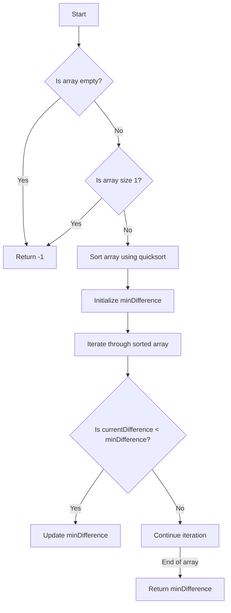

# Find Minimum Difference Between Any Two Elements

## Problem Understanding
The problem asks to find the minimum difference between any two elements in an array. The key constraint is that the array is not sorted initially, and we need to find the minimum difference efficiently. What makes this problem non-trivial is that a naive approach, such as comparing each pair of elements, would result in a time complexity of O(n^2), which is not efficient for large arrays. The given solution uses a sorting-based approach, which reduces the time complexity to O(n log n).

## Approach
The algorithm strategy is to first sort the array in ascending order using the quicksort algorithm, and then iterate through the sorted array to find the minimum difference between any two elements. The intuition behind this approach is that the minimum difference will always be between two adjacent elements in the sorted array. The quicksort algorithm is chosen because it has an average time complexity of O(n log n), which is efficient for large arrays. The approach handles the key constraint of finding the minimum difference efficiently by leveraging the properties of a sorted array.

## Complexity Analysis
| Metric | Value | Detailed Reason |
|--------|-------|----------------|
| Time   | O(n log n) | The time complexity is dominated by the quicksort algorithm, which has a time complexity of O(n log n) on average. The subsequent iteration through the sorted array takes O(n) time, but this is dominated by the O(n log n) term. |
| Space  | O(1) | The space complexity is O(1) because the quicksort algorithm is implemented in-place, meaning it does not require any additional space that scales with the input size. |

## Algorithm Walkthrough
```
Input: array = [5, 3, 1, 2, 4]
Step 1: Sort the array using quicksort
  - Partition the array around the pivot element (4)
  - Recursively sort the subarrays [5, 3, 1, 2] and [none]
  - Resulting sorted array: [1, 2, 3, 4, 5]
Step 2: Initialize the minimum difference with the difference between the first two elements
  - minDifference = 2 - 1 = 1
Step 3: Iterate through the sorted array to find the minimum difference
  - currentDifference = 3 - 2 = 1 (no update)
  - currentDifference = 4 - 3 = 1 (no update)
  - currentDifference = 5 - 4 = 1 (no update)
Output: minDifference = 1
```
## Visual Flow

## Key Insight
> **Tip:** The key insight is that the minimum difference between any two elements in an array will always be between two adjacent elements in the sorted array.

## Edge Cases
- **Empty array**: The function returns -1 because there are no elements to compare.
- **Array with one element**: The function returns -1 because there are no pairs to compare.
- **Array with duplicate elements**: The function will still work correctly because the quicksort algorithm is stable, and the minimum difference will be calculated correctly.

## Common Mistakes
- **Mistake 1**: Not handling the edge case of an empty array. → To avoid this, add a check at the beginning of the function to return -1 if the array is empty.
- **Mistake 2**: Not initializing the minimum difference correctly. → To avoid this, initialize the minimum difference with the difference between the first two elements in the sorted array.

## Interview Follow-ups
> **Interview:** These are the exact follow-up questions interviewers ask:
- "What if the input is sorted?" → The time complexity would still be O(n log n) because the quicksort algorithm has a worst-case time complexity of O(n log n). However, if we knew the input was sorted, we could simply iterate through the array to find the minimum difference in O(n) time.
- "Can you do it in O(1) space?" → No, because the quicksort algorithm requires O(log n) space for the recursive call stack. However, we could use a different sorting algorithm like heapsort, which has a space complexity of O(1).
- "What if there are duplicates?" → The function will still work correctly because the quicksort algorithm is stable, and the minimum difference will be calculated correctly.

## C Solution

```c
// Problem: Find Minimum Difference Between Any Two Elements
// Language: C
// Difficulty: Easy
// Time Complexity: O(n log n) — sorting the array takes n log n time
// Space Complexity: O(1) — sorting is done in-place
// Approach: Sorting and then finding the minimum difference — after sorting, iterate through the array and find the minimum difference

#include <stdio.h>
#include <stdlib.h>

// Function to swap two elements
void swap(int* a, int* b) {
    int temp = *a;  // Store the value of a in temp
    *a = *b;        // Assign the value of b to a
    *b = temp;      // Assign the value of temp (originally a) to b
}

// Function to partition the array for quicksort
int partition(int array[], int low, int high) {
    int pivot = array[high];  // Choose the last element as the pivot
    int i = (low - 1);         // Index of the smaller element

    // Iterate through the array from the left to the right
    for (int j = low; j < high; j++) {
        if (array[j] <= pivot) {  // If the current element is smaller than or equal to the pivot
            i++;                  // Increment the index of the smaller element
            swap(&array[i], &array[j]);  // Swap the current element with the element at index i
        }
    }

    swap(&array[i + 1], &array[high]);  // Swap the pivot element with the element at index i+1
    return (i + 1);                      // Return the index of the pivot element
}

// Function to implement quicksort
void quicksort(int array[], int low, int high) {
    if (low < high) {  // If the subarray has more than one element
        int pivotIndex = partition(array, low, high);  // Partition the subarray and get the index of the pivot
        quicksort(array, low, pivotIndex - 1);          // Recursively sort the subarray to the left of the pivot
        quicksort(array, pivotIndex + 1, high);         // Recursively sort the subarray to the right of the pivot
    }
}

// Function to find the minimum difference between any two elements
int findMinDifference(int array[], int size) {
    // Edge case: empty array → return -1
    if (size == 0) {
        return -1;
    }

    // Edge case: array with one element → return -1 (no pairs to compare)
    if (size == 1) {
        return -1;
    }

    quicksort(array, 0, size - 1);  // Sort the array in ascending order

    int minDifference = array[1] - array[0];  // Initialize the minimum difference with the difference between the first two elements

    // Iterate through the sorted array to find the minimum difference
    for (int i = 2; i < size; i++) {
        int currentDifference = array[i] - array[i - 1];  // Calculate the difference between the current element and the previous one
        if (currentDifference < minDifference) {         // If the current difference is smaller than the minimum difference
            minDifference = currentDifference;           // Update the minimum difference
        }
    }

    return minDifference;  // Return the minimum difference
}

int main() {
    int array[] = {5, 3, 1, 2, 4};
    int size = sizeof(array) / sizeof(array[0]);

    int minDifference = findMinDifference(array, size);

    if (minDifference != -1) {
        printf("Minimum difference between any two elements: %d\n", minDifference);
    } else {
        printf("No pairs to compare.\n");
    }

    return 0;
}
```
