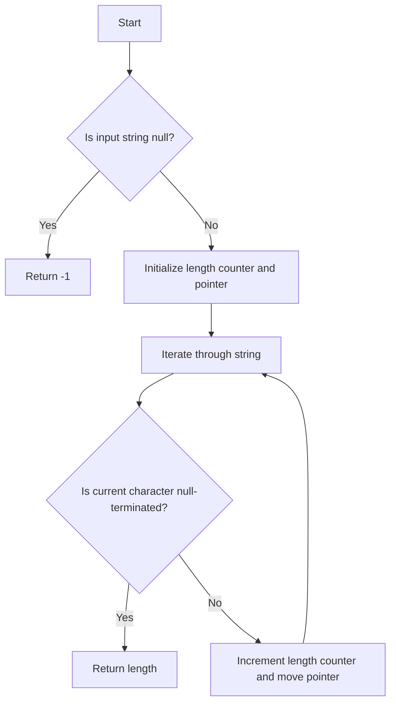

# Find String Length Using Pointers

## Problem Understanding
The problem asks to find the length of a given string using pointers in C. The key constraint is to use pointers to iterate through the string and find its length. The problem is non-trivial because it requires understanding how strings are represented in memory and how to use pointers to traverse them. A naive approach might involve using a fixed-size buffer or relying on library functions, but the problem requires a manual implementation using pointers.

## Approach
The algorithm strategy is to use a pointer to iterate through the input string, checking each character to see if it's the null-terminated character that marks the end of the string. This approach works because C strings are null-terminated, meaning they have a '\0' character at the end. The algorithm uses a simple while loop to iterate through the string, incrementing a length counter for each non-null character encountered. The algorithm handles key constraints by checking for a null pointer input and returning an error code, and by correctly handling empty strings.

## Complexity Analysis
| Metric | Value | Detailed Reason |
|--------|-------|----------------|
| Time   | O(n)  | The algorithm iterates through the string once, where n is the length of the string. Each iteration takes constant time, so the total time complexity is linear. |
| Space  | O(1)  | The algorithm uses a constant amount of space to store the length counter and the pointer, regardless of the input size. |

## Algorithm Walkthrough
```
Input: str = "Hello"
Step 1: ptr = str, length = 0
Step 2: *ptr = 'H', length = 1, ptr = str + 1
Step 3: *ptr = 'e', length = 2, ptr = str + 2
Step 4: *ptr = 'l', length = 3, ptr = str + 3
Step 5: *ptr = 'l', length = 4, ptr = str + 4
Step 6: *ptr = 'o', length = 5, ptr = str + 5
Step 7: *ptr = '\0', length = 5, exit loop
Output: length = 5
```
This example illustrates how the algorithm iterates through the string, incrementing the length counter for each non-null character.

## Visual Flow

This flowchart illustrates the algorithm's decision flow, including the handling of null input and the iteration through the string.

## Key Insight
> **Tip:** The key insight is to understand that C strings are null-terminated, and that a pointer can be used to iterate through the string and find its length by checking for the null-terminated character.

## Edge Cases
- **Empty/null input**: If the input string is null, the algorithm returns -1 to indicate an error. If the input string is empty (i.e., it contains only the null-terminated character), the algorithm returns 0.
- **Single element**: If the input string contains only a single character, the algorithm returns 1.
- **Null-terminated character in the middle of the string**: This is not a valid edge case, as C strings cannot contain null-terminated characters in the middle. However, if the input string is not a valid C string, the algorithm's behavior is undefined.

## Common Mistakes
- **Mistake 1**: Not checking for a null input pointer, which can cause a segmentation fault or other undefined behavior. To avoid this, always check for null input before attempting to iterate through the string.
- **Mistake 2**: Not incrementing the pointer correctly, which can cause the algorithm to iterate through the string incorrectly or get stuck in an infinite loop. To avoid this, make sure to increment the pointer correctly using the `++` operator.

## Interview Follow-ups
> **Interview:** These are the exact follow-up questions interviewers ask:
- "What if the input is sorted?" → This question is not relevant to the problem, as the algorithm does not rely on the input being sorted.
- "Can you do it in O(1) space?" → No, the algorithm requires at least O(1) space to store the length counter and the pointer, and it is not possible to reduce the space complexity further.
- "What if there are duplicates?" → This question is not relevant to the problem, as the algorithm does not rely on the input containing unique characters.

## C Solution

```c
// Problem: Find String Length Using Pointers
// Language: C
// Difficulty: Easy
// Time Complexity: O(n) — single pass through string
// Space Complexity: O(1) — constant space usage
// Approach: Pointer iteration — for each character, check if it's null-terminated

#include <stdio.h>

/**
 * Returns the length of the input string.
 *
 * @param str the input string
 * @return the length of the input string
 */
int findStringLength(char* str) {
    // Edge case: null pointer → return -1
    if (str == NULL) {
        return -1;
    }

    int length = 0; // initialize length counter
    char* ptr = str; // create pointer to input string

    // iterate through string until null-terminated character is found
    while (*ptr != '\0') {
        length++; // increment length counter
        ptr++; // move pointer to next character
    }

    return length; // return calculated length
}

int main() {
    char str[] = "Hello, World!";
    printf("String length: %d\n", findStringLength(str));

    // Edge case: empty string → return 0
    char emptyStr[] = "";
    printf("Empty string length: %d\n", findStringLength(emptyStr));

    // Edge case: null pointer → return -1
    char* nullPtr = NULL;
    printf("Null pointer length: %d\n", findStringLength(nullPtr));

    return 0;
}
```
