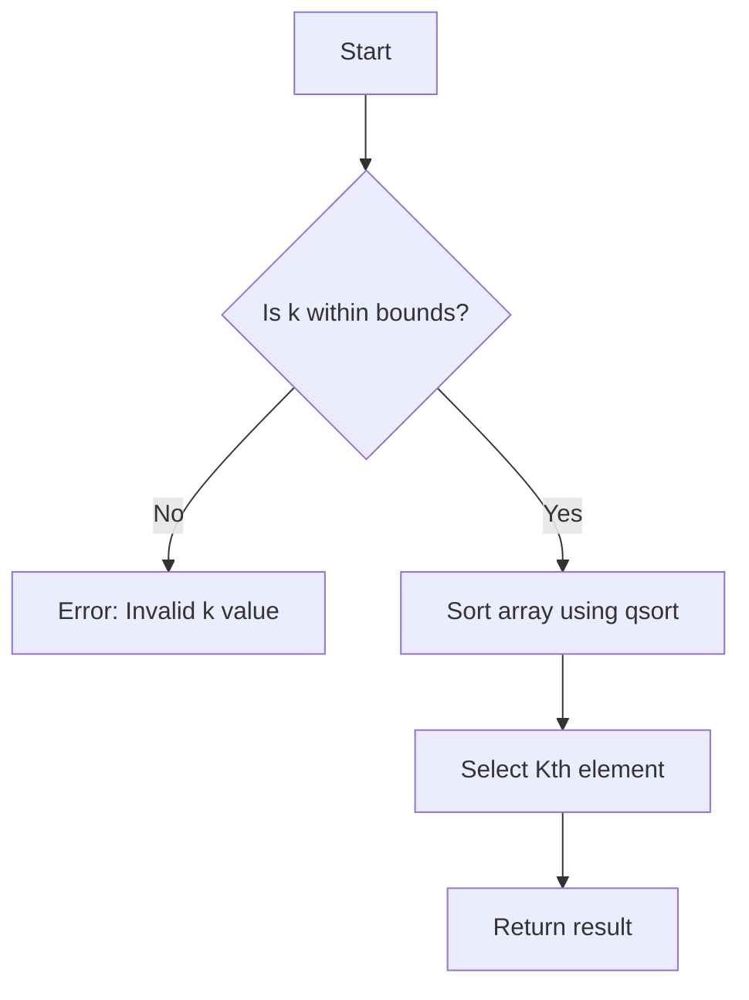

# Find the Kth Smallest Element (Sorting based)

## Problem Understanding
The problem asks to find the Kth smallest element in an array of integers. The key constraint is that the array is not sorted, and we need to find the Kth smallest element efficiently. What makes this problem non-trivial is that a naive approach, such as finding the minimum element K times, would result in a time complexity of O(n*K), which can be inefficient for large arrays. The problem requires a more efficient approach that can handle large arrays and find the Kth smallest element in a reasonable time.

## Approach
The algorithm strategy is to sort the array in ascending order using the qsort function and then select the Kth element. This approach works because sorting the array ensures that the smallest elements are at the beginning of the array, and the Kth element will be the Kth smallest element. The comparison function is used to compare two integers, allowing qsort to sort the array correctly. The qsort function is used because it is a built-in sorting function in C that uses a quicksort algorithm, which has an average time complexity of O(n log n). The approach handles the key constraint of finding the Kth smallest element by sorting the array and then selecting the Kth element.

## Complexity Analysis
| Metric | Value | Detailed Reason |
|--------|-------|----------------|
| Time   | O(n log n) | The qsort function has a time complexity of O(n log n) because it uses a quicksort algorithm, which has an average time complexity of O(n log n). The rest of the code has a time complexity of O(1) because it only involves a constant number of operations. |
| Space  | O(1) | The qsort function sorts the array in-place, meaning it does not use any additional space that scales with the input size. The rest of the code only uses a constant amount of space to store the result and other variables. |

## Algorithm Walkthrough
```
Input: nums = [5, 2, 8, 12, 3], numsSize = 5, k = 3
Step 1: Check if k is within bounds (1 <= k <= numsSize)
    - k = 3, which is within bounds
Step 2: Sort the array in ascending order
    - qsort(nums, numsSize, sizeof(int), compare)
    - nums = [2, 3, 5, 8, 12]
Step 3: Select the Kth element
    - Return nums[k - 1] = nums[2] = 5
Output: The 3th smallest element is: 5
```

## Visual Flow


## Key Insight
> **Tip:** The key insight is to use the qsort function to sort the array in ascending order, which allows us to find the Kth smallest element in O(n log n) time complexity.

## Edge Cases
- **Empty/null input**: If the input array is empty or null, the function will not work correctly because it assumes that the input array is not empty. To handle this edge case, we need to add a check at the beginning of the function to return an error if the input array is empty or null.
- **Single element**: If the input array has only one element, the function will work correctly because the qsort function will not change the array, and the function will return the only element in the array.
- **K is out of bounds**: If K is less than 1 or greater than the size of the array, the function will return an error message because K is out of bounds.

## Common Mistakes
- **Mistake 1**: Not checking if K is within bounds before sorting the array. This can lead to an error if K is out of bounds.
- **Mistake 2**: Not using the qsort function correctly. This can lead to incorrect results if the array is not sorted correctly.

## Interview Follow-ups
> **Interview:** These are the exact follow-up questions interviewers ask:
- "What if the input is sorted?" → The qsort function will still work correctly, but it will have a best-case time complexity of O(n log n) instead of O(n) because it uses a quicksort algorithm.
- "Can you do it in O(1) space?" → No, because the qsort function sorts the array in-place, but it still uses a recursive call stack, which can use up to O(log n) space in the worst case.
- "What if there are duplicates?" → The qsort function will sort the duplicates together, and the function will return the Kth smallest element correctly. If there are multiple elements with the same value, the function will return one of them.

## C Solution

```c
// Problem: Find the Kth Smallest Element
// Language: C
// Difficulty: Easy
// Time Complexity: O(n log n) — sorting the entire array using qsort
// Space Complexity: O(1) — no additional space used (in-place sorting)
// Approach: Sorting — sorting the array and then selecting the kth element

#include <stdio.h>
#include <stdlib.h>

// Comparison function for qsort
int compare(const void *a, const void *b) {
    // Compare two integers
    return (*(int*)a - *(int*)b);
}

int findKthSmallest(int* nums, int numsSize, int k) {
    // Edge case: k is out of bounds
    if (k < 1 || k > numsSize) {
        printf("Invalid k value\n");
        return -1;
    }

    // Sort the array in ascending order
    qsort(nums, numsSize, sizeof(int), compare);

    // Return the kth smallest element
    return nums[k - 1];
}

int main() {
    int nums[] = {5, 2, 8, 12, 3};
    int numsSize = sizeof(nums) / sizeof(nums[0]);
    int k = 3;

    int result = findKthSmallest(nums, numsSize, k);
    if (result != -1) {
        printf("The %dth smallest element is: %d\n", k, result);
    }

    return 0;
}
```
