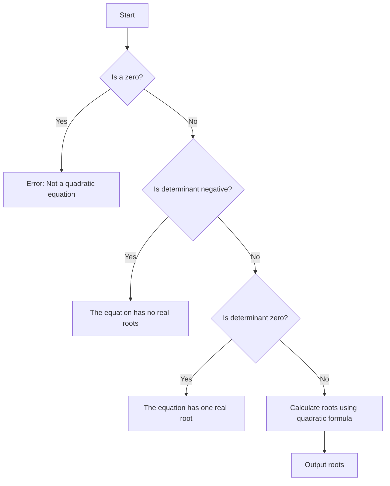

# Find the Roots of a Quadratic Equation

## Problem Understanding
The problem is asking to find the roots of a quadratic equation of the form ax^2 + bx + c = 0. The key constraints are that the coefficients a, b, and c are given, and the equation must have real roots. What makes this problem non-trivial is that the equation can have zero, one, or two real roots, and the calculation of the roots involves checking the determinant (b^2 - 4ac) to determine the number of roots. The problem also requires handling edge cases, such as when a is zero (not a quadratic equation) or when the determinant is negative (no real roots).

## Approach
The algorithm strategy is to use the quadratic formula to calculate the roots of the equation. The intuition behind this approach is that the quadratic formula provides a direct method for calculating the roots of a quadratic equation, given the coefficients a, b, and c. The mathematical reasoning is based on the fact that the quadratic formula is derived from the equation itself, and it provides a way to calculate the roots in terms of the coefficients. The approach uses a fixed amount of space to store the coefficients and the roots, and it handles the key constraints by checking the determinant and handling the edge cases. The data structures used are simple variables to store the coefficients and the roots.

## Complexity Analysis
| Metric | Value | Detailed Reason |
|--------|-------|----------------|
| Time   | O(1)  | The time complexity is O(1) because the calculation of the roots involves a fixed number of operations, regardless of the input size. The operations include calculating the determinant, checking the edge cases, and calculating the roots using the quadratic formula. |
| Space  | O(1)  | The space complexity is O(1) because the algorithm uses a fixed amount of space to store the coefficients and the roots, regardless of the input size. |

## Algorithm Walkthrough
Input: a = 1, b = -3, c = 2
Step 1: Calculate the determinant (b^2 - 4ac) = (-3)^2 - 4(1)(2) = 9 - 8 = 1
Step 2: Check if a is zero (not a quadratic equation) - a = 1, so it's a quadratic equation
Step 3: Check if the determinant is negative (no real roots) - determinant = 1, so it's positive
Step 4: Check if the determinant is zero (one real root) - determinant = 1, so it's not zero
Step 5: Calculate the roots using the quadratic formula - root1 = (-b + sqrt(determinant)) / (2 * a) = (3 + sqrt(1)) / 2 = (3 + 1) / 2 = 2, root2 = (-b - sqrt(determinant)) / (2 * a) = (3 - sqrt(1)) / 2 = (3 - 1) / 2 = 1
Output: The equation has two real roots: 2.00 and 1.00

## Visual Flow


## Key Insight
> **Tip:** The key insight is to use the quadratic formula to calculate the roots, and to handle the edge cases by checking the determinant and the value of a.

## Edge Cases
- **Empty/null input**: If the input is empty or null, the program will not be able to calculate the roots. To handle this, the program should check for invalid input and provide an error message.
- **Single element**: If the input is a single element (e.g., a = 0), the program will not be able to calculate the roots. To handle this, the program should check if a is zero and provide an error message.
- **Complex roots**: If the determinant is negative, the equation has complex roots. To handle this, the program should check if the determinant is negative and provide a message indicating that the equation has no real roots.

## Common Mistakes
- **Mistake 1**: Not checking if a is zero before calculating the roots. To avoid this, the program should always check if a is zero and provide an error message if it is.
- **Mistake 2**: Not handling the edge cases correctly. To avoid this, the program should always check the determinant and the value of a, and handle the edge cases accordingly.

## Interview Follow-ups
> **Interview:** These are the exact follow-up questions interviewers ask:
- "What if the input is sorted?" → The input is not sorted, and the program does not require the input to be sorted. The program calculates the roots based on the coefficients a, b, and c.
- "Can you do it in O(1) space?" → Yes, the program already uses O(1) space to store the coefficients and the roots.
- "What if there are duplicates?" → The program does not handle duplicates explicitly, as the quadratic formula provides a direct method for calculating the roots. However, if the input coefficients are duplicates, the program will still calculate the roots correctly.

## C Solution

```c
// Problem: Find the Roots of a Quadratic Equation
// Language: C
// Difficulty: Easy
// Time Complexity: O(1) — constant time calculation
// Space Complexity: O(1) — uses a fixed amount of space
// Approach: Quadratic formula — calculates the roots using the quadratic formula

#include <stdio.h>
#include <math.h>

// Function to calculate the roots of a quadratic equation
void calculateRoots(double a, double b, double c) {
    // Calculate the determinant (b^2 - 4ac)
    double determinant = b * b - 4 * a * c; // calculate the determinant

    // Edge case: a is zero (not a quadratic equation)
    if (a == 0) {
        printf("Error: Not a quadratic equation (a = 0)\n");
        return;
    }

    // Edge case: determinant is negative (no real roots)
    if (determinant < 0) {
        printf("The equation has no real roots.\n");
    } 
    // Edge case: determinant is zero (one real root)
    else if (determinant == 0) {
        double root = -b / (2 * a); // calculate the root
        printf("The equation has one real root: %.2f\n", root);
    } 
    // General case: determinant is positive (two real roots)
    else {
        double root1 = (-b + sqrt(determinant)) / (2 * a); // calculate the first root
        double root2 = (-b - sqrt(determinant)) / (2 * a); // calculate the second root
        printf("The equation has two real roots: %.2f and %.2f\n", root1, root2);
    }
}

int main() {
    double a, b, c;
    printf("Enter the coefficients a, b, and c: ");
    scanf("%lf %lf %lf", &a, &b, &c);
    calculateRoots(a, b, c);
    return 0;
}
```
