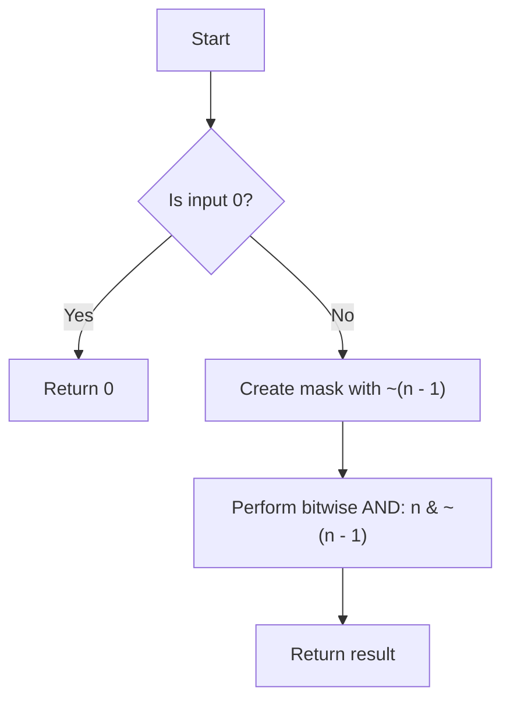

# Isolate the Rightmost Set Bit

## Problem Understanding
The problem asks to isolate the rightmost set bit in a given integer, which means to create a new integer where only the rightmost set bit of the original integer is preserved, and all other bits are cleared. The key constraint is that this operation should be performed in constant time, which implies that we cannot iterate over all bits of the integer. The problem is non-trivial because a naive approach would involve iterating over all bits of the integer, which would lead to a time complexity of O(log n), where n is the input integer. However, we can leverage bitwise operations to achieve a constant time complexity.

## Approach
The algorithm strategy is to use bitwise operations to create a mask that isolates the rightmost set bit of the input integer. The intuition behind this approach is that by flipping all bits in the input integer (i.e., getting the two's complement) and then adding 1, we can create a mask with all bits set to the right of the rightmost set bit in the input integer. We then use a bitwise AND operation to apply this mask to the input integer, effectively isolating the rightmost set bit. The key insight here is that the two's complement of a number can be obtained by flipping all its bits and adding 1, which allows us to create the desired mask. We use the `&` operator for bitwise AND and the `~` operator for bitwise NOT.

## Complexity Analysis
| Metric | Value | Detailed Reason |
|--------|-------|----------------|
| Time   | O(1)  | The algorithm only involves a constant number of bitwise operations, regardless of the size of the input integer. The operations include bitwise NOT, subtraction, and bitwise AND, all of which can be performed in constant time. |
| Space  | O(1)  | The algorithm only uses a constant amount of space to store the input integer and the mask, regardless of the size of the input integer. No additional data structures are used that scale with the input size. |

## Algorithm Walkthrough
```
Input: n = 18 (binary: 10010)
Step 1: Create a mask by flipping all bits in n and adding 1: n - 1 = 17 (binary: 10001)
Step 2: Flip all bits in n - 1: ~(n - 1) = ~17 (binary: 01110)
Step 3: Perform bitwise AND between n and ~(n - 1): n & ~(n - 1) = 18 & 01110 = 2 (binary: 10)
Output: 2 (binary: 10)
```
This walkthrough demonstrates how the algorithm isolates the rightmost set bit of the input integer 18.

## Visual Flow

This flowchart illustrates the decision flow of the algorithm, including the edge case where the input is 0.

## Key Insight
> **Tip:** The key to isolating the rightmost set bit is to use the property of two's complement to create a mask that has all bits set to the right of the rightmost set bit in the input integer.

## Edge Cases
- **Empty/null input**: Not applicable, as the input is an integer.
- **Single element**: If the input is a power of 2 (e.g., 1, 2, 4, 8, ...), the algorithm will correctly isolate the rightmost set bit.
- **Zero input**: The algorithm correctly handles the case where the input is 0 by returning 0, as there is no rightmost set bit in this case.

## Common Mistakes
- **Mistake 1**: Failing to handle the edge case where the input is 0, which would result in an incorrect result.
- **Mistake 2**: Using a naive approach that iterates over all bits of the input integer, leading to a time complexity of O(log n) instead of O(1).

## Interview Follow-ups
> **Interview:** These are the exact follow-up questions interviewers ask:
- "What if the input is sorted?" → This question is not relevant to the problem, as the input is an integer, not a sorted array or list.
- "Can you do it in O(1) space?" → Yes, the algorithm already uses O(1) space, as it only uses a constant amount of space to store the input integer and the mask.
- "What if there are duplicates?" → This question is not relevant to the problem, as the input is an integer, not a collection of values that may contain duplicates.

## C Solution

```c
// Problem: Isolate the Rightmost Set Bit
// Language: C
// Difficulty: Easy
// Time Complexity: O(1) — constant time operation
// Space Complexity: O(1) — no extra space used
// Approach: bitwise AND with two's complement — isolate the rightmost set bit

#include <stdio.h>

/**
 * Isolates the rightmost set bit in a given integer.
 * 
 * @param n The input integer.
 * @return The integer with only the rightmost set bit.
 */
int isolateRightmostSetBit(int n) {
    // Edge case: n is 0 → return 0
    if (n == 0) return 0;
    
    // Create a mask with all bits set to the right of the rightmost set bit in n
    // This is done by flipping all bits in n (i.e., getting the two's complement) and then adding 1
    int mask = n & ~(n - 1);  // ~ is bitwise NOT, -1 flips all bits
    
    // Return the mask, which now only has the rightmost set bit
    return mask;
}

int main() {
    printf("%d\n", isolateRightmostSetBit(18));  // Output: 2 (binary: 10)
    printf("%d\n", isolateRightmostSetBit(12));  // Output: 4 (binary: 100)
    printf("%d\n", isolateRightmostSetBit(0));   // Output: 0
    
    return 0;
}
```
