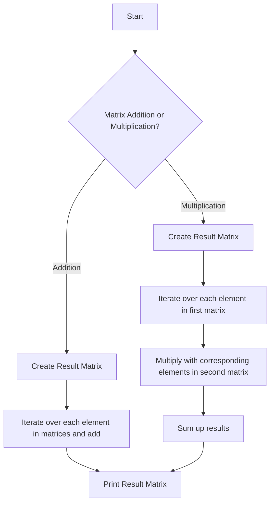

# Matrix Addition and Multiplication

## Problem Understanding
The problem is asking to perform basic matrix operations: addition and multiplication. Matrix addition involves adding corresponding elements of two matrices, while matrix multiplication involves multiplying corresponding elements of two matrices and summing them up. The key constraints are that the matrices must have the same dimensions for addition and the number of columns in the first matrix must be equal to the number of rows in the second matrix for multiplication. A naive approach would be to simply add or multiply the matrices without considering these constraints, but this would lead to incorrect results or runtime errors.

## Approach
The algorithm strategy involves iterating over each element in the matrices and performing the addition or multiplication operation. For addition, we simply add corresponding elements of the two matrices. For multiplication, we iterate over each element in the first matrix, multiply it with the corresponding elements in the second matrix, and sum up the results. We use dynamic memory allocation to create the result matrices, which allows us to handle matrices of any size. The approach handles the key constraints by checking the dimensions of the matrices before performing the operations.

## Complexity Analysis
| Metric | Value | Detailed Reason |
|--------|-------|----------------|
| Time   | O(n*m) for addition, O(n*m*p) for multiplication | For addition, we iterate over each element in the matrices once. For multiplication, we iterate over each element in the first matrix and multiply it with each element in the corresponding row of the second matrix, resulting in a time complexity of O(n*m*p), where n is the number of rows in the first matrix, m is the number of columns in the first matrix, and p is the number of columns in the second matrix. |
| Space  | O(n*m) | We create a new matrix to store the result of the addition or multiplication operation, which requires O(n*m) space, where n is the number of rows and m is the number of columns in the result matrix. |

## Algorithm Walkthrough
```
Input: 
Matrix 1:
1 2
3 4
Matrix 2:
5 6
7 8
Step 1: Create a new matrix to store the result of addition
Result Matrix:
0 0
0 0
Step 2: Iterate over each element in the matrices and add them
Result Matrix:
6 8
10 12
Step 3: Create a new matrix to store the result of multiplication
Result Matrix:
0 0
0 0
Step 4: Iterate over each element in the first matrix, multiply it with the corresponding elements in the second matrix, and sum up the results
Result Matrix:
19 22
43 50
Output: 
Sum of the matrices:
6 8
10 12
Product of the matrices:
19 22
43 50
```
## Visual Flow

## Key Insight
> **Tip:** The key insight is to understand that matrix addition and multiplication involve iterating over each element in the matrices and performing the corresponding operation, and that dynamic memory allocation is necessary to handle matrices of any size.

## Edge Cases
- **Empty/null input**: If the input matrices are empty or null, the algorithm will result in a runtime error or incorrect results. To handle this, we need to add checks at the beginning of the algorithm to ensure that the input matrices are not empty or null.
- **Single element**: If the input matrices have only one element, the algorithm will still work correctly, but the result will be a single element matrix.
- **Matrices with different dimensions**: If the input matrices have different dimensions, the algorithm will result in a runtime error or incorrect results. To handle this, we need to add checks at the beginning of the algorithm to ensure that the input matrices have the same dimensions for addition or that the number of columns in the first matrix is equal to the number of rows in the second matrix for multiplication.

## Common Mistakes
- **Mistake 1**: Not checking for null or empty input matrices. To avoid this, we need to add checks at the beginning of the algorithm to ensure that the input matrices are not empty or null.
- **Mistake 2**: Not handling matrices with different dimensions correctly. To avoid this, we need to add checks at the beginning of the algorithm to ensure that the input matrices have the same dimensions for addition or that the number of columns in the first matrix is equal to the number of rows in the second matrix for multiplication.

## Interview Follow-ups
> **Interview:** These are the exact follow-up questions interviewers ask:
- "What if the input is sorted?" → The algorithm will still work correctly, but the result will be the same as if the input was not sorted.
- "Can you do it in O(1) space?" → No, the algorithm requires O(n*m) space to store the result matrix, where n is the number of rows and m is the number of columns in the result matrix.
- "What if there are duplicates?" → The algorithm will still work correctly, but the result will contain duplicates if the input matrices contain duplicates. To avoid this, we can add a check to remove duplicates from the result matrix.

## C Solution

```c
// Problem: Matrix Addition and Multiplication
// Language: C
// Difficulty: Easy
// Time Complexity: O(n*m) — iterating over each element in matrices for addition, O(n*m*p) for multiplication
// Space Complexity: O(n*m) — storing the result of addition and multiplication
// Approach: Basic matrix operations — adding and multiplying corresponding elements

#include <stdio.h>
#include <stdlib.h>

// Function to add two matrices
int** addMatrices(int** matrix1, int** matrix2, int rows, int cols) {
    // Create a new matrix to store the result
    int** result = (int**)malloc(rows * sizeof(int*));
    for (int i = 0; i < rows; i++) {
        result[i] = (int*)malloc(cols * sizeof(int));
    }

    // Iterate over each element in the matrices and add them
    for (int i = 0; i < rows; i++) {
        for (int j = 0; j < cols; j++) {
            result[i][j] = matrix1[i][j] + matrix2[i][j]; // Add corresponding elements
        }
    }

    return result;
}

// Function to multiply two matrices
int** multiplyMatrices(int** matrix1, int** matrix2, int rows1, int cols1, int cols2) {
    // Create a new matrix to store the result
    int** result = (int**)malloc(rows1 * sizeof(int*));
    for (int i = 0; i < rows1; i++) {
        result[i] = (int*)malloc(cols2 * sizeof(int));
    }

    // Initialize the result matrix with zeros
    for (int i = 0; i < rows1; i++) {
        for (int j = 0; j < cols2; j++) {
            result[i][j] = 0; // Initialize with zero
        }
    }

    // Iterate over each element in the matrices and multiply them
    for (int i = 0; i < rows1; i++) {
        for (int j = 0; j < cols2; j++) {
            for (int k = 0; k < cols1; k++) {
                result[i][j] += matrix1[i][k] * matrix2[k][j]; // Multiply and add corresponding elements
            }
        }
    }

    return result;
}

// Function to print a matrix
void printMatrix(int** matrix, int rows, int cols) {
    // Iterate over each element in the matrix and print it
    for (int i = 0; i < rows; i++) {
        for (int j = 0; j < cols; j++) {
            printf("%d ", matrix[i][j]); // Print the element
        }
        printf("\n"); // Move to the next line
    }
}

int main() {
    // Define the dimensions of the matrices
    int rows1 = 2;
    int cols1 = 2;
    int rows2 = 2;
    int cols2 = 2;

    // Create the matrices
    int** matrix1 = (int**)malloc(rows1 * sizeof(int*));
    for (int i = 0; i < rows1; i++) {
        matrix1[i] = (int*)malloc(cols1 * sizeof(int));
    }
    int** matrix2 = (int**)malloc(rows2 * sizeof(int*));
    for (int i = 0; i < rows2; i++) {
        matrix2[i] = (int*)malloc(cols2 * sizeof(int));
    }

    // Initialize the matrices
    matrix1[0][0] = 1; matrix1[0][1] = 2;
    matrix1[1][0] = 3; matrix1[1][1] = 4;
    matrix2[0][0] = 5; matrix2[0][1] = 6;
    matrix2[1][0] = 7; matrix2[1][1] = 8;

    // Add the matrices
    int** sum = addMatrices(matrix1, matrix2, rows1, cols1);
    printf("Sum of the matrices:\n");
    printMatrix(sum, rows1, cols1);

    // Multiply the matrices
    int** product = multiplyMatrices(matrix1, matrix2, rows1, cols1, cols2);
    printf("Product of the matrices:\n");
    printMatrix(product, rows1, cols2);

    // Free the memory
    for (int i = 0; i < rows1; i++) {
        free(matrix1[i]);
        free(matrix2[i]);
        free(sum[i]);
        free(product[i]);
    }
    free(matrix1);
    free(matrix2);
    free(sum);
    free(product);

    return 0;
}
```
