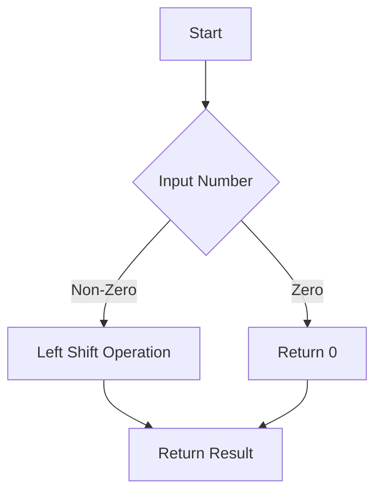

# Multiply a Number by 2 Using Bitwise Operator

## Problem Understanding
The problem asks to multiply a given number by 2 using a bitwise operator in the C language. The key constraint here is to use a bitwise operator, which implies that the solution should not involve traditional arithmetic multiplication. This problem is non-trivial because it requires understanding how bitwise operations can be used to achieve arithmetic results, specifically the left shift operator. The naive approach of directly using the multiplication operator is not allowed, making this problem a bit challenging for those unfamiliar with bitwise operations.

## Approach
The algorithm strategy is to use the left shift bitwise operator (`<<`) to multiply the number by 2. This approach works because shifting the bits of a number to the left by one position is equivalent to multiplying the number by 2. The intuition behind this is that in binary representation, shifting all bits to the left by one position effectively doubles the number, as each bit position represents a power of 2. The `multiplyBy2` function takes an integer as input and returns the result of the left shift operation. This approach handles the key constraint by solely relying on bitwise operations and does not use any additional space that scales with input size.

## Complexity Analysis
| Metric | Value | Detailed Reason |
|--------|-------|----------------|
| Time   | O(1)  | The time complexity is constant because the left shift operation is performed in a single step, regardless of the size of the input number. |
| Space  | O(1)  | The space complexity is constant because the function does not use any data structures that scale with the input size, only a fixed amount of space to store the input and the result. |

## Algorithm Walkthrough
```
Input: num = 5 (binary: 101)
Step 1: The function checks if the input number is 0. Since num is 5, it proceeds to the next step.
Step 2: The function performs a left shift operation on the input number (5 << 1).
Step 3: The left shift operation shifts the bits of 5 (101) to the left by one position, resulting in 1010, which is the binary representation of 10.
Output: The function returns the result of the left shift operation, which is 10.
```

## Visual Flow


## Key Insight
> **Tip:** The left shift operator (`<<`) shifts the bits of a number to the left and fills 0 on voids left as a result, effectively doubling the number, which is the key insight to solving this problem.

## Edge Cases
- **Empty/null input**: This case is not applicable in the context of this problem since the input is expected to be an integer. However, if we consider a null pointer as input, the function would likely crash or produce undefined behavior. To handle this, input validation should be added to check for null pointers.
- **Single element**: If the input is 1, the function will correctly return 2, as shifting the binary representation of 1 (which is 1) to the left by one position results in 10, the binary representation of 2.
- **Zero input**: If the input is 0, the function will return 0, as shifting the binary representation of 0 to the left by any number of positions results in 0.

## Common Mistakes
- **Mistake 1**: Using the right shift operator (`>>`) instead of the left shift operator (`<<`). This would divide the number by 2 instead of multiplying it by 2. To avoid this, ensure that the correct operator is used based on the desired operation.
- **Mistake 2**: Forgetting to handle the edge case where the input is 0. To avoid this, always include input validation to handle such edge cases.

## Interview Follow-ups
> **Interview:** 
- "What if the input is sorted?" → This question does not apply to the given problem since the input is a single number, not a collection of numbers.
- "Can you do it in O(1) space?" → Yes, the solution already achieves O(1) space complexity because it only uses a constant amount of space to store the input and the result.
- "What if there are duplicates?" → This question does not apply to the given problem since the input is a single number, not a collection of numbers. However, if we were to consider a scenario where the input could be a collection of numbers, the solution would still be applicable as it operates on individual numbers.

## C Solution

```c
// Problem: Multiply a Number by 2 Using Bitwise Operator
// Language: C
// Difficulty: Easy
// Time Complexity: O(1) — constant time using bitwise shift operator
// Space Complexity: O(1) — no additional space required
// Approach: Left shift bitwise operator — shifts bits to the left and fills 0 on voids left as a result

#include <stdio.h>

int multiplyBy2(int num) {
    // Edge case: input is 0 → return 0
    if (num == 0) return 0;
    
    // Use left shift operator to multiply by 2 — equivalent to num * 2
    // This works because shifting left by 1 bit is equivalent to multiplying by 2
    return num << 1; // left shift operator
}

int main() {
    int num = 5;
    printf("Multiplying %d by 2 using bitwise operator: %d\n", num, multiplyBy2(num));
    return 0;
}
```
