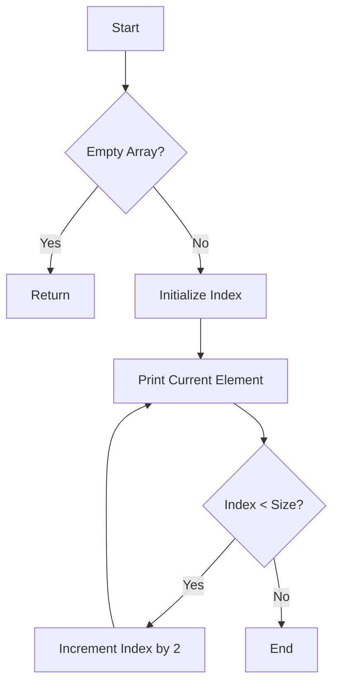

# Print Alternate Elements of an Array

## Problem Understanding
The problem asks us to print alternate elements of an array, which means we need to access and print every other element in the given array. The key constraint here is that we should only print alternate elements, starting from the first element. What makes this problem non-trivial is that we need to handle edge cases such as empty arrays or arrays with a single element, and we should do this in an efficient manner. The problem requires a simple yet efficient solution that can handle arrays of varying sizes.

## Approach
The algorithm strategy used here is an iterative index-based traversal of the array, where we print every other element by incrementing the index by 2 in each iteration. This approach works because it allows us to access the array elements in a sequential manner while skipping the elements in between. We use a simple for loop to iterate over the array, and we print the current element at each index. The key data structure used here is the array itself, which is accessed using the index variable. This approach handles the key constraint of printing alternate elements efficiently and also handles edge cases such as empty arrays.

## Complexity Analysis
| Metric | Value | Detailed Reason |
|--------|-------|----------------|
| Time   | O(n)  | The algorithm iterates over the array once, where n is the number of elements in the array. The time complexity is linear because the number of operations performed is directly proportional to the size of the input array. |
| Space  | O(1)  | The algorithm uses a constant amount of space to store the index variable and other temporary variables, regardless of the size of the input array. This is because we are not using any data structures that grow with the size of the input. |

## Algorithm Walkthrough
```
Input: array = [1, 2, 3, 4, 5, 6], size = 6
Step 1: index = 0, print array[0] = 1
Step 2: index = 2, print array[2] = 3
Step 3: index = 4, print array[4] = 5
Output: 1 3 5
```
This example demonstrates how the algorithm prints alternate elements of the input array.

## Visual Flow

This flowchart shows the decision flow of the algorithm, including the handling of empty arrays and the iteration over the array elements.

## Key Insight
> **Tip:** The key insight here is to use a simple iterative approach with a step size of 2 to print alternate elements, which allows for efficient and easy-to-understand code.

## Edge Cases
- **Empty input**: If the input array is empty, the algorithm will simply return without printing anything, which is the expected behavior.
- **Single element**: If the input array has only one element, the algorithm will print that single element, which is the expected behavior.
- **Array with even number of elements**: If the input array has an even number of elements, the algorithm will print every other element, starting from the first element, which is the expected behavior.

## Common Mistakes
- **Mistake 1**: Not handling the case where the input array is empty, which can lead to runtime errors or unexpected behavior.
- **Mistake 2**: Using a recursive approach instead of an iterative one, which can lead to stack overflow errors for large input arrays.

## Interview Follow-ups
> **Interview:** These are the exact follow-up questions interviewers ask:
- "What if the input is sorted?" → The algorithm will still work correctly, as it only cares about printing alternate elements, not about the order of the elements.
- "Can you do it in O(1) space?" → The algorithm already uses O(1) space, as it only uses a constant amount of space to store the index variable and other temporary variables.
- "What if there are duplicates?" → The algorithm will still work correctly, as it only cares about printing alternate elements, not about the values of the elements.

## C Solution

```c
// Problem: Print Alternate Elements of an Array
// Language: C
// Difficulty: Easy
// Time Complexity: O(n) — single pass through array
// Space Complexity: O(1) — constant space usage
// Approach: Iterative index-based traversal — print every other element

#include <stdio.h>

void printAlternateElements(int array[], int size) {
    // Edge case: empty input → return immediately
    if (size == 0) return;

    // Iterate over array with step size 2 to print alternate elements
    for (int index = 0; index < size; index += 2) {
        // Print current element
        printf("%d ", array[index]);
    }
    // Print newline for readability
    printf("\n");
}

int main() {
    int array[] = {1, 2, 3, 4, 5, 6};
    int size = sizeof(array) / sizeof(array[0]);
    
    // Print original array
    printf("Original array: ");
    for (int i = 0; i < size; i++) {
        printf("%d ", array[i]);
    }
    printf("\n");
    
    // Print alternate elements
    printf("Alternate elements: ");
    printAlternateElements(array, size);

    // Edge case: empty array
    printf("Empty array: ");
    int emptyArray[] = {};
    printAlternateElements(emptyArray, 0);

    return 0;
}
```
