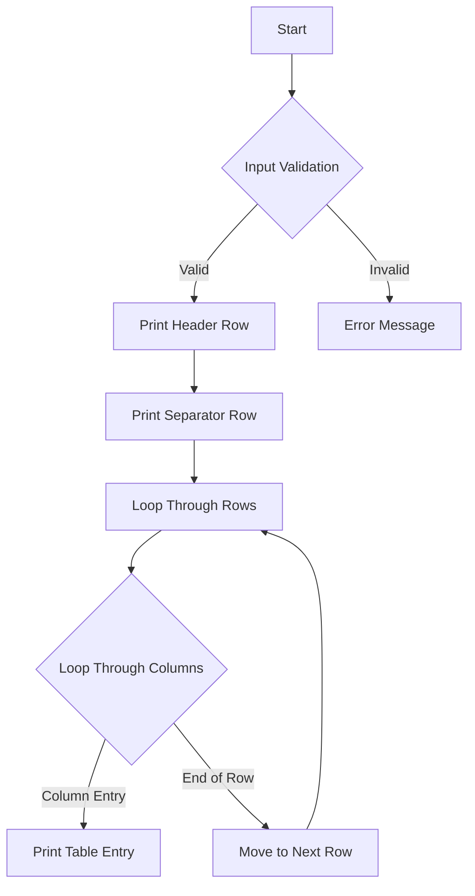

# Print Multiplication Table

## Problem Understanding
The problem is asking to print a multiplication table of a given size, where the size is specified by the user. The key constraint is that the input size must be a positive integer, and the table should be printed in a readable format with proper headers and separators. What makes this problem non-trivial is that it requires handling edge cases, such as invalid input, and printing the table in a specific format. The naive approach of simply iterating over the numbers and printing them would not produce a well-formatted table.

## Approach
The algorithm strategy is to use nested loop iteration to print the multiplication table. The outer loop iterates over the rows, and the inner loop iterates over the columns. This approach works because it allows us to print each table entry as the product of the row and column headers. The data structures used are simple loops and conditional statements, which are sufficient for this problem. The approach handles the key constraints by checking for invalid input and printing the table in a specific format. The use of loops and conditional statements makes the code efficient and easy to understand.

## Complexity Analysis
| Metric | Value | Detailed Reason |
|--------|-------|----------------|
| Time   | O(n^2) | The algorithm uses nested loops to print the table, where each loop iterates n times, resulting in a time complexity of O(n^2). The additional print statements and conditional checks do not affect the overall time complexity. |
| Space  | O(1)  | The algorithm uses a constant amount of space to store the input size and loop variables, regardless of the input size, resulting in a space complexity of O(1). |

## Algorithm Walkthrough
```
Input: n = 5
Step 1: Print header row
   |   1   2   3   4   5
Step 2: Print separator row
-----------------------
Step 3: Print table rows
  1|   1   2   3   4   5
  2|   2   4   6   8  10
  3|   3   6   9  12  15
  4|   4   8  12  16  20
  5|   5  10  15  20  25
Output: The printed multiplication table
```
This example demonstrates how the algorithm prints the multiplication table for a given input size.

## Visual Flow

This flowchart illustrates the decision flow and data transformation of the algorithm.

## Key Insight
> **Tip:** The key insight is to recognize that the multiplication table can be generated using nested loops, where each loop iterates over the rows and columns, allowing for efficient and readable printing of the table.

## Edge Cases
- **Empty/null input**: The algorithm checks for invalid input and prints an error message if the input is not a positive integer.
- **Single element**: The algorithm handles single-element input by printing a 1x1 table with the single element as the table entry.
- **Zero input**: The algorithm checks for zero input and prints an error message, as a multiplication table with zero size is not defined.

## Common Mistakes
- **Mistake 1**: Not checking for invalid input, which can lead to incorrect or undefined behavior.
- **Mistake 2**: Not using proper formatting and separators, which can make the output difficult to read.

## Interview Follow-ups
> **Interview:** These are the exact follow-up questions interviewers ask:
- "What if the input is very large?" → The algorithm has a time complexity of O(n^2), which may be inefficient for very large inputs. However, the space complexity remains O(1), making it suitable for large inputs with limited memory.
- "Can you optimize the algorithm for smaller inputs?" → For smaller inputs, the algorithm is already efficient, and further optimization may not be necessary. However, using a more efficient data structure, such as a lookup table, could potentially improve performance for very small inputs.
- "What if there are duplicates in the input?" → The algorithm does not handle duplicates explicitly, as it assumes the input is a single positive integer. If duplicates are possible, additional logic would be needed to handle them correctly.

## C Solution

```c
// Problem: Print Multiplication Table
// Language: C
// Difficulty: Easy
// Time Complexity: O(n*m) — nested loop to print table
// Space Complexity: O(1) — no additional space used
// Approach: Nested loop iteration — iterate over rows and columns to print table

#include <stdio.h>

void printMultiplicationTable(int n) {
    // Edge case: n is 0 or negative → return without printing
    if (n <= 0) {
        printf("Invalid input. Please enter a positive integer.\n");
        return;
    }

    // Print header row
    printf("   |");
    for (int i = 1; i <= n; i++) {  // Loop through columns
        printf("%4d", i);  // Print column header
    }
    printf("\n");

    // Print separator row
    printf("---");
    for (int i = 1; i <= n; i++) {  // Loop through columns
        printf("----");  // Print separator
    }
    printf("\n");

    // Print table rows
    for (int i = 1; i <= n; i++) {  // Loop through rows
        printf("%3d|", i);  // Print row header
        for (int j = 1; j <= n; j++) {  // Loop through columns
            printf("%4d", i * j);  // Print table entry
        }
        printf("\n");  // Move to next row
    }
}

int main() {
    int n;
    printf("Enter the size of the multiplication table: ");
    scanf("%d", &n);  // Read input from user
    printMultiplicationTable(n);  // Print multiplication table
    return 0;
}
```
