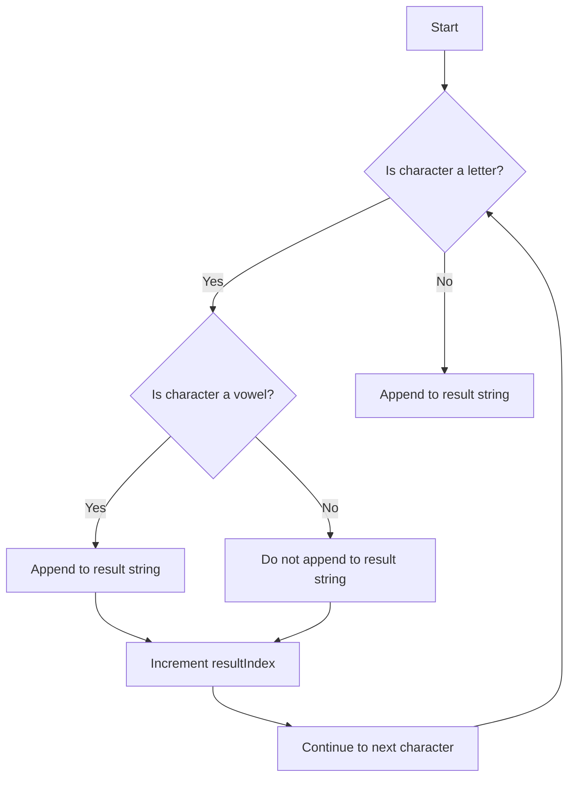

# Remove all Consonants from a String

## Problem Understanding
The problem asks to remove all consonants from a given string, preserving the original order of vowels and non-alphabetic characters. The key constraint is to handle both uppercase and lowercase letters, as well as non-alphabetic characters such as punctuation and spaces. What makes this problem non-trivial is the need to iterate through the string while maintaining the correct order of characters, and also handling edge cases such as empty input or strings with no consonants.

## Approach
The algorithm strategy is to iterate through the input string, checking each character to determine if it's a vowel or not. The intuition behind this approach is to use a simple conditional statement to filter out consonants. The `isalpha` function is used to check if a character is a letter, and the `tolower` function is used to convert characters to lowercase for simplicity. A new string is allocated to store the result, and characters are appended to this string if they are vowels or non-alphabetic characters. This approach works because it ensures that the original order of characters is preserved, and it correctly handles both uppercase and lowercase letters.

## Complexity Analysis
| Metric | Value | Detailed Reason |
|--------|-------|----------------|
| Time   | O(n)  | The algorithm makes a single pass through the input string, where n is the length of the string. The operations inside the loop (conditional checks and character appending) take constant time, so the overall time complexity is linear. |
| Space  | O(n)  | The algorithm allocates a new string to store the result, which can have a maximum length of n (if all characters are vowels or non-alphabetic). Therefore, the space complexity is also linear. |

## Algorithm Walkthrough
```
Input: "Hello, World!"
Step 1: Initialize result string as empty and resultIndex as 0
Step 2: Check first character 'H' (consonant) → do not append to result string
Step 3: Check second character 'e' (vowel) → append to result string, resultIndex = 1
Step 4: Check third character 'l' (consonant) → do not append to result string
Step 5: Check fourth character 'l' (consonant) → do not append to result string
Step 6: Check fifth character 'o' (vowel) → append to result string, resultIndex = 2
Step 7: Check sixth character ',' (non-alphabetic) → append to result string, resultIndex = 3
Step 8: Check seventh character ' ' (non-alphabetic) → append to result string, resultIndex = 4
Step 9: Check eighth character 'W' (consonant) → do not append to result string
Step 10: Check ninth character 'o' (vowel) → append to result string, resultIndex = 5
Step 11: Check tenth character 'r' (consonant) → do not append to result string
Step 12: Check eleventh character 'l' (consonant) → do not append to result string
Step 13: Check twelfth character 'd' (consonant) → do not append to result string
Step 14: Check thirteenth character '!' (non-alphabetic) → append to result string, resultIndex = 6
Output: "eo, o!"
```

## Visual Flow


## Key Insight
> **Tip:** The key insight here is to use a simple conditional statement to filter out consonants, and to preserve the original order of characters by appending vowels and non-alphabetic characters to a new string.

## Edge Cases
- **Empty/null input**: If the input string is empty, the function will return an empty string. This is because the function checks the length of the input string before iterating through it, and if the length is 0, it immediately returns the result string.
- **Single element**: If the input string has only one character, the function will return a string containing that character if it's a vowel or non-alphabetic, or an empty string if it's a consonant.
- **String with no consonants**: If the input string has no consonants (i.e., it consists only of vowels and non-alphabetic characters), the function will return the original string.

## Common Mistakes
- **Mistake 1**: Not checking if the input string is null before iterating through it, which can cause a segmentation fault. To avoid this, always check for null input before processing the string.
- **Mistake 2**: Not preserving the original case of the input string. To avoid this, do not convert the input string to lowercase before processing it, and instead compare the characters in a case-insensitive manner.

## Interview Follow-ups
> **Interview:** These are the exact follow-up questions interviewers ask:
- "What if the input is sorted?" → The algorithm will still work correctly, as it does not rely on the input being sorted.
- "Can you do it in O(1) space?" → No, it's not possible to do it in O(1) space, because we need to allocate a new string to store the result.
- "What if there are duplicates?" → The algorithm will handle duplicates correctly, as it checks each character individually and appends it to the result string if it's a vowel or non-alphabetic character.

## C Solution

```c
// Problem: Remove all Consonants from a String
// Language: C
// Difficulty: Easy
// Time Complexity: O(n) — single pass through string
// Space Complexity: O(n) — new string to store result
// Approach: Simple iteration with conditional append — check each character and append to result if it's a vowel

#include <stdio.h>
#include <string.h>
#include <ctype.h>

// Function to remove all consonants from a string
char* removeConsonants(char* str) {
    int length = strlen(str); // Calculate the length of the input string
    char* result = (char*) malloc((length + 1) * sizeof(char)); // Allocate memory for the result string
    result[0] = '\0'; // Initialize the result string as empty

    // Edge case: empty input → return empty string
    if (length == 0) {
        return result;
    }

    int resultIndex = 0; // Index for the result string
    for (int i = 0; i < length; i++) {
        // Check if the character is a letter
        if (isalpha(str[i])) {
            char lowerCaseChar = tolower(str[i]); // Convert to lower case for simplicity
            // Check if the character is a vowel
            if (lowerCaseChar == 'a' || lowerCaseChar == 'e' || lowerCaseChar == 'i' || lowerCaseChar == 'o' || lowerCaseChar == 'u') {
                result[resultIndex] = str[i]; // Append the vowel to the result string
                resultIndex++;
            }
        } else {
            // If the character is not a letter, append it to the result string
            result[resultIndex] = str[i];
            resultIndex++;
        }
    }
    result[resultIndex] = '\0'; // Terminate the result string
    return result;
}

int main() {
    char str[] = "Hello, World!";
    printf("Original string: %s\n", str);
    char* result = removeConsonants(str);
    printf("String after removing consonants: %s\n", result);
    free(result); // Deallocate memory
    return 0;
}
```
