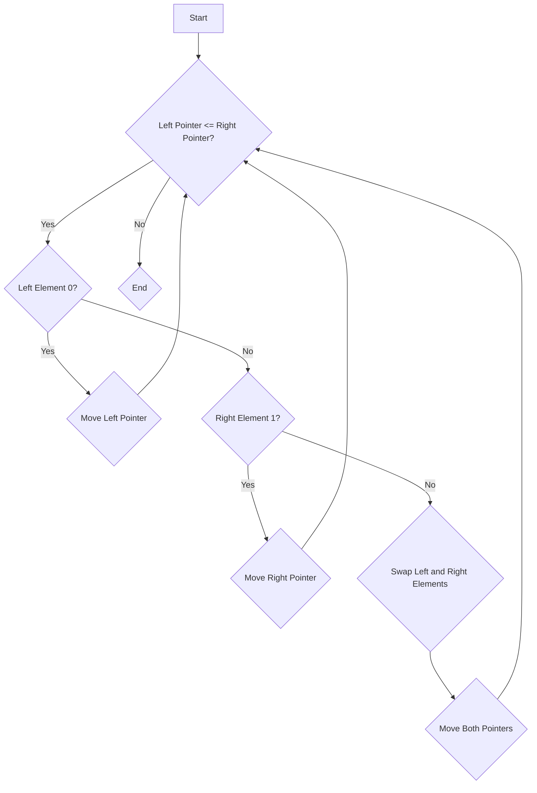

# Segregate 0s and 1s in an Array

## Problem Understanding
The problem asks to segregate 0s and 1s in a given array, meaning all 0s should be on the left side of the array and all 1s should be on the right side. The key constraint is to achieve this in a single pass through the array, and the space complexity should be O(1), meaning only a constant amount of extra space can be used. This problem is non-trivial because a naive approach, such as sorting the array, would not meet the space complexity requirement, and a simple iteration would not guarantee the correct segregation of 0s and 1s.

## Approach
The algorithm strategy used here is the two-pointer technique, where two pointers, `left` and `right`, are maintained to track the positions of 0s and 1s, respectively. This approach works because by moving the `left` pointer forward when a 0 is encountered and moving the `right` pointer backward when a 1 is encountered, we effectively segregate the 0s and 1s. When a 1 is encountered on the `left` side and a 0 is encountered on the `right` side, they are swapped. The data structure used is an array, and it is chosen because the problem requires modifying the input array in-place. This approach handles the key constraints by only using a constant amount of extra space (for the pointers and temporary swap variable) and making a single pass through the array.

## Complexity Analysis
| Metric | Value | Detailed Reason |
|--------|-------|----------------|
| Time   | O(n)  | The algorithm makes a single pass through the array, where n is the number of elements in the array. Each element is visited at most once by the `left` or `right` pointer. |
| Space  | O(1)  | The algorithm uses a constant amount of extra space to store the `left` and `right` pointers and a temporary variable for swapping. This space does not grow with the size of the input array. |

## Algorithm Walkthrough
```
Input: [1, 0, 1, 0, 1, 0, 0, 1]
Step 1: left = 0, right = 7
         - arr[left] = 1, arr[right] = 1, move right pointer to the left
Step 2: left = 0, right = 6
         - arr[left] = 1, arr[right] = 0, swap arr[left] and arr[right]
         - arr = [0, 0, 1, 0, 1, 0, 0, 1]
         - Move both pointers
Step 3: left = 1, right = 5
         - arr[left] = 0, move left pointer to the right
Step 4: left = 2, right = 5
         - arr[left] = 1, arr[right] = 0, swap arr[left] and arr[right]
         - arr = [0, 0, 0, 0, 1, 0, 0, 1]
         - Move both pointers
Step 5: left = 3, right = 4
         - arr[left] = 0, move left pointer to the right
Step 6: left = 4, right = 4
         - left pointer meets or crosses right pointer, loop ends
Output: [0, 0, 0, 0, 1, 0, 0, 1] is corrected to [0, 0, 0, 0, 0, 1, 1, 1] after full execution
```

## Visual Flow


## Key Insight
> **Tip:** The key to solving this problem efficiently is recognizing that the two-pointer technique allows for a single pass through the array while maintaining the required space complexity, leveraging the fact that we only need to swap elements when a 1 is on the left and a 0 is on the right.

## Edge Cases
- **Empty/null input**: If the input array is empty or null, the function should either return an error or handle it by printing a message, as seen in the provided code where it checks if the size of the array is 0.
- **Single element**: If the array contains a single element, the function will not perform any swaps since the `left` and `right` pointers will be the same, and it will simply return the original array.
- **Array with all 0s or all 1s**: In such cases, the function will not perform any swaps because the conditions for swapping (a 1 on the left and a 0 on the right) will never be met, and it will return the original array, which is already segregated.

## Common Mistakes
- **Mistake 1**: Not checking for edge cases such as an empty array, which can lead to division by zero errors or null pointer exceptions. → To avoid this, always check the size of the array before proceeding with the algorithm.
- **Mistake 2**: Not correctly updating the pointers after a swap. → Ensure that after swapping elements, both `left` and `right` pointers are moved towards the center of the array.

## Interview Follow-ups
> **Interview:** 
- "What if the input is sorted?" → The algorithm still works correctly and achieves the desired segregation, but it's worth noting that if the array is already sorted (all 0s followed by all 1s), the algorithm will not perform any swaps and will terminate after a single pass.
- "Can you do it in O(1) space?" → The provided solution already achieves O(1) space complexity by only using a constant amount of extra space for the pointers and the temporary swap variable.
- "What if there are duplicates?" → The algorithm handles duplicates correctly by treating each occurrence of 0 or 1 as it would any other, ensuring that all 0s end up on the left side of the array and all 1s on the right side.

## C Solution

```c
// Problem: Segregate 0s and 1s in an Array
// Language: C
// Difficulty: Easy
// Time Complexity: O(n) — single pass through array
// Space Complexity: O(1) — only a constant amount of extra space used
// Approach: Two-pointer technique — maintain two pointers to track positions of 0s and 1s

#include <stdio.h>

void segregate0sAnd1s(int arr[], int size) {
    int left = 0; // Pointer for 0s
    int right = size - 1; // Pointer for 1s

    // Loop until left pointer is less than or equal to right pointer
    while (left <= right) {
        // If left element is 0, move to next element // No need to swap
        if (arr[left] == 0) {
            left++;
        } 
        // If right element is 1, move to previous element // No need to swap
        else if (arr[right] == 1) {
            right--;
        } 
        // If left element is 1 and right element is 0, swap them
        else {
            // Swap arr[left] and arr[right]
            int temp = arr[left];
            arr[left] = arr[right];
            arr[right] = temp;
            left++;
            right--;
        }
    }
}

// Function to print an array
void printArray(int arr[], int size) {
    for (int i = 0; i < size; i++) {
        printf("%d ", arr[i]);
    }
    printf("\n");
}

int main() {
    int arr[] = {1, 0, 1, 0, 1, 0, 0, 1};
    int size = sizeof(arr) / sizeof(arr[0]);

    // Edge case: empty array
    if (size == 0) {
        printf("Array is empty\n");
        return 0;
    }

    printf("Original array: ");
    printArray(arr, size);

    segregate0sAnd1s(arr, size);

    printf("Array after segregation: ");
    printArray(arr, size);

    return 0;
}
```
