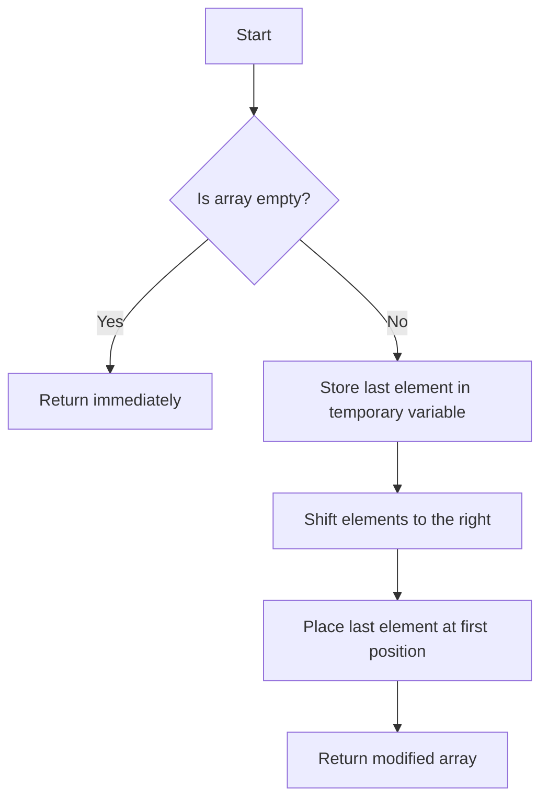

# Shift Array Elements to Right by One

## Problem Understanding
The problem requires shifting all elements in an array to the right by one position, effectively rotating the array. The key constraint is that this operation should be performed in-place, without using any extra space that scales with the input size. The problem becomes non-trivial because a naive approach might involve creating a new array and copying elements, which would require additional space. However, the requirement for an in-place modification adds complexity, as we need to ensure that the original array is modified correctly without losing any data during the shift operation.

## Approach
The algorithm strategy involves using a temporary variable to hold the last element of the array and then shifting all other elements to the right by one position. This approach works because by temporarily storing the last element, we can safely move all other elements to the right without overwriting the last element, which would be lost otherwise. The temporary variable serves as a buffer, allowing us to perform the shift operation in-place. The algorithm handles the key constraint of no extra space by only using a constant amount of space (for the temporary variable), regardless of the array size.

## Complexity Analysis
| Metric | Value | Detailed Reason |
|--------|-------|----------------|
| Time   | O(n)  | The algorithm iterates through the array once to shift all elements to the right. The number of operations (assignments) directly depends on the size of the input array, hence the linear time complexity. |
| Space  | O(1)  | The space complexity is constant because we only use a fixed amount of space to store the temporary variable, regardless of the input size. This means the space usage does not grow with the size of the input array. |

## Algorithm Walkthrough
```
Input: array = [1, 2, 3, 4, 5]
Step 1: Store the last element in a temporary variable: lastElement = 5
Step 2: Shift elements to the right starting from the second last element: 
  - array[4] = array[3] = 4
  - array[3] = array[2] = 3
  - array[2] = array[1] = 2
  - array[1] = array[0] = 1
Step 3: Place the last element (held in the temporary variable) at the first position: array[0] = lastElement = 5
Output: array = [5, 1, 2, 3, 4]
```
This walkthrough demonstrates how the algorithm shifts the elements of the array to the right by one position, effectively rotating the array.

## Visual Flow

This flowchart illustrates the decision flow of the algorithm, including the handling of the edge case where the input array is empty.

## Key Insight
> **Tip:** The key to this algorithm is using a temporary variable to hold the last element, allowing for an in-place shift of all other elements to the right without data loss.

## Edge Cases
- **Empty array**: If the input array is empty, the algorithm returns immediately without attempting to access or modify any elements, thus avoiding potential errors.
- **Single element**: For an array with a single element, the algorithm does not need to perform any shifts since shifting a single element does not change the array's content.
- **Array with duplicate elements**: The algorithm works correctly even if the array contains duplicate elements, as the shift operation is based solely on the position of the elements, not their values.

## Common Mistakes
- **Mistake 1: Not checking for an empty array**: Failing to handle the edge case of an empty array can lead to runtime errors when trying to access the last element of an empty array.
- **Mistake 2: Not using a temporary variable**: Attempting to shift elements without temporarily storing the last element can result in data loss, as the last element would be overwritten during the shift operation.

## Interview Follow-ups
> **Interview:** 
- "What if the input is sorted?" → The algorithm's performance and correctness are unaffected by the input being sorted, as the shift operation is based on element positions, not values.
- "Can you do it in O(1) space?" → The algorithm already achieves O(1) space complexity by using a constant amount of space for the temporary variable, regardless of the input size.
- "What if there are duplicates?" → The presence of duplicates does not affect the algorithm's correctness, as the shift operation is based on element positions, not their values.

## C Solution

```c
// Problem: Shift Array Elements to Right by One
// Language: C
// Difficulty: Easy
// Time Complexity: O(n) — single pass through array to shift elements
// Space Complexity: O(1) — no extra space required, in-place modification
// Approach: Temporary variable swap — use a temporary variable to hold the last element and shift others

#include <stdio.h>

void shiftArrayElementsToRightByOne(int* array, int arraySize) {
    // Edge case: empty array → return immediately
    if (arraySize == 0) return;

    // Store the last element in a temporary variable
    int lastElement = array[arraySize - 1]; // Hold the last element temporarily

    // Shift all elements to the right by one position
    for (int i = arraySize - 1; i > 0; i--) {
        // Shift each element to the right by one position
        array[i] = array[i - 1]; // Move the current element to the next position
    }

    // Place the last element (held in the temporary variable) at the first position
    array[0] = lastElement; // Place the last element at the beginning
}

// Example usage:
int main() {
    int array[] = {1, 2, 3, 4, 5};
    int arraySize = sizeof(array) / sizeof(array[0]);

    printf("Original array: ");
    for (int i = 0; i < arraySize; i++) {
        printf("%d ", array[i]);
    }
    printf("\n");

    shiftArrayElementsToRightByOne(array, arraySize);

    printf("Array after shifting elements to the right by one: ");
    for (int i = 0; i < arraySize; i++) {
        printf("%d ", array[i]);
    }
    printf("\n");

    return 0;
}
```
