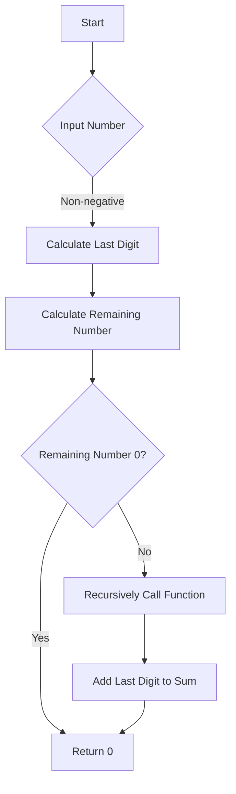

# Sum of Digits Recursively

## Problem Understanding
The problem is asking to calculate the sum of digits of a given non-negative integer using a recursive approach. The key constraint is that the solution must be implemented recursively, and it should handle non-negative integers of any size. What makes this problem non-trivial is that a naive approach might try to convert the number to a string and then iterate over each character, but this problem requires a mathematical approach to extract each digit. The recursive nature of the solution also means that the function will call itself repeatedly until it reaches a base case, which can be challenging to implement correctly.

## Approach
The algorithm strategy is to use a recursive function to calculate the sum of digits by breaking down the input number into individual digits and summing them up. The intuition behind this approach is that the sum of the digits of a number can be calculated by adding the last digit to the sum of the remaining digits. This approach works because it uses the mathematical properties of modulo and integer division to extract each digit from the number. The function uses a recursive call to calculate the sum of the remaining digits, and it handles the key constraint of non-negative integers by using a base case to stop the recursion when the input number is 0.

## Complexity Analysis
| Metric | Value | Detailed Reason |
|--------|-------|----------------|
| Time   | O(n)  | The time complexity is O(n), where n is the number of digits in the input number, because the function makes one recursive call for each digit in the number. The number of operations performed in each recursive call is constant, so the total time complexity is proportional to the number of digits. |
| Space  | O(n)  | The space complexity is O(n) due to the recursive call stack, which can grow up to a maximum depth of n in the worst case, where n is the number of digits in the input number. Each recursive call adds a new frame to the call stack, and the maximum depth of the call stack is proportional to the number of digits. |

## Algorithm Walkthrough
```
Input: 1234
Step 1: number = 1234, lastDigit = 1234 % 10 = 4, remainingNumber = 1234 / 10 = 123
Step 2: number = 123, lastDigit = 123 % 10 = 3, remainingNumber = 123 / 10 = 12
Step 3: number = 12, lastDigit = 12 % 10 = 2, remainingNumber = 12 / 10 = 1
Step 4: number = 1, lastDigit = 1 % 10 = 1, remainingNumber = 1 / 10 = 0
Step 5: number = 0, return 0 (base case)
Output: 4 + 3 + 2 + 1 = 10
```
This walkthrough shows how the function calculates the sum of digits of the input number 1234.

## Visual Flow

This visual flow shows the decision flow of the function, including the calculation of the last digit and the remaining number, and the recursive call to calculate the sum of the remaining digits.

## Key Insight
> **Tip:** The key insight is to use the modulo operator to extract the last digit of the number and integer division to remove the last digit, allowing the function to recursively calculate the sum of the remaining digits.

## Edge Cases
- **Empty/null input**: The function does not handle empty or null input, as it expects a non-negative integer. If the input is empty or null, the function will not work correctly.
- **Single element**: If the input is a single digit, the function will return the digit itself, as there are no remaining digits to calculate.
- **Negative input**: The function does not handle negative input, as it expects a non-negative integer. If the input is negative, the function will not work correctly.

## Common Mistakes
- **Mistake 1**: Not handling the base case correctly, leading to a stack overflow error. To avoid this, make sure to return 0 when the input number is 0.
- **Mistake 2**: Not calculating the last digit and remaining number correctly, leading to incorrect results. To avoid this, use the modulo operator to extract the last digit and integer division to remove the last digit.

## Interview Follow-ups
> **Interview:** These are the exact follow-up questions interviewers ask:
- "What if the input is sorted?" → The function does not rely on the input being sorted, so it will work correctly regardless of the input order.
- "Can you do it in O(1) space?" → No, the function uses recursive calls, which require O(n) space on the call stack. However, an iterative solution could be implemented using O(1) space.
- "What if there are duplicates?" → The function does not rely on the input having unique digits, so it will work correctly even if there are duplicates.

## C Solution

```c
// Problem: Sum of Digits Recursively
// Language: C
// Difficulty: Easy
// Time Complexity: O(n) — where n is the number of digits in the input number
// Space Complexity: O(n) — due to recursive call stack
// Approach: Recursive sum calculation — breaking down number into individual digits and summing them

#include <stdio.h>

/**
 * Function to calculate the sum of digits of a number recursively.
 * 
 * @param number The input number.
 * @return The sum of digits of the input number.
 */
int sumOfDigits(int number) {
    // Base case: if the number is 0, return 0
    if (number == 0) {
        return 0;
    }
    // Recursive case: add the last digit to the sum of the remaining digits
    else {
        // Get the last digit
        int lastDigit = number % 10;  // Using modulo operator to get the remainder
        // Remove the last digit from the number
        int remainingNumber = number / 10;  // Using integer division to remove the last digit
        // Recursively call the function with the remaining number
        return lastDigit + sumOfDigits(remainingNumber);  // Recursive call
    }
}

int main() {
    int number;
    printf("Enter a number: ");
    scanf("%d", &number);
    
    // Edge case: negative input
    if (number < 0) {
        printf("Error: Input should be a non-negative integer.\n");
        return 1;
    }
    
    int sum = sumOfDigits(number);
    printf("Sum of digits: %d\n", sum);
    return 0;
}
```
