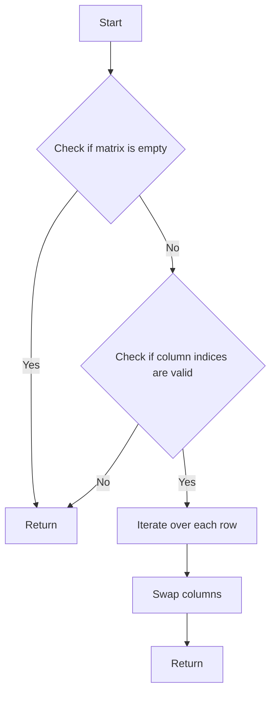

# Swap Two Columns of a Matrix

## Problem Understanding
The problem asks to swap two columns of a given matrix. The key constraint is that the swap operation should be done in-place, meaning that no additional space should be used other than a temporary variable for swapping. This problem is non-trivial because a naive approach might involve creating a new matrix and copying the elements, which would require extra space. The problem requires a solution that can efficiently swap the columns without using extra space, making it a challenging problem.

## Approach
The algorithm strategy used here is a temporary variable swap, where a temporary variable is used to hold the value of one column while the other column is swapped with it. This approach works because it only uses a constant amount of extra space (the temporary variable) and does not require any additional data structures. The algorithm iterates over each row in the matrix and swaps the elements at the specified column indices. The key insight behind this approach is that it only needs to iterate over each element in the matrix once, making it efficient.

## Complexity Analysis
| Metric | Value | Detailed Reason |
|--------|-------|----------------|
| Time   | O(m*n) | The algorithm iterates over each element in the matrix once, where m is the number of rows and n is the number of columns. The swap operation inside the loop takes constant time, so the overall time complexity is O(m*n). |
| Space  | O(1)  | The algorithm only uses a temporary variable for swapping, which takes constant space. It does not use any additional data structures that scale with the input size, so the space complexity is O(1). |

## Algorithm Walkthrough
```
Input: 
matrix = [[1, 2, 3], [4, 5, 6], [7, 8, 9]]
matrixSize = 3
matrixColSize = 3
column1 = 0
column2 = 2
Step 1: i = 0, matrix[i][column1] = 1, matrix[i][column2] = 3
Step 2: Swap matrix[i][column1] and matrix[i][column2], matrix = [[3, 2, 1], [4, 5, 6], [7, 8, 9]]
Step 3: i = 1, matrix[i][column1] = 4, matrix[i][column2] = 6
Step 4: Swap matrix[i][column1] and matrix[i][column2], matrix = [[3, 2, 1], [6, 5, 4], [7, 8, 9]]
Step 5: i = 2, matrix[i][column1] = 7, matrix[i][column2] = 9
Step 6: Swap matrix[i][column1] and matrix[i][column2], matrix = [[3, 2, 1], [6, 5, 4], [9, 8, 7]]
Output: 
matrix = [[3, 2, 1], [6, 5, 4], [9, 8, 7]]
```
## Visual Flow

## Key Insight
> **Tip:** The key insight is to use a temporary variable to swap the columns, which allows for an efficient and space-efficient solution.

## Edge Cases
- **Empty/null input**: If the input matrix is empty or null, the function will return immediately without attempting to swap the columns.
- **Single element**: If the matrix has only one element, the function will still work correctly and swap the columns (although it's a trivial case).
- **Duplicate columns**: If the column indices are the same, the function will not swap anything, as it's essentially a no-op.

## Common Mistakes
- **Mistake 1**: Not checking for invalid column indices, which can lead to out-of-bounds access and crashes.
- **Mistake 2**: Not using a temporary variable for swapping, which can lead to incorrect results.

## Interview Follow-ups
> **Interview:** 
- "What if the input is sorted?" → The algorithm will still work correctly, as it only depends on the column indices and not the actual values.
- "Can you do it in O(1) space?" → No, the algorithm already uses O(1) space, as it only uses a temporary variable for swapping.
- "What if there are duplicates?" → The algorithm will still work correctly, as it only swaps the columns based on the indices, regardless of the actual values.

## C Solution

```c
// Problem: Swap Two Columns of a Matrix
// Language: C
// Difficulty: Easy
// Time Complexity: O(m*n) — iterating over each element in the matrix
// Space Complexity: O(1) — only using a temporary variable for swapping
// Approach: Temporary variable swap — using a temporary variable to swap the columns

#include <stdio.h>

// Function to swap two columns of a matrix
void swapColumns(int** matrix, int matrixSize, int* matrixColSize, int column1, int column2) {
    // Check if the matrix is empty
    if (matrixSize == 0 || matrixColSize == NULL) {
        // Edge case: empty matrix → return
        return;
    }
    
    // Check if the column indices are valid
    if (column1 < 0 || column1 >= *matrixColSize || column2 < 0 || column2 >= *matrixColSize) {
        // Edge case: invalid column indices → return
        return;
    }
    
    // Iterate over each row in the matrix
    for (int i = 0; i < matrixSize; i++) {
        // Use a temporary variable to swap the columns
        int temp = matrix[i][column1];
        matrix[i][column1] = matrix[i][column2]; // Swap column1 with column2
        matrix[i][column2] = temp; // Swap column2 with the temporary variable
    }
}

// Example usage
int main() {
    int matrixSize = 3;
    int matrixColSize = 3;
    int** matrix = (int**)malloc(matrixSize * sizeof(int*));
    for (int i = 0; i < matrixSize; i++) {
        matrix[i] = (int*)malloc(matrixColSize * sizeof(int));
    }
    
    // Initialize the matrix
    matrix[0][0] = 1; matrix[0][1] = 2; matrix[0][2] = 3;
    matrix[1][0] = 4; matrix[1][1] = 5; matrix[1][2] = 6;
    matrix[2][0] = 7; matrix[2][1] = 8; matrix[2][2] = 9;
    
    // Print the original matrix
    printf("Original Matrix:\n");
    for (int i = 0; i < matrixSize; i++) {
        for (int j = 0; j < matrixColSize; j++) {
            printf("%d ", matrix[i][j]);
        }
        printf("\n");
    }
    
    // Swap the columns
    swapColumns(matrix, matrixSize, &matrixColSize, 0, 2);
    
    // Print the modified matrix
    printf("Modified Matrix:\n");
    for (int i = 0; i < matrixSize; i++) {
        for (int j = 0; j < matrixColSize; j++) {
            printf("%d ", matrix[i][j]);
        }
        printf("\n");
    }
    
    // Free the memory
    for (int i = 0; i < matrixSize; i++) {
        free(matrix[i]);
    }
    free(matrix);
    
    return 0;
}
```
