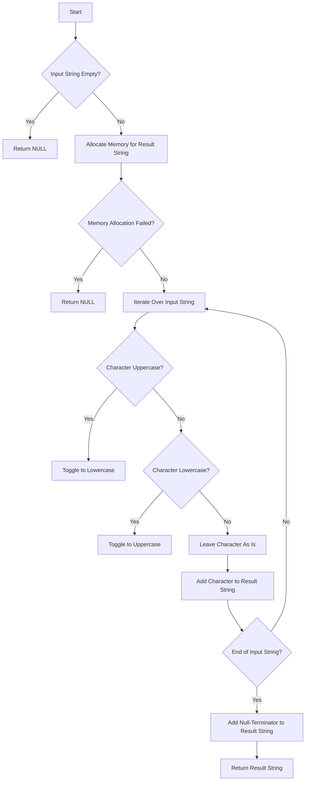

# Toggle Case of Characters in a String

## Problem Understanding
The problem asks to write a function that takes a string as input and returns a new string where the case of each character is toggled, i.e., uppercase characters become lowercase and vice versa. The key constraints are that the function should handle empty input, single-character input, and non-alphabetical characters. What makes this problem non-trivial is the need to handle different character types and edge cases, such as memory allocation failures. The naive approach of simply iterating over the string and toggling each character's case might not work due to the complexity of handling non-alphabetical characters and edge cases.

## Approach
The algorithm strategy is to iterate over each character in the input string and toggle its case using ASCII values. The intuition behind this approach is that uppercase and lowercase characters have distinct ASCII ranges, allowing us to use bitwise operations or built-in functions like `isupper`, `islower`, `tolower`, and `toupper` to toggle the case. The `toggleCase` function uses a character-wise iteration approach, where each character is checked for its case and toggled accordingly. The function also handles edge cases, such as empty input and memory allocation failures.

## Complexity Analysis
| Metric | Value | Detailed Reason |
|--------|-------|----------------|
| Time   | O(n)  | The function iterates over each character in the input string once, where n is the length of the string. The operations performed inside the loop, such as checking the case of a character and toggling it, take constant time. |
| Space  | O(n)  | The function allocates memory for a new string with the same length as the input string, which requires O(n) space. The space complexity is linear because the size of the output string is directly proportional to the size of the input string. |

## Algorithm Walkthrough
```
Input: "HeLlO"
Step 1: Initialize an empty string `result` with the same length as the input string.
Step 2: Iterate over each character in the input string:
  - Character 'H' is uppercase, toggle to lowercase: 'h'
  - Character 'e' is lowercase, toggle to uppercase: 'E'
  - Character 'L' is uppercase, toggle to lowercase: 'l'
  - Character 'l' is lowercase, toggle to uppercase: 'L'
  - Character 'O' is uppercase, toggle to lowercase: 'o'
Step 3: Add the null-terminator to the end of the `result` string.
Output: "hElLo"
```

## Visual Flow


## Key Insight
> **Tip:** The key insight is to use the `isupper`, `islower`, `tolower`, and `toupper` functions to toggle the case of each character, which simplifies the logic and makes the code more readable.

## Edge Cases
- **Empty/null input**: The function returns NULL, as there is no string to process.
- **Single character**: The function toggles the case of the single character and returns a new string with the toggled character.
- **Non-alphabetical characters**: The function leaves non-alphabetical characters as is, without toggling their case.

## Common Mistakes
- **Mistake 1**: Not checking for memory allocation failures, which can lead to crashes or unexpected behavior.
- **Mistake 2**: Not handling edge cases, such as empty input or non-alphabetical characters, which can lead to incorrect results or crashes.

## Interview Follow-ups
> **Interview:** These are the exact follow-up questions interviewers ask:
- "What if the input is sorted?" → The function still works correctly, as it iterates over each character individually and toggles its case regardless of the input order.
- "Can you do it in O(1) space?" → No, the function requires O(n) space to store the result string, as it needs to allocate memory for a new string with the same length as the input string.
- "What if there are duplicates?" → The function handles duplicates correctly, as it toggles the case of each character individually, regardless of whether it is a duplicate or not.

## C Solution

```c
// Problem: Toggle Case of Characters in a String
// Language: C
// Difficulty: Easy
// Time Complexity: O(n) — single pass through the string
// Space Complexity: O(n) — creating a new string with toggled case
// Approach: character-wise iteration and case toggle using ASCII values

#include <stdio.h>
#include <stdlib.h>
#include <string.h>
#include <ctype.h>

char* toggleCase(char* s) {
    // Edge case: empty input → return NULL
    if (s == NULL || *s == '\0') return NULL;

    // Calculate the length of the input string
    int length = strlen(s);

    // Allocate memory for the new string with toggled case
    char* result = (char*) malloc((length + 1) * sizeof(char)); // +1 for null-terminator
    if (result == NULL) {
        // Edge case: memory allocation failed → return NULL
        return NULL;
    }

    // Iterate over each character in the input string
    for (int i = 0; i < length; i++) {
        // Check if the character is uppercase
        if (isupper(s[i])) {
            // Toggle to lowercase using ASCII value
            result[i] = tolower(s[i]); 
        } else if (islower(s[i])) {
            // Toggle to uppercase using ASCII value
            result[i] = toupper(s[i]); 
        } else {
            // Non-alphabetical character, leave as is
            result[i] = s[i];
        }
    }

    // Add null-terminator to the end of the new string
    result[length] = '\0';

    return result;
}

int main() {
    char* input = "HeLlO";
    char* toggled = toggleCase(input);
    if (toggled != NULL) {
        printf("%s\n", toggled); // Output: "hElLo"
        free(toggled); // Deallocate memory
    }
    return 0;
}
```
