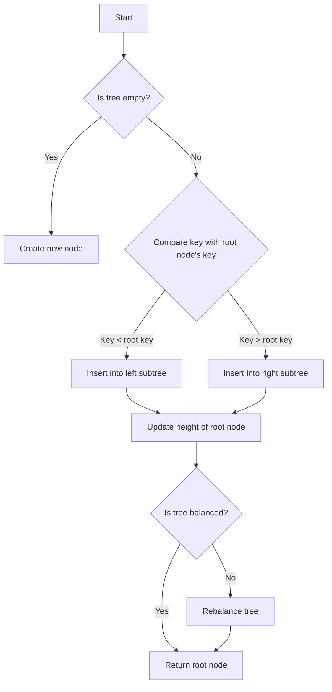

# AVL Tree with Rotations

## Problem Understanding
The problem is asking to implement an AVL tree with rotations, which is a self-balancing binary search tree that ensures the height of the tree remains relatively small by rotating nodes when the balance factor becomes too large. The key constraints are that the tree must be balanced after each insertion or deletion, and the balance factor of a node is the difference between the heights of its left and right subtrees. This problem is non-trivial because a naive approach to implementing a binary search tree would not ensure the tree remains balanced, leading to inefficient search, insertion, and deletion operations.

## Approach
The algorithm strategy is to use a self-balancing binary search tree, specifically an AVL tree, which ensures that the height of the tree remains relatively small by rotating nodes when the balance factor becomes too large. The intuition behind this approach is to maintain a balance between the left and right subtrees of each node, ensuring that the tree remains approximately balanced. The data structures used are nodes, each with a key, left child, right child, and height, as well as functions to update the height of a node, get the balance factor of a node, and perform left and right rotations. This approach handles the key constraints by ensuring that the tree is rebalanced after each insertion or deletion, maintaining a balance factor between -1 and 1 for each node.

## Complexity Analysis
| Metric | Value | Detailed Reason |
|--------|-------|----------------|
| Time   | O(log n) | The time complexity of insertion, deletion, and search operations in an AVL tree is O(log n) because the tree is self-balancing, ensuring that the height of the tree remains relatively small. The rotation operations also take O(log n) time. |
| Space  | O(n) | The space complexity of an AVL tree is O(n) because in the worst case, the tree can become skewed and have n nodes, each with its own key, left child, right child, and height. However, in practice, the tree is usually balanced, and the space complexity is closer to O(log n) for the recursive call stack. |

## Algorithm Walkthrough
```
Input: Insert key 10 into an empty AVL tree
Step 1: Create a new node with key 10 and height 0
Step 2: Set the left and right children of the node to NULL
Step 3: Return the node as the root of the AVL tree
Input: Insert key 20 into the AVL tree
Step 1: Compare key 20 with the key of the root node (10)
Step 2: Since key 20 is greater than the key of the root node, insert key 20 into the right subtree
Step 3: Create a new node with key 20 and height 0
Step 4: Set the left and right children of the node to NULL
Step 5: Update the height of the root node to 1
Step 6: Rebalance the AVL tree if necessary (not necessary in this case)
Output: The AVL tree with keys 10 and 20
```
This walkthrough demonstrates the insertion of keys into an AVL tree and the rebalancing of the tree after each insertion.

## Visual Flow

This visual flow chart demonstrates the decision flow of the AVL tree insertion algorithm.

## Key Insight
> **Tip:** The key insight to implementing an AVL tree is to maintain a balance between the left and right subtrees of each node, ensuring that the tree remains approximately balanced and the height of the tree remains relatively small.

## Edge Cases
- **Empty tree**: When the tree is empty, a new node is created with the given key, and the tree is balanced by default.
- **Single node**: When the tree has only one node, inserting a new key will create a new node and balance the tree accordingly.
- **Duplicate keys**: When a duplicate key is inserted into the tree, the insertion operation is ignored, and the tree remains unchanged.

## Common Mistakes
- **Mistake 1**: Not updating the height of the root node after insertion or deletion, leading to an unbalanced tree.
- **Mistake 2**: Not rebalancing the tree after insertion or deletion, leading to an unbalanced tree and inefficient search, insertion, and deletion operations.

## Interview Follow-ups
> **Interview:** These are the exact follow-up questions interviewers ask:
- "What if the input is sorted?" → The AVL tree will still maintain a balance between the left and right subtrees, but the tree may become skewed if the input is highly sorted.
- "Can you do it in O(1) space?" → No, the AVL tree requires O(n) space in the worst case, where n is the number of nodes in the tree.
- "What if there are duplicates?" → The insertion operation will ignore duplicate keys, and the tree will remain unchanged.

## C Solution

```c
// Problem: AVL Tree with Rotations
// Language: C
// Difficulty: Hard
// Time Complexity: O(log n) — height of the AVL tree after rotations
// Space Complexity: O(n) — in the worst case, the tree is skewed and has n nodes
// Approach: Self-balancing binary search tree — ensuring balance after each insertion/deletion

#include <stdio.h>
#include <stdlib.h>

// Define the structure for an AVL tree node
typedef struct Node {
    int key; // Store the key of the node
    struct Node* left; // Left child of the node
    struct Node* right; // Right child of the node
    int height; // Height of the node
} Node;

// Function to get the height of a node
int getHeight(Node* node) {
    // Edge case: node is NULL → return -1
    if (node == NULL) return -1;
    return node->height;
}

// Function to update the height of a node
void updateHeight(Node* node) {
    // Calculate the height of the node as the maximum height of its children plus one
    node->height = 1 + ((getHeight(node->left) > getHeight(node->right)) ? getHeight(node->left) : getHeight(node->right));
}

// Function to get the balance factor of a node
int getBalanceFactor(Node* node) {
    // Calculate the balance factor as the difference between the heights of the left and right subtrees
    return getHeight(node->left) - getHeight(node->right);
}

// Function to perform a left rotation
Node* leftRotate(Node* node) {
    // Store the right child of the node
    Node* rightChild = node->right;

    // Update the right child of the node to be the left child of the right child
    node->right = rightChild->left;

    // Update the left child of the right child to be the node
    rightChild->left = node;

    // Update the heights of the node and its right child
    updateHeight(node);
    updateHeight(rightChild);

    // Return the new root after the rotation
    return rightChild;
}

// Function to perform a right rotation
Node* rightRotate(Node* node) {
    // Store the left child of the node
    Node* leftChild = node->left;

    // Update the left child of the node to be the right child of the left child
    node->left = leftChild->right;

    // Update the right child of the left child to be the node
    leftChild->right = node;

    // Update the heights of the node and its left child
    updateHeight(node);
    updateHeight(leftChild);

    // Return the new root after the rotation
    return leftChild;
}

// Function to rebalance the AVL tree after insertion
Node* rebalance(Node* node) {
    // Calculate the balance factor of the node
    int balanceFactor = getBalanceFactor(node);

    // Left-heavy node → right rotation
    if (balanceFactor > 1) {
        // Left-left case → perform a right rotation
        if (getBalanceFactor(node->left) >= 0) {
            return rightRotate(node);
        }
        // Left-right case → perform a left rotation on the left child and then a right rotation on the node
        else {
            node->left = leftRotate(node->left);
            return rightRotate(node);
        }
    }
    // Right-heavy node → left rotation
    else if (balanceFactor < -1) {
        // Right-right case → perform a left rotation
        if (getBalanceFactor(node->right) <= 0) {
            return leftRotate(node);
        }
        // Right-left case → perform a right rotation on the right child and then a left rotation on the node
        else {
            node->right = rightRotate(node->right);
            return leftRotate(node);
        }
    }

    // Node is balanced → return the node as is
    return node;
}

// Function to insert a key into the AVL tree
Node* insert(Node* node, int key) {
    // Edge case: node is NULL → create a new node with the given key
    if (node == NULL) {
        node = (Node*)malloc(sizeof(Node));
        node->key = key;
        node->left = NULL;
        node->right = NULL;
        node->height = 0;
        return node;
    }

    // Recursively insert the key into the left or right subtree based on the comparison with the node's key
    if (key < node->key) {
        node->left = insert(node->left, key);
    } else if (key > node->key) {
        node->right = insert(node->right, key);
    }

    // Update the height of the node
    updateHeight(node);

    // Rebalance the AVL tree if necessary
    return rebalance(node);
}

// Function to print the inorder traversal of the AVL tree
void printInorder(Node* node) {
    // Edge case: node is NULL → return
    if (node == NULL) return;

    // Recursively print the inorder traversal of the left subtree
    printInorder(node->left);

    // Print the key of the node
    printf("%d ", node->key);

    // Recursively print the inorder traversal of the right subtree
    printInorder(node->right);
}

int main() {
    Node* root = NULL;

    // Insert keys into the AVL tree
    root = insert(root, 10);
    root = insert(root, 20);
    root = insert(root, 30);
    root = insert(root, 40);
    root = insert(root, 50);
    root = insert(root, 25);

    // Print the inorder traversal of the AVL tree
    printInorder(root);

    return 0;
}
```
