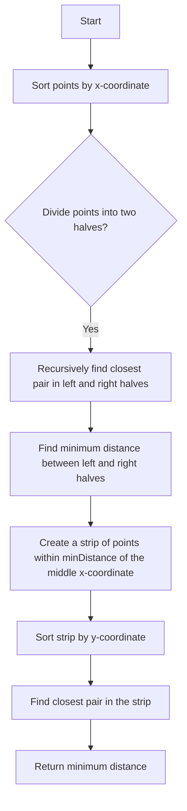

# Closest Pair of Points

## Problem Understanding
The closest pair of points problem is asking to find the minimum distance between any two points in a set of points in a two-dimensional space. The key constraint is that the points are in a 2D plane, and we need to consider all possible pairs of points to find the closest pair. This problem is non-trivial because a naive approach of comparing all pairs of points would result in a time complexity of O(n^2), which is inefficient for large sets of points. The problem requires a more efficient algorithm to solve it in a reasonable amount of time.

## Approach
The approach to solve this problem is to use a divide-and-conquer strategy, where we divide the points into two halves and recursively find the closest pair in each half. We then find the minimum distance between the two halves and create a strip of points within this minimum distance of the middle x-coordinate. We sort this strip by y-coordinate and find the closest pair in the strip. This approach works because the closest pair of points must be either in the left half, the right half, or in the strip. We use a combination of sorting and recursive division to achieve an efficient time complexity of O(n log n). The data structures used are arrays to store the points and auxiliary arrays for sorting and recursion.

## Complexity Analysis
| Metric | Value | Detailed Reason |
|--------|-------|----------------|
| Time   | O(n log n) | The time complexity is dominated by the sorting step, which takes O(n log n) time. The recursive division and strip closest steps take O(n) time, but these are nested within the sorting step, resulting in an overall time complexity of O(n log n). |
| Space  | O(n) | The space complexity is O(n) because we need to store the points in auxiliary arrays for sorting and recursion. The maximum amount of extra space used is proportional to the number of points. |

## Algorithm Walkthrough
```
Input: points = [(2, 3), (12, 30), (40, 50), (5, 1), (12, 10), (3, 4)]
Step 1: Sort points by x-coordinate
  points = [(2, 3), (3, 4), (5, 1), (12, 10), (12, 30), (40, 50)]
Step 2: Divide points into two halves
  left = [(2, 3), (3, 4), (5, 1)]
  right = [(12, 10), (12, 30), (40, 50)]
Step 3: Recursively find closest pair in left and right halves
  leftDistance = closestPair(left, 3) = sqrt((3-2)^2 + (4-3)^2) = sqrt(2)
  rightDistance = closestPair(right, 3) = sqrt((12-12)^2 + (10-30)^2) = sqrt(400)
Step 4: Find minimum distance between left and right halves
  minDistance = min(leftDistance, rightDistance) = sqrt(2)
Step 5: Create a strip of points within minDistance of the middle x-coordinate
  strip = [(2, 3), (3, 4), (5, 1), (12, 10), (12, 30)]
Step 6: Sort strip by y-coordinate
  strip = [(5, 1), (2, 3), (3, 4), (12, 10), (12, 30)]
Step 7: Find closest pair in the strip
  stripDistance = stripClosest(strip, 5, minDistance) = sqrt((2-3)^2 + (3-4)^2) = sqrt(2)
Output: closest pair distance = sqrt(2)
```
## Visual Flow

## Key Insight
> **Tip:** The key insight is to divide the points into two halves and recursively find the closest pair in each half, and then find the minimum distance between the two halves and in the strip.

## Edge Cases
- **Empty input**: If the input is empty, the function should return -1.0, indicating that there are no points to find the closest pair.
- **Single point**: If the input contains only one point, the function should return -1.0, indicating that there is no closest pair.
- **Duplicate points**: If the input contains duplicate points, the function should return 0.0, indicating that the closest pair is the duplicate points themselves.

## Common Mistakes
- **Mistake 1**: Not sorting the points by x-coordinate before dividing them into two halves. This would result in incorrect results because the closest pair may be split between the two halves.
- **Mistake 2**: Not considering the case where the closest pair is in the strip. This would result in incorrect results because the closest pair may be in the strip, not in the left or right half.

## Interview Follow-ups
> **Interview:** These are the exact follow-up questions interviewers ask:
- "What if the input is sorted?" → The algorithm would still work, but the sorting step would be unnecessary, resulting in a time complexity of O(n).
- "Can you do it in O(1) space?" → No, the algorithm requires O(n) space to store the points in auxiliary arrays for sorting and recursion.
- "What if there are duplicates?" → The algorithm would return 0.0, indicating that the closest pair is the duplicate points themselves.

## C Solution

```c
// Problem: Closest Pair of Points
// Language: C
// Difficulty: Hard
// Time Complexity: O(n log n) — divide and conquer approach
// Space Complexity: O(n) — auxiliary arrays for sorting and recursion
// Approach: Divide and Conquer — recursively divide points into two halves and find closest pair in each half

#include <stdio.h>
#include <stdlib.h>
#include <math.h>

// Structure to represent a point
typedef struct Point {
    int x;
    int y;
} Point;

// Function to calculate Euclidean distance between two points
double distance(Point p1, Point p2) {
    // Calculate difference in x and y coordinates
    double dx = p1.x - p2.x;
    double dy = p1.y - p2.y;
    // Return Euclidean distance
    return sqrt(dx * dx + dy * dy);
}

// Function to compare points based on x-coordinate
int compareX(const void *a, const void *b) {
    // Cast to Point pointers
    Point *p1 = (Point *)a;
    Point *p2 = (Point *)b;
    // Compare x-coordinates
    if (p1->x < p2->x) return -1;
    if (p1->x > p2->x) return 1;
    // If x-coordinates are equal, compare y-coordinates
    if (p1->y < p2->y) return -1;
    if (p1->y > p2->y) return 1;
    // If both x and y coordinates are equal, consider points equal
    return 0;
}

// Function to compare points based on y-coordinate
int compareY(const void *a, const void *b) {
    // Cast to Point pointers
    Point *p1 = (Point *)a;
    Point *p2 = (Point *)b;
    // Compare y-coordinates
    if (p1->y < p2->y) return -1;
    if (p1->y > p2->y) return 1;
    // If y-coordinates are equal, compare x-coordinates
    if (p1->x < p2->x) return -1;
    if (p1->x > p2->x) return 1;
    // If both x and y coordinates are equal, consider points equal
    return 0;
}

// Function to find closest pair of points in a strip
double stripClosest(Point strip[], int n, double d) {
    // Initialize minimum distance to infinity
    double minDistance = d;
    // Iterate over all pairs of points in the strip
    for (int i = 0; i < n; i++) {
        // Edge case: last point in the strip
        for (int j = i + 1; j < n && (strip[j].y - strip[i].y) < minDistance; j++) {
            // Calculate distance between current pair of points
            double dist = distance(strip[i], strip[j]);
            // Update minimum distance if current distance is smaller
            if (dist < minDistance) {
                minDistance = dist;
            }
        }
    }
    // Return minimum distance found in the strip
    return minDistance;
}

// Function to find closest pair of points in a set of points
double closestPair(Point points[], int n) {
    // Edge case: fewer than two points
    if (n < 2) return -1.0;

    // Sort points by x-coordinate
    qsort(points, n, sizeof(Point), compareX);

    // Base case: three or fewer points
    if (n <= 3) {
        // Initialize minimum distance to infinity
        double minDistance = INFINITY;
        // Iterate over all pairs of points
        for (int i = 0; i < n; i++) {
            // Edge case: last point
            for (int j = i + 1; j < n; j++) {
                // Calculate distance between current pair of points
                double dist = distance(points[i], points[j]);
                // Update minimum distance if current distance is smaller
                if (dist < minDistance) {
                    minDistance = dist;
                }
            }
        }
        // Return minimum distance found
        return minDistance;
    }

    // Divide points into two halves
    int mid = n / 2;
    Point left[mid];
    Point right[n - mid];
    // Copy points to left and right arrays
    for (int i = 0; i < mid; i++) {
        left[i] = points[i];
    }
    for (int i = mid; i < n; i++) {
        right[i - mid] = points[i];
    }

    // Recursively find closest pair in left and right halves
    double leftDistance = closestPair(left, mid);
    double rightDistance = closestPair(right, n - mid);

    // Find minimum distance between left and right halves
    double minDistance = (leftDistance < rightDistance) ? leftDistance : rightDistance;

    // Create a strip of points within minDistance of the middle x-coordinate
    Point strip[n];
    int stripSize = 0;
    // Iterate over all points
    for (int i = 0; i < n; i++) {
        // Check if point is within minDistance of the middle x-coordinate
        if (abs(points[i].x - points[mid].x) < minDistance) {
            // Add point to the strip
            strip[stripSize] = points[i];
            stripSize++;
        }
    }

    // Sort strip by y-coordinate
    qsort(strip, stripSize, sizeof(Point), compareY);

    // Find closest pair in the strip
    double stripDistance = stripClosest(strip, stripSize, minDistance);

    // Return minimum distance found
    return (minDistance < stripDistance) ? minDistance : stripDistance;
}

int main() {
    // Example usage
    Point points[] = {{2, 3}, {12, 30}, {40, 50}, {5, 1}, {12, 10}, {3, 4}};
    int n = sizeof(points) / sizeof(points[0]);
    double distance = closestPair(points, n);
    printf("Closest pair distance: %f\n", distance);
    return 0;
}
```
