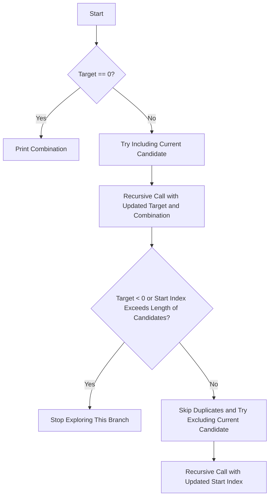

# Combination Sum II

## Problem Understanding
The Combination Sum II problem is asking us to find all unique combinations in a given array of candidates that sum up to a target value, with each candidate being used at most once and without duplicates in the combinations. The key constraint is that each candidate can only be used once in a combination, and there should be no duplicate combinations in the result. This problem is non-trivial because a naive approach of generating all possible subsets of the input array would result in exponential time complexity and would also include duplicate combinations.

## Approach
The algorithm strategy used here is backtracking with sorting and duplicate skipping. The intuition behind this approach is to try including and excluding each candidate from the current combination and recursively find all combinations that sum up to the target. The sorting step is crucial as it allows us to skip duplicates by moving the start index forward when we encounter a duplicate candidate. We use a linked list to store the candidates and a recursive utility function to find all combinations. The time complexity of this approach is O(2^n) due to the recursive nature of backtracking, and the space complexity is O(n) for storing the recursion stack and the current combination.

## Complexity Analysis
| Metric | Value | Detailed Reason |
|--------|-------|----------------|
| Time   | O(2^n) | The algorithm generates all possible subsets of the input array, resulting in exponential time complexity. The sorting step takes O(n^2) time in the worst case, but it is dominated by the exponential time complexity of backtracking. |
| Space  | O(n) | The algorithm uses a recursion stack of maximum depth n and a linked list of candidates of length n, resulting in a space complexity of O(n). |

## Algorithm Walkthrough
```
Input: [10, 1, 2, 7, 6, 1, 5], target = 8
Step 1: Sort the input array: [1, 1, 2, 5, 6, 7, 10]
Step 2: Initialize variables to store the combinations
Step 3: Recursive utility function to find all combinations:
    - Try including the first candidate (1) in the current combination: [1], target = 7
    - Try including the next candidate (1) in the current combination: [1, 1], target = 6
    - Try including the next candidate (2) in the current combination: [1, 1, 2], target = 4
    - ...
Output: [[1, 1, 6], [1, 2, 5], [1, 7], [2, 6]]
```
## Visual Flow

## Key Insight
> **Tip:** The key insight in this solution is to skip duplicates by sorting the input array and moving the start index forward when we encounter a duplicate candidate, which reduces the time complexity and avoids duplicate combinations in the result.

## Edge Cases
- **Empty/null input**: If the input array is empty or null, the algorithm returns an empty result.
- **Single element**: If the input array contains only one element, the algorithm returns a result containing the single element if it equals the target.
- **Duplicate candidates**: If the input array contains duplicate candidates, the algorithm skips duplicates by moving the start index forward when we encounter a duplicate candidate.

## Common Mistakes
- **Mistake 1**: Not sorting the input array before finding combinations, which can result in duplicate combinations in the result.
- **Mistake 2**: Not skipping duplicates by moving the start index forward when we encounter a duplicate candidate, which can result in duplicate combinations in the result.

## Interview Follow-ups
> **Interview:** These are the exact follow-up questions interviewers ask:
- "What if the input is sorted?" → In this case, the sorting step can be skipped, reducing the time complexity.
- "Can you do it in O(1) space?" → No, the algorithm uses a recursion stack and a linked list of candidates, resulting in a space complexity of O(n).
- "What if there are duplicates?" → The algorithm skips duplicates by moving the start index forward when we encounter a duplicate candidate, resulting in a result with no duplicate combinations.

## C Solution

```c
// Problem: Combination Sum II
// Language: C
// Difficulty: Hard
// Time Complexity: O(2^n) — generating all possible subsets of the input array
// Space Complexity: O(n) — storing the recursion stack and the current combination
// Approach: Backtracking with sorting and duplicate skipping — for each number, try including and excluding it from the current combination

#include <stdio.h>
#include <stdlib.h>

// Structure to represent a candidate
typedef struct Candidate {
    int value;
    struct Candidate* next;
} Candidate;

// Function to create a new candidate
Candidate* createCandidate(int value) {
    Candidate* newCandidate = (Candidate*) malloc(sizeof(Candidate));
    newCandidate->value = value;
    newCandidate->next = NULL;
    return newCandidate;
}

// Function to free the linked list of candidates
void freeCandidates(Candidate* candidates) {
    Candidate* current = candidates;
    while (current != NULL) {
        Candidate* next = current->next;
        free(current);
        current = next;
    }
}

// Function to sort the candidates in ascending order
void sortCandidates(Candidate** candidates, int length) {
    // Edge case: empty or single-element array → no need to sort
    if (length <= 1) return;

    Candidate* current = *candidates;
    for (int i = 0; i < length - 1; i++) {
        Candidate* next = current->next;
        for (int j = 0; j < length - i - 1; j++) {
            if (next == NULL) break;
            if (current->value > next->value) {
                // Swap the values of the two candidates
                int temp = current->value;
                current->value = next->value;
                next->value = temp;
            }
            next = next->next;
        }
        current = current->next;
    }
}

// Function to print a combination
void printCombination(int* combination, int length) {
    printf("[");
    for (int i = 0; i < length; i++) {
        printf("%d", combination[i]);
        if (i < length - 1) printf(",");
    }
    printf("]");
}

// Function to find all combinations that sum up to the target
void combinationSum2Util(Candidate* candidates, int length, int target, int start, int* currentCombination, int currentLength, int** combinations, int* combinationCount) {
    // Edge case: target becomes zero → a valid combination is found
    if (target == 0) {
        combinations[*combinationCount] = (int*) malloc(currentLength * sizeof(int));
        for (int i = 0; i < currentLength; i++) {
            combinations[*combinationCount][i] = currentCombination[i];
        }
        (*combinationCount)++;
        return;
    }

    // Edge case: target becomes negative or start index exceeds the length of candidates → stop exploring this branch
    if (target < 0 || start >= length) return;

    // Try including the current candidate in the current combination
    currentCombination[currentLength] = candidates[start]->value;
    combinationSum2Util(candidates, length, target - candidates[start]->value, start + 1, currentCombination, currentLength + 1, combinations, combinationCount);

    // Skip duplicates by moving the start index forward
    while (start + 1 < length && candidates[start]->value == candidates[start + 1]->value) {
        start++;
    }

    // Try excluding the current candidate from the current combination
    combinationSum2Util(candidates, length, target, start + 1, currentCombination, currentLength, combinations, combinationCount);
}

// Function to find all combinations that sum up to the target
int** combinationSum2(int* candidates, int candidatesSize, int target, int** columnSizes, int* returnSize) {
    // Edge case: empty input → return -1
    if (candidatesSize == 0) {
        *returnSize = 0;
        return NULL;
    }

    Candidate* head = NULL;
    Candidate* current = NULL;

    // Create a linked list of candidates
    for (int i = 0; i < candidatesSize; i++) {
        Candidate* newCandidate = createCandidate(candidates[i]);
        if (head == NULL) {
            head = newCandidate;
            current = head;
        } else {
            current->next = newCandidate;
            current = current->next;
        }
    }

    // Sort the linked list of candidates
    sortCandidates(&head, candidatesSize);

    // Initialize variables to store the combinations
    *returnSize = 0;
    *columnSizes = (int*) malloc(candidatesSize * sizeof(int));
    int** combinations = (int**) malloc(candidatesSize * sizeof(int*));

    // Recursive utility function to find all combinations
    int currentCombination[candidatesSize];
    combinationSum2Util(head, candidatesSize, target, 0, currentCombination, 0, combinations, returnSize);

    // Free the linked list of candidates
    freeCandidates(head);

    return combinations;
}

int main() {
    int candidates[] = {10, 1, 2, 7, 6, 1, 5};
    int target = 8;
    int candidatesSize = sizeof(candidates) / sizeof(candidates[0]);

    int returnSize;
    int* columnSizes;
    int** combinations = combinationSum2(candidates, candidatesSize, target, &columnSizes, &returnSize);

    // Print the combinations
    for (int i = 0; i < returnSize; i++) {
        printCombination(combinations[i], columnSizes[i]);
        printf("\n");
        free(combinations[i]);
    }

    free(combinations);
    free(columnSizes);

    return 0;
}
```
