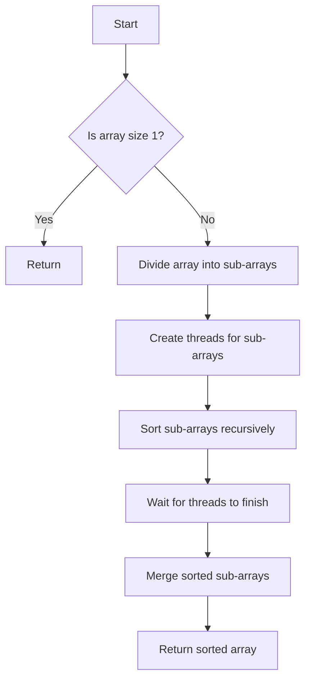

# Demonstrate Multithreaded Merge Sort

## Problem Understanding
The problem is asking to implement a multithreaded merge sort algorithm in C, which sorts an array of integers in ascending order using multiple threads. The key constraint is that the algorithm should divide the array into sub-arrays, sort them recursively using multiple threads, and then merge the sorted sub-arrays. The problem is non-trivial because it requires careful synchronization of threads and efficient merging of sorted sub-arrays. A naive approach would be to simply divide the array into sub-arrays and sort them sequentially, but this would not take advantage of multiple threads and would not be efficient for large arrays.

## Approach
The algorithm strategy is to use a divide-and-conquer approach with multi-threading, where the array is divided into sub-arrays, sorted recursively using multiple threads, and then merged. The intuition behind this approach is that dividing the array into smaller sub-arrays allows for parallel sorting, which can significantly reduce the overall sorting time. The algorithm uses a structure to pass arguments to merge sort threads, and a function to merge two sorted sub-arrays. The approach handles the key constraints by using pthreads to create and manage threads, and by using a temporary array to store the merged result.

## Complexity Analysis
| Metric | Value | Detailed Reason |
|--------|-------|----------------|
| Time   | O(n log n) | The algorithm divides the array into sub-arrays of size n/2, sorts them recursively, and then merges them. The time complexity of the merge step is O(n), and the time complexity of the recursive sorting step is O(n log n). Since the algorithm uses multiple threads to sort the sub-arrays, the overall time complexity is still O(n log n). |
| Space  | O(n) | The algorithm uses a temporary array to store the merged result, which requires O(n) space. Additionally, the algorithm uses a structure to pass arguments to merge sort threads, which requires O(1) space. However, the overall space complexity is dominated by the temporary array, so it is O(n). |

## Algorithm Walkthrough
```
Input: array = [64, 34, 25, 12, 22, 11, 90]
Step 1: Divide the array into sub-arrays [64, 34, 25] and [12, 22, 11, 90]
Step 2: Recursively sort the sub-arrays using multiple threads
  - Thread 1: Sort [64, 34, 25] = [25, 34, 64]
  - Thread 2: Sort [12, 22, 11, 90] = [11, 12, 22, 90]
Step 3: Merge the sorted sub-arrays
  - Merge [25, 34, 64] and [11, 12, 22, 90] = [11, 12, 22, 25, 34, 64, 90]
Output: Sorted array = [11, 12, 22, 25, 34, 64, 90]
```
This walkthrough demonstrates the algorithm's ability to divide the array into sub-arrays, sort them recursively using multiple threads, and then merge the sorted sub-arrays.

## Visual Flow

This visual flowchart demonstrates the algorithm's decision flow and data transformation.

## Key Insight
> **Tip:** The key insight is to divide the array into sub-arrays and sort them recursively using multiple threads, which allows for parallel sorting and reduces the overall sorting time.

## Edge Cases
- **Empty/null input**: If the input array is empty or null, the algorithm will return an error or a null value, since there is nothing to sort.
- **Single element**: If the input array has only one element, the algorithm will return the same array, since it is already sorted.
- **Duplicate elements**: If the input array has duplicate elements, the algorithm will sort them correctly and return the sorted array with the duplicate elements in the correct order.

## Common Mistakes
- **Mistake 1**: Not synchronizing threads properly, which can lead to incorrect results or crashes.
- **Mistake 2**: Not handling edge cases correctly, such as empty or null input, which can lead to errors or crashes.

## Interview Follow-ups
> **Interview:** These are the exact follow-up questions interviewers ask:
- "What if the input is sorted?" → The algorithm will still work correctly and return the sorted array, but it will not take advantage of the fact that the input is already sorted.
- "Can you do it in O(1) space?" → No, the algorithm requires O(n) space to store the temporary array for merging.
- "What if there are duplicates?" → The algorithm will sort the duplicates correctly and return the sorted array with the duplicates in the correct order.

## C Solution

```c
// Problem: Multithreaded Merge Sort
// Language: C
// Difficulty: Hard
// Time Complexity: O(n log n) — divide-and-conquer approach with multi-threading
// Space Complexity: O(n) — auxiliary array for merge operation
// Approach: Divide-and-Conquer with multi-threading — split array into sub-arrays and merge them

#include <stdio.h>
#include <stdlib.h>
#include <pthread.h>

// Structure to pass arguments to merge sort threads
typedef struct {
    int* array;
    int start;
    int end;
} merge_sort_args;

// Function to merge two sorted sub-arrays
void merge(int* array, int start, int mid, int end) {
    // Create a temporary array to store the merged result
    int* temp = (int*) malloc((end - start + 1) * sizeof(int));
    int i = start;  // Index for the left sub-array
    int j = mid + 1;  // Index for the right sub-array
    int k = 0;  // Index for the temporary array

    // Merge the two sub-arrays
    while (i <= mid && j <= end) {
        if (array[i] <= array[j]) {
            temp[k] = array[i];
            i++;
        } else {
            temp[k] = array[j];
            j++;
        }
        k++;
    }

    // Copy the remaining elements from the left sub-array, if any
    while (i <= mid) {
        temp[k] = array[i];
        i++;
        k++;
    }

    // Copy the remaining elements from the right sub-array, if any
    while (j <= end) {
        temp[k] = array[j];
        j++;
        k++;
    }

    // Copy the merged result back to the original array
    for (i = start; i <= end; i++) {
        array[i] = temp[i - start];
    }

    // Free the temporary array
    free(temp);
}

// Function to perform merge sort on a sub-array
void* merge_sort(void* args) {
    merge_sort_args* arg = (merge_sort_args*) args;
    int* array = arg->array;
    int start = arg->start;
    int end = arg->end;

    // Edge case: sub-array has only one element, so it's already sorted
    if (start >= end) {
        return NULL;
    }

    // Divide the sub-array into two halves
    int mid = (start + end) / 2;

    // Recursively sort the left and right sub-arrays
    merge_sort_args left_args = {array, start, mid};
    merge_sort_args right_args = {array, mid + 1, end};
    pthread_t left_thread, right_thread;

    // Create threads for the left and right sub-arrays
    pthread_create(&left_thread, NULL, merge_sort, &left_args);
    pthread_create(&right_thread, NULL, merge_sort, &right_args);

    // Wait for the threads to finish
    pthread_join(left_thread, NULL);
    pthread_join(right_thread, NULL);

    // Merge the sorted left and right sub-arrays
    merge(array, start, mid, end);

    return NULL;
}

int main() {
    int array[] = {64, 34, 25, 12, 22, 11, 90};
    int n = sizeof(array) / sizeof(array[0]);

    // Create a thread for the merge sort
    merge_sort_args args = {array, 0, n - 1};
    pthread_t thread;
    pthread_create(&thread, NULL, merge_sort, &args);

    // Wait for the thread to finish
    pthread_join(thread, NULL);

    // Print the sorted array
    printf("Sorted array: ");
    for (int i = 0; i < n; i++) {
        printf("%d ", array[i]);
    }
    printf("\n");

    return 0;
}
```
