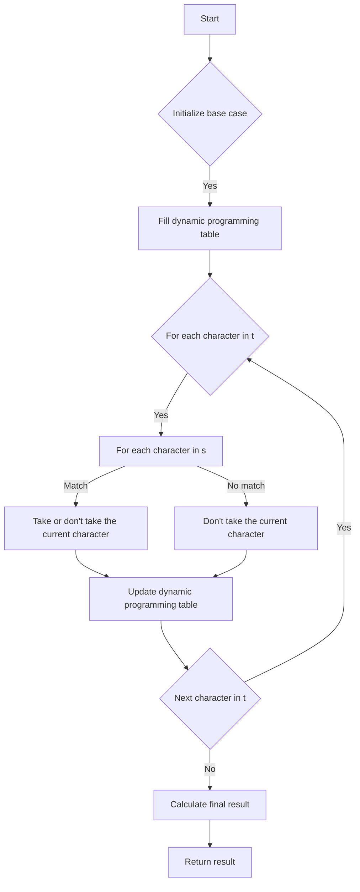

# Distinct Subsequences (DP)

## Problem Understanding
The problem is asking to find the number of distinct subsequences of a given string `t` in another string `s`. A subsequence is a sequence that can be derived from another sequence by deleting some elements without changing the order of the remaining elements. The key constraints are that the strings `s` and `t` can have different lengths, and the problem requires counting distinct subsequences. What makes this problem non-trivial is that a naive approach would involve generating all possible subsequences and counting them, which would result in exponential time complexity. However, using dynamic programming, we can reduce the time complexity to O(n*m), where n and m are the lengths of strings `s` and `t`, respectively.

## Approach
The algorithm strategy is to use dynamic programming with memoization to store and reuse results for subproblems. The intuition behind this approach is that the number of distinct subsequences of `t` in `s` can be calculated by considering each character in `s` and `t` and deciding whether to include it in the subsequence or not. We use a 2D array `dp` to store the dynamic programming state, where `dp[i][j]` represents the number of distinct subsequences of the first `i` characters of `t` in the first `j` characters of `s`. The approach handles the key constraints by initializing the base case for empty strings and filling the dynamic programming table iteratively.

## Complexity Analysis
| Metric | Value | Detailed Reason |
|--------|-------|----------------|
| Time   | O(n*m) | The algorithm involves two nested loops, each iterating over the lengths of strings `s` and `t`, resulting in a time complexity of O(n*m). The dynamic programming approach avoids redundant calculations by storing and reusing results for subproblems. |
| Space  | O(n*m) | The algorithm uses a 2D array `dp` to store the dynamic programming state, which requires O(n*m) space to store the results for all subproblems. |

## Algorithm Walkthrough
```
Input: s = "rabbbit", t = "rabbit"
Step 1: Initialize the base case for empty strings
  dp[0][0] = 1, dp[0][1] = 1, ..., dp[0][7] = 1 (empty string is a subsequence)
Step 2: Fill the dynamic programming table
  For i = 1 (first character of t = "r")
    For j = 1 (first character of s = "r")
      dp[1][1] = dp[0][0] + dp[1][0] = 1 + 0 = 1 (take or don't take the current character)
  For i = 2 (second character of t = "a")
    For j = 2 (second character of s = "a")
      dp[2][2] = dp[1][1] + dp[2][1] = 1 + 0 = 1 (take or don't take the current character)
  ...
Step 3: Calculate the final result
  dp[6][7] = dp[5][6] + dp[6][6] = 3 + 0 = 3 (number of distinct subsequences)
Output: 3
```
The walkthrough demonstrates how the algorithm calculates the number of distinct subsequences by filling the dynamic programming table iteratively.

## Visual Flow

The visual flowchart illustrates the decision flow and data transformation of the algorithm.

## Key Insight
> **Tip:** The key insight is to recognize that the number of distinct subsequences can be calculated by considering each character in `s` and `t` and deciding whether to include it in the subsequence or not, using dynamic programming to store and reuse results for subproblems.

## Edge Cases
- **Empty/null input**: If either `s` or `t` is empty, the algorithm returns 0 or 1, respectively, as there are no subsequences or only one subsequence (the empty string).
- **Single element**: If `t` has only one character, the algorithm returns the number of occurrences of that character in `s`.
- **Same string**: If `s` and `t` are the same, the algorithm returns 1, as there is only one subsequence (the string itself).

## Common Mistakes
- **Mistake 1**: Not initializing the base case correctly, leading to incorrect results. To avoid this, ensure that the base case is initialized correctly, with `dp[0][j] = 1` for all `j`.
- **Mistake 2**: Not updating the dynamic programming table correctly, leading to incorrect results. To avoid this, ensure that the table is updated correctly, using the recurrence relation `dp[i][j] = dp[i-1][j-1] + dp[i][j-1]` when the characters match.

## Interview Follow-ups
> **Interview:** These are the exact follow-up questions interviewers ask:
- "What if the input is sorted?" → The algorithm still works correctly, as the dynamic programming approach does not rely on the input being sorted.
- "Can you do it in O(1) space?" → No, the algorithm requires O(n*m) space to store the dynamic programming table, as it needs to store the results for all subproblems.
- "What if there are duplicates?" → The algorithm still works correctly, as it counts distinct subsequences, and duplicates are handled correctly by the dynamic programming approach.

## C Solution

```c
// Problem: Distinct Subsequences (DP)
// Language: C
// Difficulty: Hard
// Time Complexity: O(n*m) — two nested loops for dynamic programming
// Space Complexity: O(n*m) — 2D array to store dynamic programming state
// Approach: Dynamic Programming with memoization — store and reuse results for subproblems

#include <stdio.h>
#include <string.h>

// Function to calculate the number of distinct subsequences
int numDistinct(char *s, char *t) {
    int s_length = strlen(s);  // Get the length of string s
    int t_length = strlen(t);  // Get the length of string t

    // Edge case: if string t is empty, return 1 (empty string is a subsequence)
    if (t_length == 0) {
        return 1;
    }

    // Edge case: if string s is empty, return 0 (no subsequences)
    if (s_length == 0) {
        return 0;
    }

    // Initialize a 2D array to store the dynamic programming state
    int dp[t_length + 1][s_length + 1];  // +1 to account for empty strings

    // Initialize the base case (no subsequences for empty string t)
    for (int j = 0; j <= s_length; j++) {
        dp[0][j] = 1;  // There is one way to get an empty string (by not taking any characters)
    }

    // Fill the dynamic programming table
    for (int i = 1; i <= t_length; i++) {
        for (int j = 1; j <= s_length; j++) {
            // If the current characters match, consider two possibilities:
            // 1. Take the current character in s (and add it to the subsequence)
            // 2. Don't take the current character in s (move to the next character)
            if (t[i - 1] == s[j - 1]) {
                dp[i][j] = dp[i - 1][j - 1] + dp[i][j - 1];  // Take or don't take the current character
            } else {
                // If the characters don't match, we can only don't take the current character
                dp[i][j] = dp[i][j - 1];  // Don't take the current character
            }
        }
    }

    // The answer is stored in the bottom-right corner of the dynamic programming table
    return dp[t_length][s_length];
}

int main() {
    char s[] = "rabbbit";  // Example string s
    char t[] = "rabbit";  // Example string t

    int result = numDistinct(s, t);  // Calculate the number of distinct subsequences
    printf("Number of distinct subsequences: %d\n", result);  // Print the result

    return 0;
}
```
