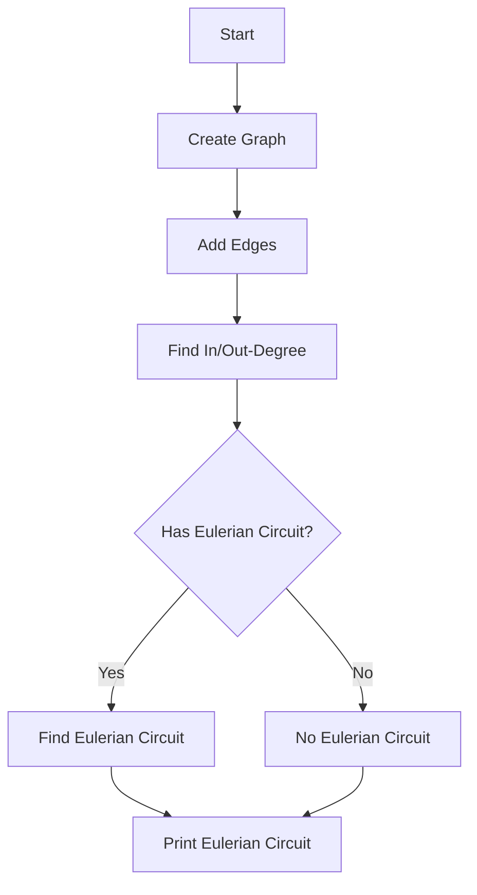

# Eulerian Circuit in a Directed Graph

## Problem Understanding
The problem asks to find an Eulerian circuit in a directed graph, which is a path that visits every edge exactly once and returns to the starting vertex. The key constraint is that the graph must have at most one vertex with in-degree greater than out-degree and at most one vertex with out-degree greater than in-degree. This problem is non-trivial because a naive approach would be to simply traverse the graph and try to find a path that visits every edge, but this would not guarantee that the path is an Eulerian circuit. The problem requires a more sophisticated approach, such as Hierholzer's Algorithm, to ensure that the circuit is found correctly.

## Approach
The algorithm strategy used is Hierholzer's Algorithm, which is a well-known algorithm for finding Eulerian circuits in directed graphs. The intuition behind this algorithm is to start at a vertex with out-degree greater than 0 and perform a depth-first search to find a path that visits every edge exactly once. The algorithm uses a stack to keep track of the vertices to visit and a visited array to keep track of the edges that have been visited. The algorithm also uses the in-degree and out-degree arrays to check if the graph has an Eulerian circuit. The data structures used are adjacency lists to represent the graph, a stack to keep track of the vertices to visit, and visited and in/out-degree arrays to keep track of the edges and vertices.

## Complexity Analysis
| Metric | Value | Detailed Reason |
|--------|-------|----------------|
| Time   | O(V + E) | The algorithm performs a depth-first search on the graph, which visits each vertex and edge once. The time complexity is linear with respect to the number of vertices and edges. |
| Space  | O(V + E) | The algorithm uses adjacency lists to represent the graph, a stack to keep track of the vertices to visit, and visited and in/out-degree arrays to keep track of the edges and vertices. The space complexity is linear with respect to the number of vertices and edges. |

## Algorithm Walkthrough
```
Input: Graph with 5 vertices and 7 edges
Step 1: Create a graph with 5 vertices and add 7 edges
Step 2: Find the in-degree and out-degree of each vertex
  - Vertex 0: in-degree 0, out-degree 2
  - Vertex 1: in-degree 1, out-degree 2
  - Vertex 2: in-degree 3, out-degree 2
  - Vertex 3: in-degree 2, out-degree 1
  - Vertex 4: in-degree 2, out-degree 0
Step 3: Check if the graph has an Eulerian circuit
  - The graph has an Eulerian circuit because there is at most one vertex with in-degree greater than out-degree and at most one vertex with out-degree greater than in-degree.
Step 4: Find the Eulerian circuit using Hierholzer's Algorithm
  - Start at vertex 0 and perform a depth-first search
  - Visit vertex 1, then vertex 2, then vertex 3, then vertex 4
  - The Eulerian circuit is: 0 1 2 3 4
Output: The Eulerian circuit is: 0 1 2 3 4
```

## Visual Flow


## Key Insight
> **Tip:** The key to finding an Eulerian circuit is to use Hierholzer's Algorithm, which involves performing a depth-first search on the graph and using the in-degree and out-degree arrays to check if the graph has an Eulerian circuit.

## Edge Cases
- **Empty Graph**: If the graph is empty, the algorithm will not find an Eulerian circuit because there are no edges to visit.
- **Single Vertex**: If the graph has only one vertex, the algorithm will not find an Eulerian circuit because there are no edges to visit.
- **Disjoint Graph**: If the graph is disjoint, the algorithm will not find an Eulerian circuit because there is no path that visits every edge exactly once.

## Common Mistakes
- **Incorrect In/Out-Degree Calculation**: If the in-degree and out-degree arrays are not calculated correctly, the algorithm will not find an Eulerian circuit.
- **Incorrect Depth-First Search**: If the depth-first search is not performed correctly, the algorithm will not find an Eulerian circuit.

## Interview Follow-ups
> **Interview:** These are the exact follow-up questions interviewers ask:
- "What if the input graph is not connected?" → The algorithm will not find an Eulerian circuit because there is no path that visits every edge exactly once.
- "Can you optimize the algorithm to use less space?" → The algorithm can be optimized to use less space by using a more efficient data structure to represent the graph.
- "What if the input graph has multiple Eulerian circuits?" → The algorithm will find one of the Eulerian circuits, but it may not be the only one.

## C Solution

```c
// Problem: Eulerian Circuit in a Directed Graph
// Language: C
// Difficulty: Hard
// Time Complexity: O(V + E) — DFS traversal for finding the circuit
// Space Complexity: O(V + E) — adjacency list representation of the graph
// Approach: Hierholzer's Algorithm — finding an Eulerian circuit in a directed graph

#include <stdio.h>
#include <stdlib.h>
#include <stdbool.h>

// Define the structure for a graph edge
typedef struct Edge {
    int destination;
    struct Edge* next;
} Edge;

// Define the structure for a graph
typedef struct Graph {
    int numVertices;
    Edge** adjacencyList;
} Graph;

// Function to create a new graph with the given number of vertices
Graph* createGraph(int numVertices) {
    // Allocate memory for the graph
    Graph* graph = (Graph*)malloc(sizeof(Graph));
    graph->numVertices = numVertices;
    // Allocate memory for the adjacency list
    graph->adjacencyList = (Edge**)malloc(numVertices * sizeof(Edge*));
    for (int i = 0; i < numVertices; i++) {
        graph->adjacencyList[i] = NULL;
    }
    return graph;
}

// Function to add an edge to the graph
void addEdge(Graph* graph, int source, int destination) {
    // Create a new edge
    Edge* edge = (Edge*)malloc(sizeof(Edge));
    edge->destination = destination;
    edge->next = graph->adjacencyList[source];
    // Add the edge to the adjacency list
    graph->adjacencyList[source] = edge;
}

// Function to find the in-degree and out-degree of each vertex
void findDegrees(Graph* graph, int* inDegree, int* outDegree) {
    // Initialize the in-degree and out-degree arrays
    for (int i = 0; i < graph->numVertices; i++) {
        inDegree[i] = 0;
        outDegree[i] = 0;
    }
    // Calculate the in-degree and out-degree of each vertex
    for (int i = 0; i < graph->numVertices; i++) {
        Edge* edge = graph->adjacencyList[i];
        while (edge != NULL) {
            outDegree[i]++;
            inDegree[edge->destination]++;
            edge = edge->next;
        }
    }
}

// Function to check if the graph has an Eulerian circuit
bool hasEulerianCircuit(Graph* graph, int* inDegree, int* outDegree) {
    // Check if there is at most one vertex with in-degree greater than out-degree
    int inCount = 0;
    int outCount = 0;
    for (int i = 0; i < graph->numVertices; i++) {
        if (inDegree[i] > outDegree[i]) {
            inCount++;
        }
        if (inDegree[i] < outDegree[i]) {
            outCount++;
        }
    }
    return inCount == 0 && outCount == 0;
}

// Function to find the Eulerian circuit using Hierholzer's Algorithm
void findEulerianCircuit(Graph* graph, int* inDegree, int* outDegree) {
    // Find a starting vertex
    int startVertex = -1;
    for (int i = 0; i < graph->numVertices; i++) {
        if (outDegree[i] > 0) {
            startVertex = i;
            break;
        }
    }
    // Edge case: no edges in the graph
    if (startVertex == -1) {
        printf("No Eulerian circuit found.\n");
        return;
    }
    // Perform a depth-first search to find the circuit
    int* stack = (int*)malloc(graph->numVertices * sizeof(int));
    int top = 0;
    int* visited = (int*)malloc(graph->numVertices * sizeof(int));
    for (int i = 0; i < graph->numVertices; i++) {
        visited[i] = 0;
    }
    stack[top++] = startVertex;
    while (top > 0) {
        int vertex = stack[top - 1];
        // Find an unvisited edge from the current vertex
        Edge* edge = graph->adjacencyList[vertex];
        while (edge != NULL && visited[edge->destination]) {
            edge = edge->next;
        }
        if (edge != NULL) {
            // Mark the edge as visited
            visited[edge->destination] = 1;
            // Add the destination vertex to the stack
            stack[top++] = edge->destination;
        } else {
            // No unvisited edges, pop the vertex from the stack
            printf("%d ", stack[--top]);
        }
    }
    printf("\n");
}

int main() {
    // Create a graph with 5 vertices
    Graph* graph = createGraph(5);
    // Add edges to the graph
    addEdge(graph, 0, 1);
    addEdge(graph, 0, 2);
    addEdge(graph, 1, 2);
    addEdge(graph, 1, 3);
    addEdge(graph, 2, 3);
    addEdge(graph, 2, 4);
    addEdge(graph, 3, 4);
    // Find the in-degree and out-degree of each vertex
    int* inDegree = (int*)malloc(graph->numVertices * sizeof(int));
    int* outDegree = (int*)malloc(graph->numVertices * sizeof(int));
    findDegrees(graph, inDegree, outDegree);
    // Check if the graph has an Eulerian circuit
    if (hasEulerianCircuit(graph, inDegree, outDegree)) {
        // Find the Eulerian circuit
        findEulerianCircuit(graph, inDegree, outDegree);
    } else {
        printf("No Eulerian circuit found.\n");
    }
    return 0;
}
```
