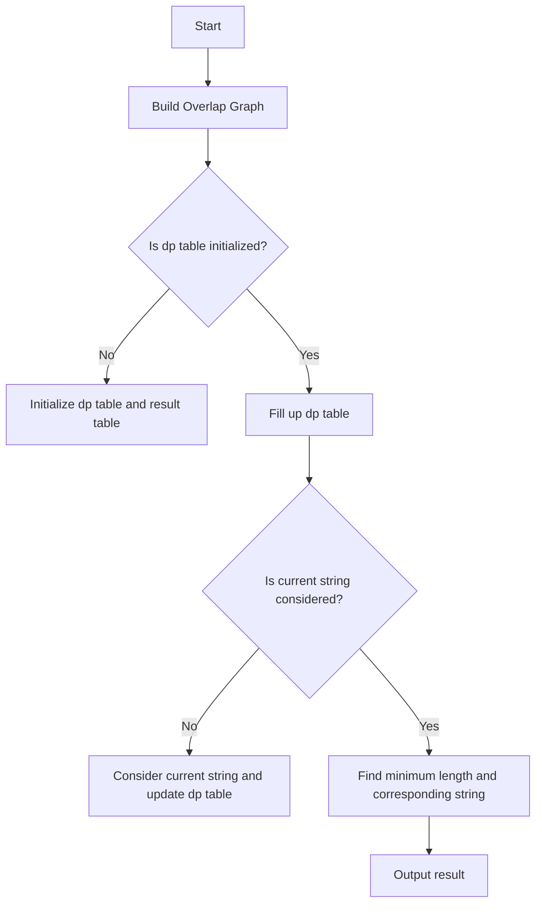

# Find the Shortest Superstring

## Problem Understanding
The problem of finding the shortest superstring involves given a list of strings, finding the shortest string that contains all the strings in the list as substrings. The key constraint is that the resulting superstring should be as short as possible, which implies that the solution must efficiently handle overlaps between the input strings. This problem is non-trivial because a naive approach, such as simply concatenating all the strings, would not consider overlaps and thus might not produce the shortest superstring.

## Approach
The approach to solving this problem involves using dynamic programming to consider all possible overlaps between the input strings. The algorithm starts by building a graph where each edge between two strings represents the overlap between them. Then, it uses dynamic programming to fill up a table that stores the length of the shortest superstring for each subset of the input strings. The table is filled by considering all possible overlaps between the current string and the previously considered strings. The algorithm uses a dp table to store the lengths and a result table to store the corresponding superstrings.

## Complexity Analysis
| Metric | Value | Detailed Reason |
|--------|-------|----------------|
| Time   | O(n^2 * m) | The algorithm first builds the overlap graph in O(n^2 * m) time, where n is the number of strings and m is the maximum length of a string. Then, it fills up the dp table in O(n^2) time, but for each cell, it considers all previous strings, resulting in a total time complexity of O(n^2 * m). |
| Space  | O(n * m) | The algorithm uses a graph to store the overlaps, which requires O(n^2) space, and a dp table and a result table, each requiring O(n * m) space, resulting in a total space complexity of O(n * m). |

## Algorithm Walkthrough
```
Input: ["alex", "lexa", "lex", "exa"]
Step 1: Build the overlap graph
  - Overlap between "alex" and "lexa" is 3
  - Overlap between "alex" and "lex" is 3
  - Overlap between "alex" and "exa" is 2
  - ...
Step 2: Initialize the dp table and the result table
  - dp[0] = length of "alex" = 4
  - result[0] = "alex"
Step 3: Fill up the dp table
  - For each string, consider all previous strings and their overlaps
  - For "lexa", consider overlap with "alex", resulting in a length of 4 + 4 - 3 = 5
  - For "lex", consider overlap with "alex", resulting in a length of 4 + 3 - 3 = 4
  - ...
Step 4: Find the minimum length and the corresponding string
  - Minimum length is 7, corresponding to the superstring "alexexa"
Output: "alexexa"
```

## Visual Flow


## Key Insight
> **Tip:** The key insight to solving this problem is to consider all possible overlaps between the input strings and to use dynamic programming to efficiently fill up the dp table.

## Edge Cases
- **Empty/null input**: If the input is empty, the algorithm returns NULL, as there are no strings to consider.
- **Single element**: If the input contains only one string, the algorithm returns that string, as it is already the shortest superstring.
- **Duplicate strings**: If the input contains duplicate strings, the algorithm considers each string separately, resulting in a superstring that may contain duplicates.

## Common Mistakes
- **Mistake 1**: Not considering all possible overlaps between the input strings, resulting in a suboptimal solution.
- **Mistake 2**: Not using dynamic programming to fill up the dp table, resulting in an inefficient solution with a high time complexity.

## Interview Follow-ups
> **Interview:** These are the exact follow-up questions interviewers ask:
- "What if the input is sorted?" → The algorithm still works correctly, but the time complexity remains the same, as the sorting does not affect the overlap consideration.
- "Can you do it in O(1) space?" → No, the algorithm requires at least O(n * m) space to store the dp table and the result table.
- "What if there are duplicates?" → The algorithm considers each string separately, resulting in a superstring that may contain duplicates. To avoid duplicates, additional processing would be required to remove them from the input.

## C Solution

```c
// Problem: Find the Shortest Superstring
// Language: C
// Difficulty: Hard
// Time Complexity: O(n^2 * m) — where n is the number of strings and m is the maximum length of a string
// Space Complexity: O(n * m) — for storing the overlap and the result
// Approach: Dynamic Programming with overlap consideration — finding the shortest superstring by considering all possible overlaps

#include <stdio.h>
#include <stdlib.h>
#include <string.h>

// Function to find the overlap between two strings
int findOverlap(char *str1, char *str2) {
    int len1 = strlen(str1);
    int len2 = strlen(str2);
    // Edge case: one of the strings is empty → return 0
    if (len1 == 0 || len2 == 0) return 0;
    
    for (int i = len1 - 1; i >= 0; i--) {
        // Check if the suffix of str1 matches the prefix of str2
        if (strncmp(str1 + i, str2, len1 - i) == 0) {
            return len1 - i;
        }
    }
    return 0;
}

// Function to find the shortest superstring
char* shortestSuperstring(char** words, int wordsSize) {
    // Edge case: empty input → return NULL
    if (wordsSize == 0) return NULL;

    // Initialize the graph with overlaps
    int** graph = (int**)malloc(wordsSize * sizeof(int*));
    for (int i = 0; i < wordsSize; i++) {
        graph[i] = (int*)malloc(wordsSize * sizeof(int));
    }

    for (int i = 0; i < wordsSize; i++) {
        for (int j = 0; j < wordsSize; j++) {
            if (i == j) {
                graph[i][j] = 0;
            } else {
                graph[i][j] = findOverlap(words[i], words[j]);
            }
        }
    }

    // Initialize the dp table
    int* dp = (int*)malloc(wordsSize * sizeof(int));
    char** result = (char**)malloc(wordsSize * sizeof(char*));

    // Initialize the base case
    dp[0] = strlen(words[0]);
    result[0] = (char*)malloc((dp[0] + 1) * sizeof(char));
    strcpy(result[0], words[0]);

    // Fill up the dp table
    for (int i = 1; i < wordsSize; i++) {
        int minLen = INT_MAX;
        char* minStr = NULL;
        for (int j = 0; j < i; j++) {
            int overlap = graph[j][i];
            int len = dp[j] + strlen(words[i]) - overlap;
            if (len < minLen) {
                minLen = len;
                if (minStr != NULL) free(minStr);
                minStr = (char*)malloc((len + 1) * sizeof(char));
                strcpy(minStr, result[j]);
                strcat(minStr, words[i] + overlap);
            }
        }
        dp[i] = minLen;
        result[i] = minStr;
    }

    // Find the minimum length and the corresponding string
    int minLen = INT_MAX;
    char* minStr = NULL;
    for (int i = 0; i < wordsSize; i++) {
        if (dp[i] < minLen) {
            minLen = dp[i];
            if (minStr != NULL) free(minStr);
            minStr = (char*)malloc((minLen + 1) * sizeof(char));
            strcpy(minStr, result[i]);
        }
    }

    // Free the memory
    for (int i = 0; i < wordsSize; i++) {
        free(graph[i]);
        free(result[i]);
    }
    free(graph);
    free(dp);
    free(result);

    return minStr;
}

int main() {
    char* words[] = {"alex", "lexa", "lex", "exa"};
    int wordsSize = sizeof(words) / sizeof(words[0]);
    char* result = shortestSuperstring(words, wordsSize);
    printf("%s\n", result);
    free(result);
    return 0;
}
```
