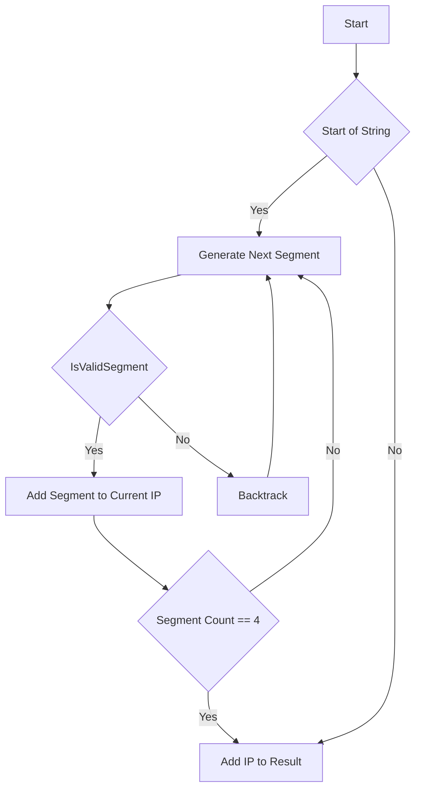

# Generate all Valid IP Addresses from String

## Problem Understanding
The problem asks to generate all valid IP addresses from a given string of digits. The key constraint is that the generated IP addresses must be valid, meaning each segment must be between 0 and 255, and must not start with 0 unless it is 0 itself. The problem is non-trivial because a naive approach would involve trying all possible combinations of segments, which would result in many invalid IP addresses. The constraint that each segment must be between 0 and 255, and must not start with 0 unless it is 0 itself, adds complexity to the problem.

## Approach
The algorithm strategy used is backtracking with string splitting. The intuition behind it is to try all possible splits of the string into 4 segments, and check if each segment is a valid IP segment. The approach works by using a recursive function to generate all possible splits of the string, and checking if each split is valid. A result structure is used to store the valid IP addresses. The approach handles the key constraints by checking if each segment is a valid IP segment before adding it to the result.

## Complexity Analysis
| Metric | Value | Detailed Reason |
|--------|-------|----------------|
| Time   | O(3^n) | The algorithm generates all possible splits of the string, which is O(3^n) because each character in the string can be the start of a new segment, the end of the previous segment, or part of the previous segment. The isValidSegment function takes O(n) time, but it is called O(3^n) times, so the overall time complexity is O(3^n) * O(n) = O(3^n) because n is bounded by the length of the string. |
| Space  | O(n) | The algorithm uses a result structure to store the valid IP addresses, which takes O(n) space because the maximum number of valid IP addresses is bounded by the length of the string. The recursive function call stack also takes O(n) space because the maximum depth of the recursion tree is bounded by the length of the string. |

## Algorithm Walkthrough
```
Input: s = "25525511135"
Step 1: start = 0, current = "", segmentCount = 0
Step 2: try all possible lengths for the next segment: len = 1, 2, 3
Step 3: for len = 1, segment = "2", isValidSegment("2") = 1
Step 4: add "2" to current, current = "2", segmentCount = 1
Step 5: recursively call generateIPAddresses with start = 1, current = "2", segmentCount = 1
Step 6: try all possible lengths for the next segment: len = 1, 2, 3
Step 7: for len = 2, segment = "55", isValidSegment("55") = 1
Step 8: add "55" to current, current = "2.55", segmentCount = 2
Step 9: recursively call generateIPAddresses with start = 3, current = "2.55", segmentCount = 2
...
Output: all valid IP addresses, such as "255.255.11.135", "255.255.111.35"
```
## Visual Flow

## Key Insight
> **Tip:** The key insight is to use backtracking to generate all possible splits of the string, and to check if each segment is a valid IP segment before adding it to the result.

## Edge Cases
- **Empty/null input**: If the input string is empty or null, the algorithm will not generate any valid IP addresses.
- **Single element**: If the input string has only one element, the algorithm will not generate any valid IP addresses because a single element cannot form a valid IP address.
- **All zeros**: If the input string consists of all zeros, the algorithm will generate a single valid IP address: "0.0.0.0".

## Common Mistakes
- **Mistake 1**: Not checking if a segment starts with 0 unless it is 0 itself. To avoid this mistake, add a check in the isValidSegment function to return 0 if the segment starts with 0 and has a length greater than 1.
- **Mistake 2**: Not handling the case where the input string has a length less than 4. To avoid this mistake, add a check at the beginning of the algorithm to return an empty result if the length of the input string is less than 4.

## Interview Follow-ups
> **Interview:** These are the exact follow-up questions interviewers ask:
- "What if the input is sorted?" → The algorithm will still generate all valid IP addresses, but the order of the segments may be different.
- "Can you do it in O(1) space?" → No, because we need to store the result and intermediate strings, which takes O(n) space.
- "What if there are duplicates?" → The algorithm will generate duplicate IP addresses if there are duplicate segments. To avoid this, we can add a check to skip duplicate segments.

## C Solution

```c
// Problem: Generate all Valid IP Addresses from String
// Language: C
// Difficulty: Hard
// Time Complexity: O(3^n) — generating all possible splits of the string
// Space Complexity: O(n) — storing the result and intermediate strings
// Approach: Backtracking with string splitting — for each position, try splitting into 4 parts

#include <stdio.h>
#include <stdlib.h>
#include <string.h>
#include <ctype.h>

// Structure to store the result
typedef struct {
    char** data;
    int size;
    int capacity;
} Result;

// Function to initialize the result structure
void initResult(Result* result, int capacity) {
    result->data = (char**) malloc(capacity * sizeof(char*));
    result->size = 0;
    result->capacity = capacity;
}

// Function to add a new string to the result
void addResult(Result* result, char* str) {
    if (result->size < result->capacity) {
        result->data[result->size] = (char*) malloc(strlen(str) + 1);
        strcpy(result->data[result->size], str);
        result->size++;
    }
}

// Function to check if a string is a valid IP segment
int isValidSegment(char* segment) {
    // Edge case: segment is empty
    if (strlen(segment) == 0) return 0;
    // Edge case: segment starts with 0 and is not 0
    if (segment[0] == '0' && strlen(segment) > 1) return 0;
    int num = atoi(segment);
    return num >= 0 && num <= 255;
}

// Function to generate all valid IP addresses
void generateIPAddresses(char* s, int start, char* current, int segmentCount, Result* result) {
    // Edge case: if we have 4 segments and we have reached the end of the string
    if (segmentCount == 4 && start == strlen(s)) {
        // Add the current IP address to the result
        addResult(result, current);
        return;
    }
    // Try all possible lengths for the next segment
    for (int len = 1; len <= 3; len++) {
        // Edge case: if the next segment would exceed the string length
        if (start + len > strlen(s)) break;
        // Get the next segment
        char segment[4];
        strncpy(segment, s + start, len);
        segment[len] = '\0';
        // Check if the next segment is valid
        if (isValidSegment(segment)) {
            // Add the next segment to the current IP address
            int currentLen = strlen(current);
            if (currentLen > 0) strcat(current, ".");
            strcat(current, segment);
            // Recursively generate the next segments
            generateIPAddresses(s, start + len, current, segmentCount + 1, result);
            // Remove the last segment from the current IP address (backtracking)
            current[currentLen] = '\0';
            if (currentLen > 0) current[currentLen - 1] = '\0';
        }
    }
}

int main() {
    char s[] = "25525511135";
    Result result;
    initResult(&result, 1000);
    char current[20] = "";
    generateIPAddresses(s, 0, current, 0, &result);
    // Print the result
    for (int i = 0; i < result.size; i++) {
        printf("%s\n", result.data[i]);
        free(result.data[i]);
    }
    free(result.data);
    return 0;
}
```
