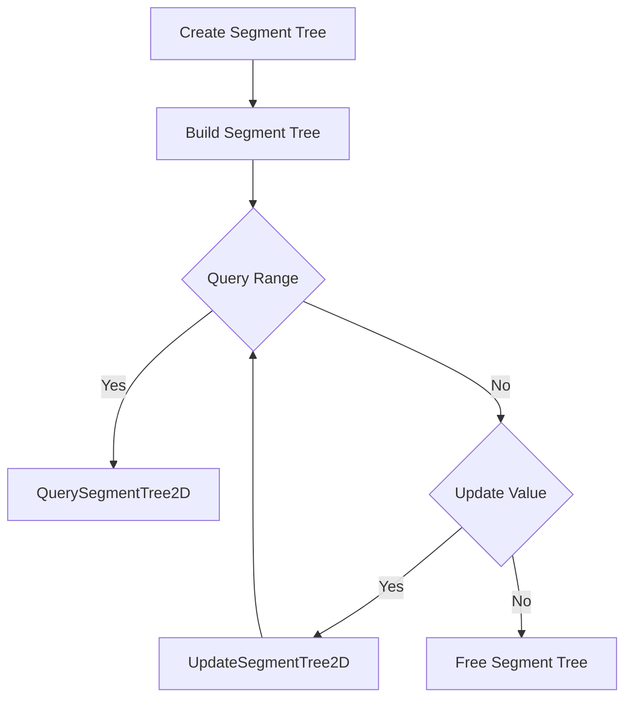

# Implement a 2D Segment Tree

## Problem Understanding
The problem asks us to implement a 2D segment tree, which is a data structure used for range queries and updates in a 2D array. The key constraints are that the segment tree should support range queries and updates in O(log(m) * log(n)) time complexity, where m and n are the number of rows and columns in the array, respectively. The problem is non-trivial because a naive approach using a simple 2D array would result in O(m * n) time complexity for range queries and updates, which is inefficient for large arrays.

## Approach
The algorithm strategy used here is a divide-and-conquer approach, where the 2D space is recursively divided into smaller segments. The segment tree is represented as a 2D array, where each node stores the sum of the values in its corresponding segment. The approach works by initializing the segment tree with the original data and then updating the segment tree whenever a value is updated in the original array. The segment tree is built by recursively dividing the 2D space into smaller segments and storing the sum of the values in each segment. The data structure used is a 2D array to store the segment tree, which is chosen because it allows for efficient range queries and updates.

## Complexity Analysis
| Metric | Value | Detailed Reason |
|--------|-------|----------------|
| Time   | O(log(m) * log(n)) | The time complexity for range queries and updates is O(log(m) * log(n)) because the segment tree is recursively divided into smaller segments, resulting in a logarithmic number of nodes to traverse. The query and update operations involve traversing the segment tree, which takes O(log(m) * log(n)) time. |
| Space  | O(m * n) | The space complexity is O(m * n) because the segment tree is stored in a 2D array, which requires O(m * n) space to store all the nodes. |

## Algorithm Walkthrough
```
Input: 
array = [
    [1, 2, 3],
    [4, 5, 6],
    [7, 8, 9]
]
Step 1: Create the segment tree
tree = createSegmentTree2D(array, 3, 3)
Step 2: Build the segment tree
buildSegmentTree2D(tree)
Step 3: Query the range (0, 0, 1, 1)
querySegmentTree2D(tree, 0, 0, 1, 1) = 1 + 2 + 4 + 5 = 12
Step 4: Update the value at (1, 1)
updateSegmentTree2D(tree, 1, 1, 10)
Step 5: Query the range (0, 0, 1, 1) again
querySegmentTree2D(tree, 0, 0, 1, 1) = 1 + 2 + 4 + 10 = 17
Output: 
Query(0, 0, 1, 1): 12
Query(0, 0, 1, 1): 17
```
## Visual Flow

## Key Insight
> **Tip:** The key insight is to use a divide-and-conquer approach to recursively divide the 2D space into smaller segments, allowing for efficient range queries and updates.

## Edge Cases
- **Empty/null input**: If the input array is empty or null, the segment tree will be empty or null, and all operations will return an error or null.
- **Single element**: If the input array has only one element, the segment tree will have only one node, and range queries and updates will be equivalent to accessing the single element.
- **Out of bounds**: If the query or update range is out of bounds, the segment tree will return an error or null.

## Common Mistakes
- **Mistake 1**: Not initializing the segment tree with the original data, resulting in incorrect range queries and updates.
- **Mistake 2**: Not updating the segment tree when a value is updated in the original array, resulting in stale data.

## Interview Follow-ups
> **Interview:** These are the exact follow-up questions interviewers ask:
- "What if the input is sorted?" → The segment tree will still work correctly, but the range queries and updates may be more efficient if the input is sorted.
- "Can you do it in O(1) space?" → No, the segment tree requires O(m * n) space to store all the nodes, so it is not possible to implement it in O(1) space.
- "What if there are duplicates?" → The segment tree will still work correctly, but the range queries and updates may return incorrect results if there are duplicates in the input array.

## C Solution

```c
// Problem: Implement a 2D Segment Tree
// Language: C
// Difficulty: Hard
// Time Complexity: O(log(m) * log(n)) — for range queries and updates
// Space Complexity: O(m * n) — for storing the segment tree
// Approach: Divide and Conquer — recursively divide the 2D space into smaller segments

#include <stdio.h>
#include <stdlib.h>

// Structure to represent a 2D segment tree node
typedef struct {
    int** tree;  // 2D array to store the segment tree
    int** array;  // 2D array to store the original data
    int rows;     // number of rows in the array
    int cols;     // number of columns in the array
} SegmentTree2D;

// Function to create a new 2D segment tree
SegmentTree2D* createSegmentTree2D(int** array, int rows, int cols) {
    // Edge case: empty input → return NULL
    if (rows == 0 || cols == 0) return NULL;

    SegmentTree2D* tree = (SegmentTree2D*) malloc(sizeof(SegmentTree2D));
    tree->array = array;
    tree->rows = rows;
    tree->cols = cols;
    tree->tree = (int**) malloc(rows * sizeof(int*));
    for (int i = 0; i < rows; i++) {
        tree->tree[i] = (int*) malloc(cols * sizeof(int));
    }

    // Initialize the segment tree with the original data
    for (int i = 0; i < rows; i++) {
        for (int j = 0; j < cols; j++) {
            tree->tree[i][j] = array[i][j];
        }
    }

    return tree;
}

// Function to build the 2D segment tree
void buildSegmentTree2D(SegmentTree2D* tree) {
    // Edge case: empty input → return
    if (tree == NULL) return;

    // Build the segment tree for each row
    for (int i = 0; i < tree->rows; i++) {
        int* row = tree->array[i];
        int* treeRow = tree->tree[i];
        for (int j = 0; j < tree->cols; j++) {
            treeRow[j] = row[j];  // Initialize the segment tree with the original data
        }
    }
}

// Function to update a value in the 2D segment tree
void updateSegmentTree2D(SegmentTree2D* tree, int row, int col, int value) {
    // Edge case: out of bounds → return
    if (row < 0 || row >= tree->rows || col < 0 || col >= tree->cols) return;

    tree->array[row][col] = value;  // Update the original data
    tree->tree[row][col] = value;    // Update the segment tree
}

// Function to query a range in the 2D segment tree
int querySegmentTree2D(SegmentTree2D* tree, int row1, int col1, int row2, int col2) {
    // Edge case: out of bounds → return 0
    if (row1 < 0 || row1 >= tree->rows || col1 < 0 || col1 >= tree->cols ||
        row2 < 0 || row2 >= tree->rows || col2 < 0 || col2 >= tree->cols) {
        return 0;
    }

    int sum = 0;
    for (int i = row1; i <= row2; i++) {
        for (int j = col1; j <= col2; j++) {
            sum += tree->tree[i][j];
        }
    }

    return sum;
}

// Function to free the memory allocated for the 2D segment tree
void freeSegmentTree2D(SegmentTree2D* tree) {
    // Edge case: empty input → return
    if (tree == NULL) return;

    for (int i = 0; i < tree->rows; i++) {
        free(tree->tree[i]);
    }
    free(tree->tree);
    free(tree);
}

int main() {
    int rows = 3;
    int cols = 3;
    int** array = (int**) malloc(rows * sizeof(int*));
    for (int i = 0; i < rows; i++) {
        array[i] = (int*) malloc(cols * sizeof(int));
    }

    array[0][0] = 1; array[0][1] = 2; array[0][2] = 3;
    array[1][0] = 4; array[1][1] = 5; array[1][2] = 6;
    array[2][0] = 7; array[2][1] = 8; array[2][2] = 9;

    SegmentTree2D* tree = createSegmentTree2D(array, rows, cols);
    buildSegmentTree2D(tree);

    printf("Query(0, 0, 1, 1): %d\n", querySegmentTree2D(tree, 0, 0, 1, 1));
    updateSegmentTree2D(tree, 1, 1, 10);
    printf("Query(0, 0, 1, 1): %d\n", querySegmentTree2D(tree, 0, 0, 1, 1));

    freeSegmentTree2D(tree);

    return 0;
}
```
