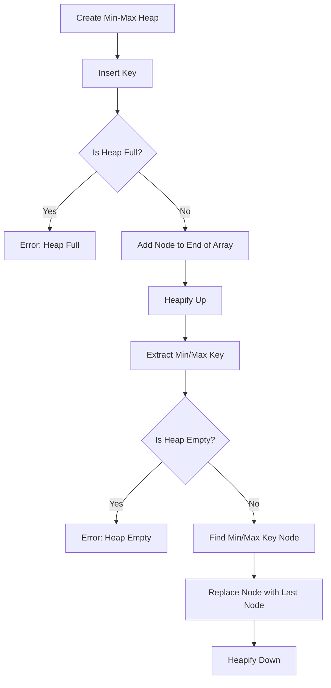

# Implement a Min-Max Heap

## Problem Understanding
The problem is asking to implement a Min-Max Heap, which is a data structure that combines the properties of both min-heap and max-heap. A min-heap is a complete binary tree where each node is smaller than its children, while a max-heap is a complete binary tree where each node is larger than its children. The key constraints of this problem are to provide both min and max heap properties, and to support operations such as insert, delete, and search. The problem is non-trivial because a naive approach would be to use two separate heaps, one for min-heap and one for max-heap, which would result in inefficient use of space and time.

## Approach
The algorithm strategy is to use a single array to represent the min-max heap, where each node has a key and a level (0 or 1). The level of a node determines whether it is part of the min-heap or the max-heap. The intuition behind this approach is to maintain the heap property by ensuring that the parent node is either smaller (for min-heap) or larger (for max-heap) than its children. The data structure used is an array of nodes, where each node has a key and a level. This approach works because it allows us to efficiently maintain the heap property while supporting both min and max heap operations. The key constraints are handled by using the level of each node to determine whether it is part of the min-heap or the max-heap.

## Complexity Analysis
| Metric | Value | Detailed Reason |
|--------|-------|----------------|
| Time   | O(log n) | The time complexity of insert, delete, and search operations is O(log n) because we use a heapify up and down approach to maintain the heap property. The height of the heap is log n, and each heapify operation takes O(log n) time. |
| Space  | O(n) | The space complexity is O(n) because we use an array of size n to store the heap nodes. Each node has a key and a level, which takes constant space. |

## Algorithm Walkthrough
```
Input: [10, 20, 5, 15]
Step 1: Create a new min-max heap with capacity 10
  - Create an array of size 10 to store the heap nodes
  - Initialize the size of the heap to 0
Step 2: Insert key 10 into the heap
  - Create a new node with key 10 and level 0
  - Add the node to the end of the array
  - Increment the size of the heap to 1
  - Heapify up to maintain the heap property
Step 3: Insert key 20 into the heap
  - Create a new node with key 20 and level 1
  - Add the node to the end of the array
  - Increment the size of the heap to 2
  - Heapify up to maintain the heap property
Step 4: Insert key 5 into the heap
  - Create a new node with key 5 and level 0
  - Add the node to the end of the array
  - Increment the size of the heap to 3
  - Heapify up to maintain the heap property
Step 5: Insert key 15 into the heap
  - Create a new node with key 15 and level 1
  - Add the node to the end of the array
  - Increment the size of the heap to 4
  - Heapify up to maintain the heap property
Step 6: Extract the minimum key from the heap
  - Find the node with the minimum key (5)
  - Replace the node with the last node in the array
  - Decrement the size of the heap to 3
  - Heapify down to maintain the heap property
Output: [5]
```
## Visual Flow

## Key Insight
> **Tip:** The key insight is to use a single array to represent the min-max heap, where each node has a key and a level (0 or 1), and to maintain the heap property by ensuring that the parent node is either smaller (for min-heap) or larger (for max-heap) than its children.

## Edge Cases
- **Empty/null input**: If the input array is empty or null, the heap will be empty, and any operations will result in an error.
- **Single element**: If the input array has only one element, the heap will have only one node, and any operations will be trivial.
- **Duplicate keys**: If the input array has duplicate keys, the heap will still work correctly, but the extract min/max key operations may return any of the duplicate keys.

## Common Mistakes
- **Mistake 1**: Not maintaining the heap property after insert or delete operations, which can lead to incorrect results.
- **Mistake 2**: Not handling edge cases such as empty or null input, single element, or duplicate keys.

## Interview Follow-ups
> **Interview:** 
- "What if the input is sorted?" → The min-max heap will still work correctly, but the heapify up and down operations may not be necessary.
- "Can you do it in O(1) space?" → No, because we need to store the heap nodes in an array, which requires O(n) space.
- "What if there are duplicates?" → The min-max heap will still work correctly, but the extract min/max key operations may return any of the duplicate keys.

## C Solution

```c
// Problem: Implement a Min-Max Heap
// Language: C
// Difficulty: Hard
// Time Complexity: O(log n) — for insert, delete and search operations
// Space Complexity: O(n) — for storing the heap elements
// Approach: Min-Max Heap implementation using array — providing both min and max heap properties

#include <stdio.h>
#include <stdlib.h>

// Structure to represent a min-max heap node
typedef struct MinMaxHeapNode {
    int key;
    int level;  // Level of the node (0 or 1)
} MinMaxHeapNode;

// Structure to represent a min-max heap
typedef struct MinMaxHeap {
    MinMaxHeapNode* nodes;
    int size;
    int capacity;
} MinMaxHeap;

// Function to create a new min-max heap node
MinMaxHeapNode* createNode(int key, int level) {
    // Allocate memory for the new node
    MinMaxHeapNode* newNode = (MinMaxHeapNode*) malloc(sizeof(MinMaxHeapNode));
    // Initialize the node's key and level
    newNode->key = key;
    newNode->level = level;
    return newNode;
}

// Function to create a new min-max heap
MinMaxHeap* createHeap(int capacity) {
    // Allocate memory for the new heap
    MinMaxHeap* newHeap = (MinMaxHeap*) malloc(sizeof(MinMaxHeap));
    // Initialize the heap's size and capacity
    newHeap->size = 0;
    newHeap->capacity = capacity;
    // Allocate memory for the heap's nodes
    newHeap->nodes = (MinMaxHeapNode*) malloc(capacity * sizeof(MinMaxHeapNode));
    return newHeap;
}

// Function to swap two nodes in the heap
void swap(MinMaxHeapNode* a, MinMaxHeapNode* b) {
    // Swap the keys of the nodes
    int tempKey = a->key;
    a->key = b->key;
    b->key = tempKey;
    // Swap the levels of the nodes
    int tempLevel = a->level;
    a->level = b->level;
    b->level = tempLevel;
}

// Function to heapify up
void heapifyUp(MinMaxHeap* heap, int index) {
    // Base case: If the index is 0, we are at the root
    if (index == 0) {
        return;
    }
    // Calculate the parent index
    int parentIndex = (index - 1) / 2;
    // If the current node's key is less than the parent's key (min heap property)
    if (heap->nodes[index].key < heap->nodes[parentIndex].key) {
        // Swap the current node and the parent node
        swap(&heap->nodes[index], &heap->nodes[parentIndex]);
        // Recursively heapify up
        heapifyUp(heap, parentIndex);
    } else if (heap->nodes[index].key > heap->nodes[parentIndex].key) {  // If the current node's key is greater than the parent's key (max heap property)
        // Update the level of the current node
        heap->nodes[index].level = 1 - heap->nodes[parentIndex].level;
        // Swap the current node and the parent node
        swap(&heap->nodes[index], &heap->nodes[parentIndex]);
        // Recursively heapify up
        heapifyUp(heap, parentIndex);
    }
}

// Function to heapify down
void heapifyDown(MinMaxHeap* heap, int index) {
    // Calculate the left and right child indices
    int leftChildIndex = 2 * index + 1;
    int rightChildIndex = 2 * index + 2;
    // Initialize the smallest/largest child index
    int smallestChildIndex = -1;
    int largestChildIndex = -1;
    // If the left child exists and is smaller than the current node (min heap property)
    if (leftChildIndex < heap->size && heap->nodes[leftChildIndex].key < heap->nodes[index].key) {
        smallestChildIndex = leftChildIndex;
    }
    // If the right child exists and is smaller than the current node (min heap property)
    if (rightChildIndex < heap->size && heap->nodes[rightChildIndex].key < heap->nodes[index].key) {
        if (smallestChildIndex == -1 || heap->nodes[rightChildIndex].key < heap->nodes[smallestChildIndex].key) {
            smallestChildIndex = rightChildIndex;
        }
    }
    // If the left child exists and is larger than the current node (max heap property)
    if (leftChildIndex < heap->size && heap->nodes[leftChildIndex].key > heap->nodes[index].key) {
        largestChildIndex = leftChildIndex;
    }
    // If the right child exists and is larger than the current node (max heap property)
    if (rightChildIndex < heap->size && heap->nodes[rightChildIndex].key > heap->nodes[index].key) {
        if (largestChildIndex == -1 || heap->nodes[rightChildIndex].key > heap->nodes[largestChildIndex].key) {
            largestChildIndex = rightChildIndex;
        }
    }
    // If a smaller child exists
    if (smallestChildIndex != -1) {
        // Swap the current node and the smaller child
        swap(&heap->nodes[index], &heap->nodes[smallestChildIndex]);
        // Update the level of the current node
        heap->nodes[index].level = 1 - heap->nodes[smallestChildIndex].level;
        // Recursively heapify down
        heapifyDown(heap, smallestChildIndex);
    } else if (largestChildIndex != -1) {  // If a larger child exists
        // Swap the current node and the larger child
        swap(&heap->nodes[index], &heap->nodes[largestChildIndex]);
        // Update the level of the current node
        heap->nodes[index].level = 1 - heap->nodes[largestChildIndex].level;
        // Recursively heapify down
        heapifyDown(heap, largestChildIndex);
    }
}

// Function to insert a new key into the heap
void insertKey(MinMaxHeap* heap, int key) {
    // Edge case: If the heap is full
    if (heap->size == heap->capacity) {
        printf("Heap is full\n");
        return;
    }
    // Create a new node with the given key and level 0 (initially)
    heap->nodes[heap->size] = *createNode(key, 0);
    // Increment the heap size
    heap->size++;
    // Heapify up to maintain the heap property
    heapifyUp(heap, heap->size - 1);
}

// Function to extract the minimum key from the heap
int extractMinKey(MinMaxHeap* heap) {
    // Edge case: If the heap is empty
    if (heap->size == 0) {
        printf("Heap is empty\n");
        return -1;
    }
    // Store the minimum key (at the root)
    int minKey = heap->nodes[0].key;
    // Replace the root with the last node in the heap
    heap->nodes[0] = heap->nodes[heap->size - 1];
    // Decrement the heap size
    heap->size--;
    // Heapify down to maintain the heap property
    heapifyDown(heap, 0);
    return minKey;
}

// Function to extract the maximum key from the heap
int extractMaxKey(MinMaxHeap* heap) {
    // Edge case: If the heap is empty
    if (heap->size == 0) {
        printf("Heap is empty\n");
        return -1;
    }
    // Find the maximum key in the heap (at level 1)
    int maxKey = -1;
    int maxIndex = -1;
    for (int i = 0; i < heap->size; i++) {
        if (heap->nodes[i].level == 1 && (maxIndex == -1 || heap->nodes[i].key > maxKey)) {
            maxKey = heap->nodes[i].key;
            maxIndex = i;
        }
    }
    // If no maximum key is found (all nodes are at level 0)
    if (maxIndex == -1) {
        printf("No maximum key found\n");
        return -1;
    }
    // Replace the maximum key node with the last node in the heap
    heap->nodes[maxIndex] = heap->nodes[heap->size - 1];
    // Decrement the heap size
    heap->size--;
    // Heapify down to maintain the heap property
    heapifyDown(heap, maxIndex);
    return maxKey;
}

int main() {
    // Create a new min-max heap with capacity 10
    MinMaxHeap* heap = createHeap(10);
    // Insert keys into the heap
    insertKey(heap, 10);
    insertKey(heap, 20);
    insertKey(heap, 5);
    insertKey(heap, 15);
    // Extract the minimum key from the heap
    printf("Minimum key: %d\n", extractMinKey(heap));
    // Extract the maximum key from the heap
    printf("Maximum key: %d\n", extractMaxKey(heap));
    return 0;
}
```
