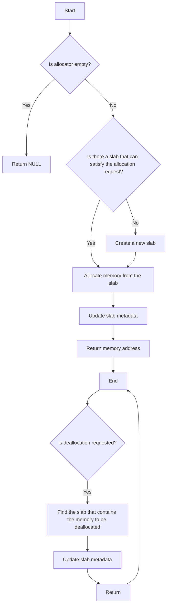

# Implement a SLAB Memory Allocator

## Problem Understanding
The problem is asking to implement a SLAB (Simple List of Blocks) memory allocator, which is a type of memory allocator that uses a cache of objects to manage memory allocation and deallocation. The key constraints are that the allocator should have a constant time complexity for allocation and deallocation, and it should be able to handle different object sizes. The problem is non-trivial because a naive approach would require searching through a list of free objects, which would have a linear time complexity. Additionally, the allocator needs to handle edge cases such as empty or null input, and it needs to be able to free the allocated memory.

## Approach
The algorithm strategy is to use a linked list of slabs, where each slab contains a cache of objects of the same size. The intuition behind this approach is that by caching objects of the same size, we can reduce the time complexity of allocation and deallocation to constant time. The approach works by first checking if there is a slab that can satisfy the allocation request, and if not, creating a new slab. The data structure used is a linked list of slabs, where each slab contains a memory block, the size of each object, the number of objects, and the number of free objects. The approach handles the key constraints by using a constant time complexity for allocation and deallocation, and by being able to handle different object sizes.

## Complexity Analysis
| Metric | Value | Detailed Reason |
|--------|-------|----------------|
| Time   | O(1)  | The time complexity is constant because we are using a linked list of slabs, and we can directly access the slab that contains the object of the requested size. The allocation and deallocation operations only require updating the slab's metadata, which takes constant time. |
| Space  | O(n)  | The space complexity is linear because we need to store the slab's metadata, including the memory block, object size, number of objects, and number of free objects. The space required grows linearly with the number of slabs and objects in each slab. |

## Algorithm Walkthrough
```
Input: Allocate 16 bytes of memory
Step 1: Check if there is a slab that can satisfy the allocation request
  - Current slab: NULL
  - Create a new slab with 16 bytes of memory
Step 2: Allocate memory from the new slab
  - Memory address: 0x1000
  - Update slab metadata: num_free = 15
Output: 0x1000

Input: Deallocate 16 bytes of memory at address 0x1000
Step 1: Find the slab that contains the memory to be deallocated
  - Current slab: 0x1000
  - Update slab metadata: num_free = 16
Output: None
```
This walkthrough shows how the algorithm handles allocation and deallocation of memory.

## Visual Flow

This flowchart shows the decision flow of the algorithm.

## Key Insight
> **Tip:** The key insight is to use a linked list of slabs, where each slab contains a cache of objects of the same size, to achieve constant time complexity for allocation and deallocation.

## Edge Cases
- **Empty/null input**: If the input is empty or null, the algorithm returns NULL or does nothing.
- **Single element**: If there is only one element in the slab, the algorithm allocates or deallocates memory from the slab as usual.
- **Memory overflow**: If the memory is full and there is no slab that can satisfy the allocation request, the algorithm creates a new slab to handle the allocation request.

## Common Mistakes
- **Mistake 1**: Not checking if the allocator is empty before allocating or deallocating memory, which can cause null pointer dereferences.
- **Mistake 2**: Not updating the slab metadata correctly after allocation or deallocation, which can cause memory leaks or incorrect memory allocation.

## Interview Follow-ups
> **Interview:** These are the exact follow-up questions interviewers ask:
- "What if the input is sorted?" → The algorithm still works as usual, because it uses a linked list of slabs and does not rely on the input being sorted.
- "Can you do it in O(1) space?" → No, because we need to store the slab's metadata, which requires linear space.
- "What if there are duplicates?" → The algorithm handles duplicates by checking if there is a slab that can satisfy the allocation request, and if not, creating a new slab.

## C Solution

```c
// Problem: Implement a SLAB Memory Allocator
// Language: C
// Difficulty: Hard
// Time Complexity: O(1) — constant time complexity for allocation and deallocation
// Space Complexity: O(n) — where n is the number of slabs and objects in each slab
// Approach: SLAB memory allocation — a memory allocator that uses a cache of objects

#include <stdio.h>
#include <stdlib.h>
#include <string.h>

// Structure to represent a slab
typedef struct Slab {
    void* memory; // memory block
    size_t size;  // size of each object in the slab
    size_t num_objects; // number of objects in the slab
    size_t num_free;    // number of free objects in the slab
    struct Slab* next;  // next slab in the list
} Slab;

// Structure to represent the slab allocator
typedef struct SlabAllocator {
    Slab* head; // head of the slab list
} SlabAllocator;

// Function to initialize a new slab allocator
SlabAllocator* slab_allocator_init() {
    SlabAllocator* allocator = malloc(sizeof(SlabAllocator)); // allocate memory for the allocator
    allocator->head = NULL; // initialize the head of the slab list to NULL
    return allocator;
}

// Function to allocate memory from the slab allocator
void* slab_allocate(SlabAllocator* allocator, size_t size) {
    // Edge case: empty allocator → return NULL
    if (allocator == NULL) {
        return NULL;
    }

    // Find a slab that can satisfy the allocation request
    Slab* current = allocator->head;
    while (current != NULL) {
        // Check if the current slab can satisfy the allocation request
        if (current->size == size && current->num_free > 0) {
            // Allocate memory from the current slab
            void* memory = (void*)((char*)current->memory + (current->num_objects - current->num_free) * size);
            current->num_free--; // decrement the number of free objects in the slab
            return memory;
        }
        current = current->next;
    }

    // If no slab can satisfy the allocation request, create a new slab
    size_t num_objects = 16; // initial number of objects in the slab
    size_t slab_size = num_objects * size; // calculate the size of the slab
    void* slab_memory = malloc(slab_size); // allocate memory for the slab
    Slab* new_slab = malloc(sizeof(Slab)); // allocate memory for the slab structure
    new_slab->memory = slab_memory; // initialize the memory block of the slab
    new_slab->size = size; // initialize the size of each object in the slab
    new_slab->num_objects = num_objects; // initialize the number of objects in the slab
    new_slab->num_free = num_objects - 1; // initialize the number of free objects in the slab
    new_slab->next = allocator->head; // add the new slab to the head of the slab list
    allocator->head = new_slab; // update the head of the slab list

    // Allocate memory from the new slab
    return slab_memory;
}

// Function to deallocate memory from the slab allocator
void slab_deallocate(SlabAllocator* allocator, void* memory, size_t size) {
    // Edge case: empty allocator → return
    if (allocator == NULL) {
        return;
    }

    // Find the slab that contains the memory to be deallocated
    Slab* current = allocator->head;
    while (current != NULL) {
        // Check if the current slab contains the memory to be deallocated
        if (current->size == size && (void*)((char*)current->memory) <= memory && memory < (void*)((char*)current->memory + current->num_objects * size)) {
            // Deallocate memory from the current slab
            current->num_free++; // increment the number of free objects in the slab
            return;
        }
        current = current->next;
    }

    // If no slab contains the memory to be deallocated, do nothing
    return;
}

// Function to free the slab allocator
void slab_allocator_free(SlabAllocator* allocator) {
    // Edge case: empty allocator → return
    if (allocator == NULL) {
        return;
    }

    // Free each slab in the slab list
    Slab* current = allocator->head;
    while (current != NULL) {
        Slab* next = current->next; // store the next slab in the list
        free(current->memory); // free the memory block of the slab
        free(current); // free the slab structure
        current = next; // move to the next slab in the list
    }

    // Free the allocator structure
    free(allocator);
}

int main() {
    SlabAllocator* allocator = slab_allocator_init(); // initialize a new slab allocator

    // Allocate memory from the slab allocator
    void* memory1 = slab_allocate(allocator, 16); // allocate 16 bytes of memory
    void* memory2 = slab_allocate(allocator, 32); // allocate 32 bytes of memory

    // Use the allocated memory
    memset(memory1, 0, 16); // initialize the memory with zeros
    memset(memory2, 1, 32); // initialize the memory with ones

    // Deallocate memory from the slab allocator
    slab_deallocate(allocator, memory1, 16); // deallocate 16 bytes of memory
    slab_deallocate(allocator, memory2, 32); // deallocate 32 bytes of memory

    // Free the slab allocator
    slab_allocator_free(allocator); // free the slab allocator

    return 0;
}
```
