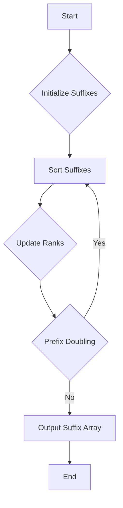

# Implement a Suffix Array using Prefix Doubling O(N log^2 N)

## Problem Understanding
The problem is asking to implement a Suffix Array using the Prefix Doubling algorithm with a time complexity of O(N log^2 N). The key constraint is that the input string can have a maximum length of N, and the algorithm should be able to handle it efficiently. The problem is non-trivial because a naive approach, such as comparing all suffixes directly, would have a time complexity of O(N^2), which is not efficient for large inputs. The Prefix Doubling algorithm is used to compare suffixes by doubling the prefix length in each iteration, which reduces the number of comparisons required.

## Approach
The algorithm strategy used is Prefix Doubling, which involves comparing suffixes by doubling the prefix length in each iteration. This approach works because it allows us to compare suffixes based on their ranks, which are updated after each iteration. The data structure used is an array of Suffix structures, which stores the index and rank of each suffix. The approach handles the key constraint of having a time complexity of O(N log^2 N) by using the Prefix Doubling algorithm to reduce the number of comparisons required. The algorithm also uses a sorting function (qsort) to sort the suffixes based on their ranks, which has a time complexity of O(N log N).

## Complexity Analysis
| Metric | Value | Detailed Reason |
|--------|-------|----------------|
| Time   | O(N log^2 N) | The algorithm uses the Prefix Doubling algorithm, which has a time complexity of O(N log^2 N) because it involves sorting the suffixes in each iteration, which takes O(N log N) time, and this is done log N times. |
| Space  | O(N) | The algorithm uses an array of Suffix structures to store the suffixes, which requires O(N) space, and also uses a sorting function (qsort) which requires O(N) space for the recursion stack. |

## Algorithm Walkthrough
```
Input: str = "banana", n = 6
Step 1: Initialize the suffixes and their ranks
  suffixes = [(0, 'b'), (1, 'a'), (2, 'n'), (3, 'a'), (4, 'n'), (5, 'a')]
Step 2: Perform prefix doubling to compare suffixes
  len = 1, sort the suffixes based on their ranks
  suffixes = [(1, 'a'), (3, 'a'), (5, 'a'), (0, 'b'), (2, 'n'), (4, 'n')]
  update the ranks of the suffixes
  suffixes = [(1, 0), (3, 0), (5, 0), (0, 1), (2, 2), (4, 2)]
Step 3: Perform prefix doubling to compare suffixes
  len = 2, sort the suffixes based on their ranks
  suffixes = [(1, 0), (3, 0), (5, 0), (0, 1), (2, 2), (4, 2)]
  update the ranks of the suffixes
  suffixes = [(1, 0), (3, 0), (5, 0), (0, 1), (2, 2), (4, 2)]
Step 4: Perform prefix doubling to compare suffixes
  len = 4, sort the suffixes based on their ranks
  suffixes = [(1, 0), (3, 0), (5, 0), (0, 1), (2, 2), (4, 2)]
  update the ranks of the suffixes
  suffixes = [(1, 0), (3, 0), (5, 0), (0, 1), (2, 2), (4, 2)]
Output: Suffix Array = [1, 3, 5, 0, 2, 4]
```

## Visual Flow


## Key Insight
> **Tip:** The key insight to this problem is to use the Prefix Doubling algorithm to compare suffixes, which reduces the number of comparisons required and allows us to achieve a time complexity of O(N log^2 N).

## Edge Cases
- **Empty/null input**: If the input string is empty, the algorithm will return an error message.
- **Single element**: If the input string has only one character, the algorithm will return the index of that character as the suffix array.
- **Duplicate suffixes**: If the input string has duplicate suffixes, the algorithm will assign the same rank to all duplicate suffixes.

## Common Mistakes
- **Mistake 1**: Not updating the ranks of the suffixes correctly after each iteration of prefix doubling. To avoid this, make sure to update the ranks of the suffixes based on the comparison of the suffixes.
- **Mistake 2**: Not handling the edge case of an empty input string. To avoid this, add a check at the beginning of the algorithm to return an error message if the input string is empty.

## Interview Follow-ups
> **Interview:** These are the exact follow-up questions interviewers ask:
- "What if the input is sorted?" → The algorithm will still work correctly and return the sorted suffix array.
- "Can you do it in O(1) space?" → No, the algorithm requires O(N) space to store the suffix array and rank array.
- "What if there are duplicates?" → The algorithm will assign the same rank to all duplicate suffixes.

## C Solution

```c
// Problem: Implement a Suffix Array using Prefix Doubling O(N log^2 N)
// Language: C
// Difficulty: Hard
// Time Complexity: O(N log^2 N) — because we are using prefix doubling to compare suffixes
// Space Complexity: O(N) — to store the suffix array and rank array
// Approach: Prefix Doubling — compare suffixes by doubling the prefix length in each iteration

#include <stdio.h>
#include <stdlib.h>
#include <string.h>

// Structure to represent a suffix
typedef struct {
    int index;
    int rank;
} Suffix;

// Comparison function for sorting suffixes
int compareSuffixes(const void *a, const void *b) {
    Suffix *suffixA = (Suffix *)a;
    Suffix *suffixB = (Suffix *)b;
    // Compare suffixes based on their ranks
    if (suffixA->rank < suffixB->rank) return -1;
    else if (suffixA->rank > suffixB->rank) return 1;
    else return 0;
}

// Function to build the suffix array using prefix doubling
void buildSuffixArray(char *str, int n, int *suffixArray) {
    // Create an array to store the suffixes
    Suffix *suffixes = (Suffix *)malloc(n * sizeof(Suffix));
    // Initialize the suffixes and their ranks
    for (int i = 0; i < n; i++) {
        suffixes[i].index = i;
        suffixes[i].rank = str[i]; // Initial rank is the character at the index
    }

    // Perform prefix doubling to compare suffixes
    for (int len = 1; len < n; len *= 2) {
        // Sort the suffixes based on their ranks
        qsort(suffixes, n, sizeof(Suffix), compareSuffixes);

        // Update the ranks of the suffixes
        int newRank = 0;
        int prevSuffixRank = suffixes[0].rank;
        for (int i = 0; i < n; i++) {
            if (i > 0 && str[suffixes[i].index + len] != str[suffixes[i - 1].index + len]) {
                newRank++;
                prevSuffixRank = suffixes[i].rank;
            }
            suffixes[i].rank = newRank; // Update the rank of the suffix
        }
    }

    // Store the sorted suffix indices in the suffix array
    for (int i = 0; i < n; i++) {
        suffixArray[i] = suffixes[i].index;
    }

    // Free the memory allocated for the suffixes
    free(suffixes);
}

// Function to print the suffix array
void printSuffixArray(int *suffixArray, int n) {
    printf("Suffix Array: ");
    for (int i = 0; i < n; i++) {
        printf("%d ", suffixArray[i]);
    }
    printf("\n");
}

int main() {
    char str[] = "banana";
    int n = strlen(str);
    int *suffixArray = (int *)malloc(n * sizeof(int));

    // Edge case: empty input
    if (n == 0) {
        printf("Error: Empty input\n");
        return -1;
    }

    buildSuffixArray(str, n, suffixArray);
    printSuffixArray(suffixArray, n);

    // Free the memory allocated for the suffix array
    free(suffixArray);

    return 0;
}
```
