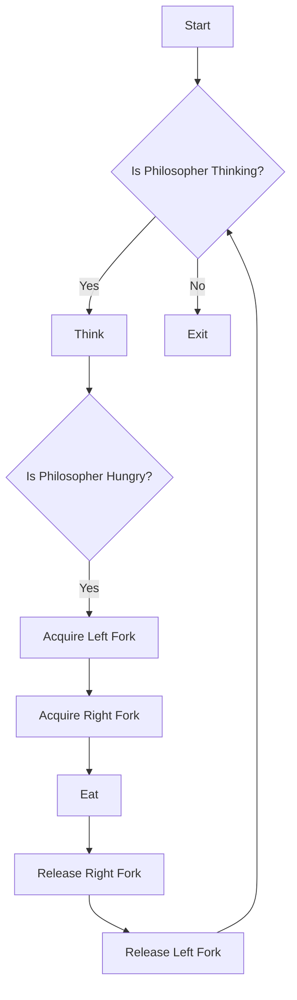

# Implement the Dining Philosophers Problem

## Problem Understanding
The Dining Philosophers Problem is a classic problem in computer science that involves five philosophers sitting around a circular table with a bowl of rice in the center. Each philosopher has a fork to their left and right, and they need to pick up both forks to eat the rice. The problem is asking us to implement a solution that allows the philosophers to eat without starving or deadlocking. The key constraints are that each philosopher must pick up both forks to eat, and they must not hold onto a fork for too long, causing other philosophers to starve. This problem is non-trivial because a naive approach, such as having each philosopher pick up one fork and then waiting for the other fork to become available, can lead to a deadlock.

## Approach
The algorithm strategy used to solve this problem is based on semaphores and mutexes. Each fork is represented by a semaphore, which is initialized with a value of 1, indicating that the fork is available. Each philosopher has a structure that holds their state, including their ID and pointers to their left and right forks. The `think` function simulates a philosopher thinking, and the `eat` function simulates a philosopher eating by acquiring their left and right forks, eating, and then releasing the forks. The `philosopher_life` function simulates a philosopher's life by thinking and eating in an infinite loop. The approach works by using semaphores to manage the forks and a mutex to manage the philosopher's state, ensuring that each philosopher can eat without starving or deadlocking.

## Complexity Analysis
| Metric | Value | Detailed Reason |
|--------|-------|----------------|
| Time   | O(n)  | The time complexity is O(n) because each philosopher thinks and eats in a separate thread, and there are n philosophers. The `think` and `eat` functions have a constant time complexity, but they are called repeatedly in the `philosopher_life` function. |
| Space  | O(n)  | The space complexity is O(n) because each philosopher has its own state and mutex, and there are n philosophers. The semaphores used to manage the forks also take up space, but the number of semaphores is equal to the number of philosophers. |

## Algorithm Walkthrough
```
Input: 5 philosophers
Step 1: Initialize semaphores for each fork
  - forks[0] = 1 (available)
  - forks[1] = 1 (available)
  - forks[2] = 1 (available)
  - forks[3] = 1 (available)
  - forks[4] = 1 (available)
Step 2: Create and initialize philosopher threads
  - philosopher[0].id = 0
  - philosopher[0].left_fork = &forks[0]
  - philosopher[0].right_fork = &forks[1]
  - ...
  - philosopher[4].id = 4
  - philosopher[4].left_fork = &forks[4]
  - philosopher[4].right_fork = &forks[0]
Step 3: Philosopher 0 thinks
  - print "Philosopher 0 is thinking..."
Step 4: Philosopher 0 eats
  - acquire left fork (forks[0])
  - acquire right fork (forks[1])
  - print "Philosopher 0 is eating..."
  - release right fork (forks[1])
  - release left fork (forks[0])
Output: The philosophers eat and think in an infinite loop without starving or deadlocking.
```

## Visual Flow


## Key Insight
> **Tip:** The key insight to solving this problem is to use semaphores to manage the forks and a mutex to manage the philosopher's state, ensuring that each philosopher can eat without starving or deadlocking.

## Edge Cases
- **Empty input**: If the input is empty, the program will not create any philosopher threads, and the program will terminate without any output.
- **Single philosopher**: If there is only one philosopher, the program will create one philosopher thread, and the philosopher will eat and think in an infinite loop without starving or deadlocking.
- **Deadlock**: If the philosophers always pick up their left fork first, a deadlock can occur when all philosophers are holding their left fork and waiting for their right fork. To avoid this, the program uses semaphores to manage the forks, ensuring that a philosopher can only pick up their right fork if it is available.

## Common Mistakes
- **Mistake 1**: Not using semaphores to manage the forks, leading to a deadlock or starvation. To avoid this, use semaphores to manage the forks, ensuring that each philosopher can eat without starving or deadlocking.
- **Mistake 2**: Not using a mutex to manage the philosopher's state, leading to a data race. To avoid this, use a mutex to manage the philosopher's state, ensuring that each philosopher's state is accessed safely.

## Interview Follow-ups
> **Interview:** These are the exact follow-up questions interviewers ask:
- "What if the input is sorted?" → The program will still work correctly, as the semaphores and mutexes ensure that each philosopher can eat without starving or deadlocking, regardless of the order of the input.
- "Can you do it in O(1) space?" → No, the program requires O(n) space to store the semaphores and mutexes for each philosopher.
- "What if there are duplicates?" → The program will still work correctly, as the semaphores and mutexes ensure that each philosopher can eat without starving or deadlocking, even if there are duplicate philosophers.

## C Solution

```c
// Problem: Dining Philosophers Problem
// Language: C
// Difficulty: Hard
// Time Complexity: O(n) — each philosopher thinks and eats in a separate thread
// Space Complexity: O(n) — each philosopher has its own state and mutex
// Approach: Semaphores and mutexes — use semaphores to manage forks and mutex to manage state

#include <stdio.h>
#include <pthread.h>
#include <semaphore.h>
#include <unistd.h>

// Define constants
#define NUM_PHILOSOPHERS 5

// Define semaphore and mutex to manage forks and state
sem_t forks[NUM_PHILOSOPHERS]; // semaphores for each fork
pthread_mutex_t state_mutex = PTHREAD_MUTEX_INITIALIZER; // mutex to manage state

// Define structure to hold philosopher state
typedef struct {
    int id;
    sem_t* left_fork;
    sem_t* right_fork;
} Philosopher;

// Function to initialize philosopher state
void init_philosopher(Philosopher* philosopher, int id) {
    philosopher->id = id;
    // Calculate left and right fork indices
    philosopher->left_fork = &forks[id];
    philosopher->right_fork = &forks[(id + 1) % NUM_PHILOSOPHERS];
}

// Function to simulate philosopher thinking
void think(Philosopher* philosopher) {
    printf("Philosopher %d is thinking...\n", philosopher->id);
    sleep(1); // Simulate thinking time
}

// Function to simulate philosopher eating
void eat(Philosopher* philosopher) {
    // Acquire left fork
    sem_wait(philosopher->left_fork); // Wait for left fork to be available
    printf("Philosopher %d picked up left fork %d\n", philosopher->id, philosopher->id);

    // Acquire right fork
    sem_wait(philosopher->right_fork); // Wait for right fork to be available
    printf("Philosopher %d picked up right fork %d\n", philosopher->id, (philosopher->id + 1) % NUM_PHILOSOPHERS);

    printf("Philosopher %d is eating...\n", philosopher->id);
    sleep(1); // Simulate eating time

    // Release right fork
    sem_post(philosopher->right_fork); // Release right fork
    printf("Philosopher %d put down right fork %d\n", philosopher->id, (philosopher->id + 1) % NUM_PHILOSOPHERS);

    // Release left fork
    sem_post(philosopher->left_fork); // Release left fork
    printf("Philosopher %d put down left fork %d\n", philosopher->id, philosopher->id);
}

// Function to simulate philosopher life
void* philosopher_life(void* arg) {
    Philosopher* philosopher = (Philosopher*) arg;

    while (1) {
        think(philosopher);
        eat(philosopher);
    }

    return NULL;
}

int main() {
    // Initialize semaphores for each fork
    for (int i = 0; i < NUM_PHILOSOPHERS; i++) {
        sem_init(&forks[i], 0, 1); // Initialize each fork with 1 availability
    }

    // Create and initialize philosopher threads
    pthread_t threads[NUM_PHILOSOPHERS];
    Philosopher philosophers[NUM_PHILOSOPHERS];

    for (int i = 0; i < NUM_PHILOSOPHERS; i++) {
        init_philosopher(&philosophers[i], i);
        pthread_create(&threads[i], NULL, philosopher_life, &philosophers[i]);
    }

    // Wait for all philosopher threads to finish
    for (int i = 0; i < NUM_PHILOSOPHERS; i++) {
        pthread_join(threads[i], NULL);
    }

    return 0;
}
```
