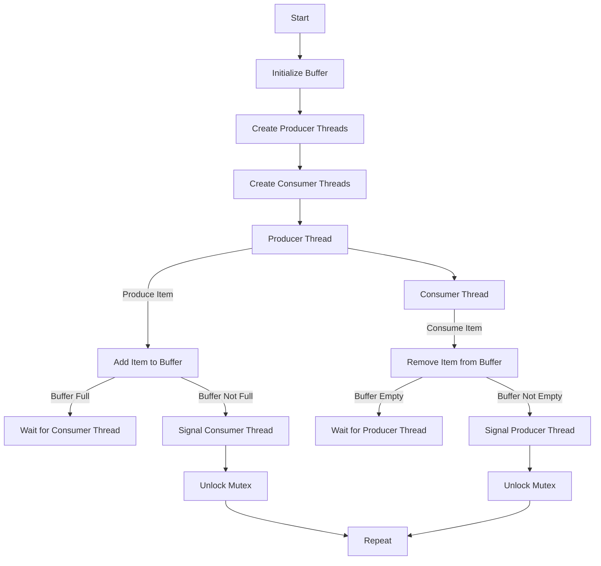

# Implement the Producer-Consumer Problem

## Problem Understanding
The Producer-Consumer Problem is a classic problem in computer science that deals with the synchronization of multiple processes or threads that share a common buffer. The problem involves two types of threads: producers and consumers. Producers produce items and add them to the buffer, while consumers consume items from the buffer. The key constraints are that the buffer has a limited size, and producers should not add items to the buffer when it is full, while consumers should not consume items from the buffer when it is empty. This problem is non-trivial because it requires careful synchronization between producers and consumers to avoid buffer overflow or underflow.

## Approach
The algorithm strategy used to solve this problem is based on multithreading with synchronization using mutex and condition variables. Each producer thread checks if the buffer is full before adding an item, and if it is full, the producer thread waits for a consumer thread to consume an item. Similarly, each consumer thread checks if the buffer is empty before consuming an item, and if it is empty, the consumer thread waits for a producer thread to add an item. The buffer is represented as a circular array, and the `front` and `rear` indices are used to keep track of the next item to be consumed and the next item to be added, respectively. The `count` variable keeps track of the number of items in the buffer.

## Complexity Analysis
| Metric | Value | Detailed Reason |
|--------|-------|----------------|
| Time   | O(1)  | The time complexity of the producer and consumer functions is O(1) because the operations performed on the buffer are constant time operations, such as adding or removing an item from the buffer, and signaling or waiting on a condition variable. The `usleep` function is used to introduce a delay between productions or consumptions, but this does not affect the time complexity. |
| Space  | O(n)  | The space complexity of the algorithm is O(n), where n is the size of the buffer, because the buffer is represented as an array of size n. Additionally, the `producer_threads` and `consumer_threads` arrays have a size of `NUM_PRODUCERS` and `NUM_CONSUMERS`, respectively, but these are constants and do not affect the overall space complexity. |

## Algorithm Walkthrough
```
Input: BUFFER_SIZE = 10, NUM_PRODUCERS = 5, NUM_CONSUMERS = 5
Step 1: Initialize buffer with front = 0, rear = 0, count = 0
Step 2: Create 5 producer threads and 5 consumer threads
Step 3: Producer thread 1 produces item 42 and adds it to the buffer
  - Lock mutex
  - Check if buffer is full (count == BUFFER_SIZE): no
  - Add item to buffer: data[rear] = 42, rear = (rear + 1) % BUFFER_SIZE, count++
  - Signal consumer thread
  - Unlock mutex
Step 4: Consumer thread 1 consumes item 42 from the buffer
  - Lock mutex
  - Check if buffer is empty (count == 0): no
  - Consume item from buffer: item = data[front], front = (front + 1) % BUFFER_SIZE, count--
  - Signal producer thread
  - Unlock mutex
...
Output: Produced: 42, Consumed: 42, ...
```
## Visual Flow

## Key Insight
> **Tip:** The key insight that makes this solution work is the use of condition variables to synchronize the producer and consumer threads, allowing them to wait for each other when the buffer is full or empty.

## Edge Cases
- **Empty/null input**: If the input buffer is empty or null, the producer threads will not be able to add items to the buffer, and the consumer threads will not be able to consume items from the buffer. In this case, the program will hang indefinitely.
- **Single element**: If the buffer has only one element, the producer threads will add items to the buffer one at a time, and the consumer threads will consume items from the buffer one at a time. This is the simplest case, and the program will work correctly.
- **Buffer overflow**: If the buffer is full and a producer thread tries to add an item to the buffer, the producer thread will wait for a consumer thread to consume an item from the buffer. This prevents buffer overflow and ensures that the program works correctly.

## Common Mistakes
- **Mistake 1**: Not using mutexes to protect access to the buffer. This can lead to race conditions and incorrect behavior.
- **Mistake 2**: Not using condition variables to synchronize the producer and consumer threads. This can lead to busy-waiting and inefficient use of CPU resources.

## Interview Follow-ups
> **Interview:** These are the exact follow-up questions interviewers ask:
- "What if the input is sorted?" → The algorithm will still work correctly, but the producer threads may produce items in a specific order, and the consumer threads may consume items in a specific order.
- "Can you do it in O(1) space?" → No, the algorithm requires O(n) space to store the buffer, where n is the size of the buffer.
- "What if there are duplicates?" → The algorithm will work correctly even if there are duplicates in the buffer. The producer threads will add duplicate items to the buffer, and the consumer threads will consume duplicate items from the buffer.

## C Solution

```c
// Problem: Producer-Consumer Problem
// Language: C
// Difficulty: Hard
// Time Complexity: O(1) — constant time operations for producer and consumer
// Space Complexity: O(n) — buffer size is n
// Approach: Multithreading with synchronization using mutex and condition variables — for each producer/consumer, check if buffer is full/empty

#include <stdio.h>
#include <pthread.h>
#include <unistd.h>

// Define constants
#define BUFFER_SIZE 10
#define NUM_PRODUCERS 5
#define NUM_CONSUMERS 5

// Define structure to represent buffer
typedef struct {
    int data[BUFFER_SIZE];
    int front, rear, count;
    pthread_mutex_t mutex;
    pthread_cond_t producer_cond, consumer_cond;
} Buffer;

// Initialize buffer
void init_buffer(Buffer* buffer) {
    buffer->front = buffer->rear = buffer->count = 0;
    pthread_mutex_init(&buffer->mutex, NULL);
    pthread_cond_init(&buffer->producer_cond, NULL);
    pthread_cond_init(&buffer->consumer_cond, NULL);
}

// Producer function
void* producer(void* arg) {
    Buffer* buffer = (Buffer*) arg;
    int item;
    while (1) {
        // Generate item
        item = rand() % 100;
        // Lock mutex
        pthread_mutex_lock(&buffer->mutex);
        // Check if buffer is full
        while (buffer->count == BUFFER_SIZE) {
            // Edge case: buffer is full → wait for consumer
            pthread_cond_wait(&buffer->producer_cond, &buffer->mutex);
        }
        // Produce item
        buffer->data[buffer->rear] = item;
        buffer->rear = (buffer->rear + 1) % BUFFER_SIZE;
        buffer->count++;
        printf("Produced: %d\n", item);
        // Signal consumer
        pthread_cond_signal(&buffer->consumer_cond);
        // Unlock mutex
        pthread_mutex_unlock(&buffer->mutex);
        // Sleep for a while
        usleep(100000);
    }
}

// Consumer function
void* consumer(void* arg) {
    Buffer* buffer = (Buffer*) arg;
    int item;
    while (1) {
        // Lock mutex
        pthread_mutex_lock(&buffer->mutex);
        // Check if buffer is empty
        while (buffer->count == 0) {
            // Edge case: buffer is empty → wait for producer
            pthread_cond_wait(&buffer->consumer_cond, &buffer->mutex);
        }
        // Consume item
        item = buffer->data[buffer->front];
        buffer->front = (buffer->front + 1) % BUFFER_SIZE;
        buffer->count--;
        printf("Consumed: %d\n", item);
        // Signal producer
        pthread_cond_signal(&buffer->producer_cond);
        // Unlock mutex
        pthread_mutex_unlock(&buffer->mutex);
        // Sleep for a while
        usleep(100000);
    }
}

int main() {
    // Initialize buffer
    Buffer buffer;
    init_buffer(&buffer);
    
    // Create producer threads
    pthread_t producer_threads[NUM_PRODUCERS];
    for (int i = 0; i < NUM_PRODUCERS; i++) {
        pthread_create(&producer_threads[i], NULL, producer, &buffer);
    }
    
    // Create consumer threads
    pthread_t consumer_threads[NUM_CONSUMERS];
    for (int i = 0; i < NUM_CONSUMERS; i++) {
        pthread_create(&consumer_threads[i], NULL, consumer, &buffer);
    }
    
    // Wait for threads to finish
    for (int i = 0; i < NUM_PRODUCERS; i++) {
        pthread_join(producer_threads[i], NULL);
    }
    for (int i = 0; i < NUM_CONSUMERS; i++) {
        pthread_join(consumer_threads[i], NULL);
    }
    
    return 0;
}
```
