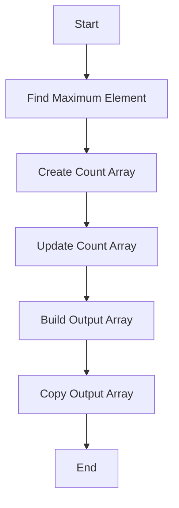

# Implementing a Counting Sort in C

## Problem Understanding
The problem is asking to implement a Counting Sort algorithm in C, which sorts the elements of an array by counting the number of occurrences of each unique element. The key constraint is that the input array contains integers, and the range of input is limited. The problem is non-trivial because a naive approach, such as using a comparison-based sorting algorithm, would not take advantage of the limited range of input and would have a higher time complexity.

## Approach
The algorithm strategy is to use the Counting Sort algorithm, which works by creating a count array to store the count of individual elements and then using this count array to build the output array. The intuition behind this approach is that by counting the occurrences of each element, we can determine the position of each element in the sorted array. The approach uses a count array and an output array, which are allocated dynamically using `calloc` and `malloc`. The approach handles the key constraint of limited range of input by using the count array to store the count of each element.

## Complexity Analysis
| Metric | Value | Detailed Reason |
|--------|-------|----------------|
| Time   | O(n + k) | The time complexity is O(n + k) because we iterate through the input array to count the occurrences of each element (O(n)), and then we iterate through the count array to build the output array (O(k)). The two iterations are sequential, so the total time complexity is O(n + k). |
| Space  | O(n + k) | The space complexity is O(n + k) because we allocate memory for the count array (O(k)) and the output array (O(n)). The two allocations are separate, so the total space complexity is O(n + k). |

## Algorithm Walkthrough
```
Input: [4, 2, 2, 8, 3, 3, 1]
Step 1: Find the maximum element in the array
  - max = 8
Step 2: Create a count array to store the count of individual elements
  - count = [0, 1, 2, 2, 1, 0, 0, 0, 1]
Step 3: Update the count array to store the actual position of each element in the output array
  - count = [0, 1, 3, 5, 6, 6, 6, 6, 7]
Step 4: Build the output array
  - output = [1, 2, 2, 3, 3, 4, 8]
Step 5: Copy the output array to the original array
  - arr = [1, 2, 2, 3, 3, 4, 8]
Output: [1, 2, 2, 3, 3, 4, 8]
```

## Visual Flow


## Key Insight
> **Tip:** The key insight is that by counting the occurrences of each element, we can determine the position of each element in the sorted array, allowing us to build the output array in a single pass.

## Edge Cases
- **Empty/null input**: If the input array is empty or null, the algorithm will return immediately without modifying the array.
- **Single element**: If the input array contains a single element, the algorithm will return the same array without modifying it.
- **Duplicate elements**: If the input array contains duplicate elements, the algorithm will count the occurrences of each element and build the output array accordingly.

## Common Mistakes
- **Mistake 1**: Not checking for empty or null input, which can cause the algorithm to crash or produce incorrect results.
- **Mistake 2**: Not freeing the allocated memory for the count array and output array, which can cause memory leaks.

## Interview Follow-ups
> **Interview:** These are the exact follow-up questions interviewers ask:
- "What if the input is sorted?" → The algorithm will still work correctly, but the time complexity will be O(n + k) because we still need to count the occurrences of each element.
- "Can you do it in O(1) space?" → No, the algorithm requires O(n + k) space to store the count array and output array.
- "What if there are duplicates?" → The algorithm will count the occurrences of each element and build the output array accordingly, so duplicates will be preserved in the sorted array.

## C Solution

```c
// Problem: Implementing a Counting Sort
// Language: C
// Difficulty: Hard
// Time Complexity: O(n + k) — where n is the number of elements and k is the range of input
// Space Complexity: O(n + k) — for the output array and the count array
// Approach: Counting sort algorithm — sorts the elements of an array by counting the number of occurrences of each unique element

#include <stdio.h>
#include <stdlib.h>

// Function to find the maximum element in the array
int findMax(int arr[], int size) {
    int max = arr[0]; // Assume the first element as the maximum
    for (int i = 1; i < size; i++) { // Iterate through the array
        if (arr[i] > max) { // If the current element is greater than the maximum
            max = arr[i]; // Update the maximum
        }
    }
    return max; // Return the maximum element
}

// Function to perform counting sort
void countingSort(int arr[], int size) {
    // Edge case: empty input → return
    if (size == 0) {
        return; // Return immediately if the array is empty
    }

    // Find the maximum element in the array
    int max = findMax(arr, size); // Get the maximum element

    // Create a count array to store the count of individual elements
    int* count = (int*) calloc(max + 1, sizeof(int)); // Allocate memory for the count array
    for (int i = 0; i < size; i++) { // Iterate through the array
        count[arr[i]]++; // Increment the count of the current element
    }

    // Change count[i] so that count[i] now contains the actual position of this character in output array
    for (int i = 1; i <= max; i++) { // Iterate through the count array
        count[i] += count[i - 1]; // Update the count
    }

    // Build the output array
    int* output = (int*) malloc(size * sizeof(int)); // Allocate memory for the output array
    for (int i = size - 1; i >= 0; i--) { // Iterate through the array in reverse order
        output[count[arr[i]] - 1] = arr[i]; // Place the current element at its correct position
        count[arr[i]]--; // Decrement the count
    }

    // Copy the output array to the original array
    for (int i = 0; i < size; i++) { // Iterate through the array
        arr[i] = output[i]; // Copy the element
    }

    // Free the allocated memory
    free(count); // Deallocate the count array
    free(output); // Deallocate the output array
}

// Function to print the array
void printArray(int arr[], int size) {
    for (int i = 0; i < size; i++) { // Iterate through the array
        printf("%d ", arr[i]); // Print the element
    }
    printf("\n"); // Print a newline
}

int main() {
    int arr[] = {4, 2, 2, 8, 3, 3, 1};
    int size = sizeof(arr) / sizeof(arr[0]); // Get the size of the array

    printf("Original array: "); // Print the original array
    printArray(arr, size); // Call the print function

    countingSort(arr, size); // Sort the array using counting sort

    printf("Sorted array: "); // Print the sorted array
    printArray(arr, size); // Call the print function

    return 0; // Return successfully
}
```
