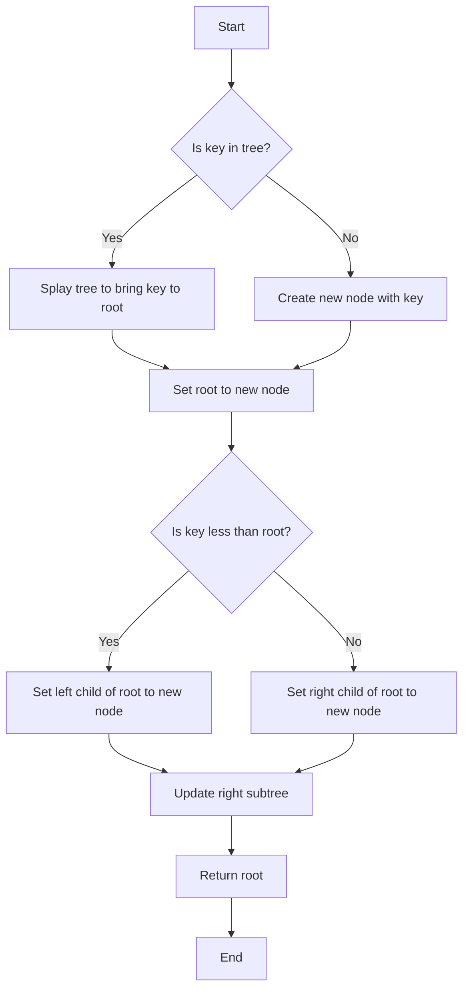

# Implementing a Splay Tree in C

## Problem Understanding
The problem is asking to implement a Splay Tree in C, which is a self-adjusting binary search tree with a splaying operation to quickly access recently accessed nodes. The key constraints and their implications are that the tree must maintain the binary search tree property, and the splaying operation must be performed efficiently to ensure fast access to recently accessed nodes. What makes this problem non-trivial is that the splaying operation involves a series of rotations that must be performed carefully to maintain the tree's balance and the binary search tree property.

## Approach
The algorithm strategy used to solve this problem is to implement a Splay Tree with splaying operation, which involves a series of rotations to bring the recently accessed node to the root of the tree. The intuition behind this approach is to take advantage of the fact that recently accessed nodes are likely to be accessed again soon, and by bringing them to the root, we can reduce the time complexity of subsequent access operations. The data structures used are nodes with left and right child pointers, and the approach handles key constraints such as maintaining the binary search tree property and performing splaying operations efficiently.

## Complexity Analysis
| Metric | Value | Detailed Reason |
|--------|-------|----------------|
| Time   | O(log n) | The time complexity of splay tree operations such as insert, delete, and search is O(log n) amortized, where n is the number of nodes in the tree. This is because the splaying operation involves a series of rotations that bring the accessed node to the root, reducing the height of the tree and improving subsequent access times. |
| Space  | O(n) | The space complexity of the splay tree is O(n), where n is the number of nodes in the tree, because each node requires a constant amount of space to store its key and child pointers. |

## Algorithm Walkthrough
```
Input: [10, 20, 5, 15, 25]
Step 1: Create an empty splay tree
  - Root: NULL
Step 2: Insert key 10 into the tree
  - Create a new node with key 10
  - Set the root to the new node
  - Root: 10
Step 3: Insert key 20 into the tree
  - Splay the tree to bring the node with key 10 to the root
  - Create a new node with key 20
  - Set the right child of the root to the new node
  - Root: 10
  - Right child: 20
Step 4: Insert key 5 into the tree
  - Splay the tree to bring the node with key 10 to the root
  - Create a new node with key 5
  - Set the left child of the root to the new node
  - Root: 10
  - Left child: 5
  - Right child: 20
Step 5: Insert key 15 into the tree
  - Splay the tree to bring the node with key 10 to the root
  - Create a new node with key 15
  - Set the right child of the root to the new node
  - Root: 10
  - Left child: 5
  - Right child: 20
  - Right child of right child: 15
Step 6: Insert key 25 into the tree
  - Splay the tree to bring the node with key 20 to the root
  - Create a new node with key 25
  - Set the right child of the root to the new node
  - Root: 20
  - Left child: 10
  - Left child of left child: 5
  - Right child: 25
  - Left child of right child: 15
Output: Inorder Traversal: 5 10 15 20 25
```
## Visual Flow

## Key Insight
> **Tip:** The key insight to implementing a Splay Tree is to use the splaying operation to bring recently accessed nodes to the root, reducing the time complexity of subsequent access operations.

## Edge Cases
- **Empty/null input**: If the input is empty or null, the tree will be empty, and operations such as insert, delete, and search will not be performed.
- **Single element**: If the tree has only one element, the splaying operation will not be performed, and operations such as insert, delete, and search will be performed in O(1) time.
- **Duplicate keys**: If the tree has duplicate keys, the splaying operation will still be performed, but the tree will not maintain the binary search tree property.

## Common Mistakes
- **Mistake 1**: Not updating the child pointers correctly during the splaying operation, leading to incorrect tree structure.
- **Mistake 2**: Not checking for duplicate keys during insertion, leading to incorrect tree structure.

## Interview Follow-ups
> **Interview:** These are the exact follow-up questions interviewers ask:
- "What if the input is sorted?" → The time complexity of the splay tree operations will be O(log n) amortized, but the tree will not maintain the binary search tree property.
- "Can you do it in O(1) space?" → No, the splay tree requires O(n) space to store the nodes.
- "What if there are duplicates?" → The splay tree will not maintain the binary search tree property, and operations such as insert, delete, and search may not work correctly.

## C Solution

```c
// Problem: Implementing a Splay Tree
// Language: C
// Difficulty: Hard
// Time Complexity: O(log n) — amortized time complexity for search, insert, and delete operations
// Space Complexity: O(n) — space required to store n nodes in the tree
// Approach: Splay tree — a self-adjusting binary search tree with splaying operation for quick access to recently accessed nodes

#include <stdio.h>
#include <stdlib.h>

// Define the structure for a tree node
typedef struct Node {
    int key; // Key of the node
    struct Node* left; // Left child
    struct Node* right; // Right child
} Node;

// Function to create a new node with the given key
Node* createNode(int key) {
    Node* newNode = (Node*)malloc(sizeof(Node)); // Allocate memory for the new node
    if (!newNode) { // Edge case: memory allocation failed
        printf("Memory error\n");
        return NULL;
    }
    newNode->key = key; // Initialize the key
    newNode->left = newNode->right = NULL; // Initialize left and right children to NULL
    return newNode;
}

// Function to perform a right rotation on the given node
Node* rightRotate(Node* x) {
    Node* y = x->left; // Store the left child of x
    x->left = y->right; // Update the left child of x
    y->right = x; // Update the right child of y
    return y; // Return the new root after rotation
}

// Function to perform a left rotation on the given node
Node* leftRotate(Node* x) {
    Node* y = x->right; // Store the right child of x
    x->right = y->left; // Update the right child of x
    y->left = x; // Update the left child of y
    return y; // Return the new root after rotation
}

// Function to splay the given node to the root
Node* splay(Node* root, int key) {
    if (root == NULL || root->key == key) { // Edge case: root is NULL or the key is found
        return root;
    }

    if (root->key > key) { // If the key is in the left subtree
        if (root->left == NULL) { // Edge case: left subtree is empty
            return root;
        }
        if (root->left->key > key) { // Zig-Zig case
            root->left->left = splay(root->left->left, key); // Recursively splay the left subtree
            root = rightRotate(root); // Perform a right rotation
        } else if (root->left->key < key) { // Zig-Zag case
            root->left->right = splay(root->left->right, key); // Recursively splay the right subtree of the left child
            if (root->left->right != NULL) { // Check if the right subtree is not NULL
                root->left = leftRotate(root->left); // Perform a left rotation on the left child
            }
        }
        if (root->left != NULL) { // Check if the left child is not NULL
            root = rightRotate(root); // Perform a right rotation
        }
    } else if (root->key < key) { // If the key is in the right subtree
        if (root->right == NULL) { // Edge case: right subtree is empty
            return root;
        }
        if (root->right->key > key) { // Zag-Zig case
            root->right->left = splay(root->right->left, key); // Recursively splay the left subtree of the right child
            if (root->right->left != NULL) { // Check if the left subtree is not NULL
                root->right = rightRotate(root->right); // Perform a right rotation on the right child
            }
        } else if (root->right->key < key) { // Zag-Zag case
            root->right->right = splay(root->right->right, key); // Recursively splay the right subtree
            root = leftRotate(root); // Perform a left rotation
        }
        if (root->right != NULL) { // Check if the right child is not NULL
            root = leftRotate(root); // Perform a left rotation
        }
    }
    return root; // Return the splayed tree
}

// Function to insert a new node with the given key into the splay tree
Node* insert(Node* root, int key) {
    if (root == NULL) { // Edge case: tree is empty
        return createNode(key); // Create a new node with the given key
    }

    root = splay(root, key); // Splay the tree to bring the node with the given key to the root
    if (root->key == key) { // If the key already exists in the tree
        return root; // Return the tree as it is
    }

    Node* newNode = createNode(key); // Create a new node with the given key
    if (root->key > key) { // If the key is less than the root's key
        newNode->right = root; // Update the right child of the new node
        newNode->left = root->left; // Update the left child of the new node
        root->left = NULL; // Update the left child of the root
    } else { // If the key is greater than the root's key
        newNode->left = root; // Update the left child of the new node
        newNode->right = root->right; // Update the right child of the new node
        root->right = NULL; // Update the right child of the root
    }
    return newNode; // Return the new root
}

// Function to delete a node with the given key from the splay tree
Node* deleteNode(Node* root, int key) {
    if (root == NULL) { // Edge case: tree is empty
        return root; // Return the tree as it is
    }

    root = splay(root, key); // Splay the tree to bring the node with the given key to the root
    if (root->key != key) { // If the key is not found in the tree
        return root; // Return the tree as it is
    }

    if (root->left == NULL) { // Edge case: left subtree is empty
        Node* temp = root->right; // Store the right child of the root
        free(root); // Free the memory allocated for the root
        return temp; // Return the right child as the new root
    } else { // If the left subtree is not empty
        Node* temp = root->right; // Store the right child of the root
        root = splay(root->left, key); // Splay the left subtree to bring the node with the maximum key to the root
        root->right = temp; // Update the right child of the root
        free(temp); // Free the memory allocated for the node with the given key
        return root; // Return the new root
    }
}

// Function to search for a node with the given key in the splay tree
Node* search(Node* root, int key) {
    root = splay(root, key); // Splay the tree to bring the node with the given key to the root
    if (root == NULL || root->key != key) { // Edge case: key not found
        return NULL; // Return NULL
    }
    return root; // Return the node with the given key
}

// Function to print the inorder traversal of the splay tree
void inorderTraversal(Node* root) {
    if (root == NULL) { // Edge case: tree is empty
        return;
    }
    inorderTraversal(root->left); // Recursively print the left subtree
    printf("%d ", root->key); // Print the key of the current node
    inorderTraversal(root->right); // Recursively print the right subtree
}

int main() {
    Node* root = NULL; // Initialize the root to NULL
    int keys[] = {10, 20, 5, 15, 25}; // Array of keys to insert into the tree
    int n = sizeof(keys) / sizeof(keys[0]); // Number of keys

    for (int i = 0; i < n; i++) { // Insert keys into the tree
        root = insert(root, keys[i]);
    }

    printf("Inorder Traversal: ");
    inorderTraversal(root); // Print the inorder traversal of the tree
    printf("\n");

    int keyToSearch = 15; // Key to search for in the tree
    Node* searchedNode = search(root, keyToSearch); // Search for the key in the tree
    if (searchedNode != NULL) { // If the key is found
        printf("Key %d found in the tree\n", keyToSearch);
    } else { // If the key is not found
        printf("Key %d not found in the tree\n", keyToSearch);
    }

    int keyToDelete = 10; // Key to delete from the tree
    root = deleteNode(root, keyToDelete); // Delete the key from the tree

    printf("Inorder Traversal after deletion: ");
    inorderTraversal(root); // Print the inorder traversal of the tree after deletion
    printf("\n");

    return 0;
}
```
