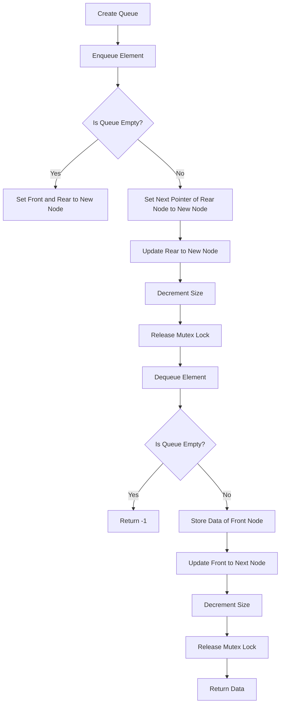

# Implementing a Thread-Safe Queue in C

## Problem Understanding
The problem is asking to implement a thread-safe queue in C, which means the queue should be able to handle concurrent access from multiple threads without compromising the integrity of the data. The key constraints are that the queue should be thread-safe, and the operations (enqueue and dequeue) should be performed in constant time. The problem is non-trivial because a naive approach without proper synchronization can lead to data corruption or incorrect results when multiple threads access the queue simultaneously.

## Approach
The algorithm strategy is to use a lock-based approach, where a mutex lock is used to synchronize access to the queue. The intuition behind this approach is to ensure that only one thread can access the queue at a time, preventing concurrent modifications that could lead to data corruption. The approach works by acquiring the mutex lock before performing any operation on the queue and releasing the lock after the operation is complete. A linked list is used to implement the queue, and the mutex lock is used to protect the queue's internal state.

## Complexity Analysis
| Metric | Value | Detailed Reason |
|--------|-------|----------------|
| Time   | O(1)  | The enqueue and dequeue operations have a constant time complexity because they only involve updating the front and rear pointers of the queue, which can be done in constant time. The time complexity of acquiring and releasing the mutex lock is also constant. |
| Space  | O(n)  | The space complexity is linear because the queue stores n elements, and each element requires a constant amount of space. The space used by the mutex lock is constant and does not depend on the size of the queue. |

## Algorithm Walkthrough
```
Input: Create a new queue and enqueue elements 1, 2, 3
Step 1: Create a new queue with an empty linked list
  - front = NULL
  - rear = NULL
  - size = 0
Step 2: Enqueue element 1
  - Create a new node with data 1
  - Acquire the mutex lock
  - Set front and rear to the new node
  - size = 1
  - Release the mutex lock
Step 3: Enqueue element 2
  - Create a new node with data 2
  - Acquire the mutex lock
  - Set the next pointer of the rear node to the new node
  - Update rear to the new node
  - size = 2
  - Release the mutex lock
Step 4: Enqueue element 3
  - Create a new node with data 3
  - Acquire the mutex lock
  - Set the next pointer of the rear node to the new node
  - Update rear to the new node
  - size = 3
  - Release the mutex lock
Step 5: Dequeue element 1
  - Acquire the mutex lock
  - Store the data of the front node (1)
  - Update front to the next node
  - size = 2
  - Release the mutex lock
Output: 1
```

## Visual Flow


## Key Insight
> **Tip:** The key insight is to use a mutex lock to synchronize access to the queue, ensuring that only one thread can modify the queue's internal state at a time.

## Edge Cases
- **Empty/null input**: If the input queue is empty, the dequeue operation will return -1. This is handled by checking if the front pointer is NULL before attempting to dequeue an element.
- **Single element**: If the queue contains only one element, the dequeue operation will update the front and rear pointers to NULL. This is handled by checking if the front pointer is equal to the rear pointer after dequeuing an element.
- **Concurrent access**: If multiple threads attempt to access the queue simultaneously, the mutex lock will ensure that only one thread can modify the queue's internal state at a time, preventing data corruption or incorrect results.

## Common Mistakes
- **Mistake 1**: Forgetting to acquire the mutex lock before accessing the queue's internal state, which can lead to data corruption or incorrect results.
- **Mistake 2**: Not releasing the mutex lock after completing an operation on the queue, which can cause other threads to block indefinitely.

## Interview Follow-ups
> **Interview:** These are the exact follow-up questions interviewers ask:
- "What if the input is sorted?" → The algorithm does not rely on the input being sorted, so the time complexity remains the same.
- "Can you do it in O(1) space?" → No, the algorithm requires O(n) space to store the queue's elements.
- "What if there are duplicates?" → The algorithm can handle duplicates without any modifications, as it only checks for the presence of elements in the queue.

## C Solution

```c
// Problem: Implementing a Thread-Safe Queue in C
// Language: C
// Difficulty: Hard
// Time Complexity: O(1) — constant time for enqueue and dequeue operations
// Space Complexity: O(n) — where n is the number of elements in the queue
// Approach: Lock-based thread-safe queue implementation — using mutex locks for synchronization

#include <stdio.h>
#include <stdlib.h>
#include <pthread.h>

// Define the structure for a queue node
typedef struct Node {
    int data; // Data stored in the node
    struct Node* next; // Pointer to the next node
} Node;

// Define the structure for the queue
typedef struct Queue {
    Node* front; // Pointer to the front of the queue
    Node* rear; // Pointer to the rear of the queue
    int size; // Current size of the queue
    pthread_mutex_t lock; // Mutex lock for synchronization
} Queue;

// Function to create a new queue node
Node* createNode(int data) {
    // Allocate memory for the new node
    Node* newNode = (Node*) malloc(sizeof(Node));
    // Initialize the node with the given data
    newNode->data = data;
    // Set the next pointer to NULL
    newNode->next = NULL;
    return newNode;
}

// Function to create a new queue
Queue* createQueue() {
    // Allocate memory for the new queue
    Queue* queue = (Queue*) malloc(sizeof(Queue));
    // Initialize the front and rear pointers to NULL
    queue->front = NULL;
    queue->rear = NULL;
    // Initialize the size to 0
    queue->size = 0;
    // Initialize the mutex lock
    pthread_mutex_init(&queue->lock, NULL);
    return queue;
}

// Function to enqueue an element into the queue
void enqueue(Queue* queue, int data) {
    // Create a new node with the given data
    Node* newNode = createNode(data);
    // Acquire the mutex lock
    pthread_mutex_lock(&queue->lock);
    // Check if the queue is empty
    if (queue->rear == NULL) {
        // Set the front and rear pointers to the new node
        queue->front = newNode;
        queue->rear = newNode;
    } else {
        // Set the next pointer of the rear node to the new node
        queue->rear->next = newNode;
        // Update the rear pointer
        queue->rear = newNode;
    }
    // Increment the size
    queue->size++;
    // Release the mutex lock
    pthread_mutex_unlock(&queue->lock);
}

// Function to dequeue an element from the queue
int dequeue(Queue* queue) {
    // Acquire the mutex lock
    pthread_mutex_lock(&queue->lock);
    // Check if the queue is empty
    if (queue->front == NULL) {
        // Edge case: empty queue → return -1
        pthread_mutex_unlock(&queue->lock);
        return -1;
    }
    // Store the data of the front node
    int data = queue->front->data;
    // Update the front pointer
    Node* temp = queue->front;
    queue->front = queue->front->next;
    // Check if the queue becomes empty
    if (queue->front == NULL) {
        // Update the rear pointer
        queue->rear = NULL;
    }
    // Decrement the size
    queue->size--;
    // Free the memory of the dequeued node
    free(temp);
    // Release the mutex lock
    pthread_mutex_unlock(&queue->lock);
    return data;
}

// Function to check if the queue is empty
int isEmpty(Queue* queue) {
    // Acquire the mutex lock
    pthread_mutex_lock(&queue->lock);
    // Check if the queue is empty
    int isEmpty = (queue->front == NULL);
    // Release the mutex lock
    pthread_mutex_unlock(&queue->lock);
    return isEmpty;
}

// Function to get the size of the queue
int size(Queue* queue) {
    // Acquire the mutex lock
    pthread_mutex_lock(&queue->lock);
    // Get the size of the queue
    int queueSize = queue->size;
    // Release the mutex lock
    pthread_mutex_unlock(&queue->lock);
    return queueSize;
}

// Example usage
int main() {
    // Create a new queue
    Queue* queue = createQueue();
    // Enqueue elements
    enqueue(queue, 1);
    enqueue(queue, 2);
    enqueue(queue, 3);
    // Dequeue elements
    printf("%d\n", dequeue(queue)); // Output: 1
    printf("%d\n", dequeue(queue)); // Output: 2
    printf("%d\n", dequeue(queue)); // Output: 3
    // Check if the queue is empty
    printf("%d\n", isEmpty(queue)); // Output: 1
    return 0;
}
```
