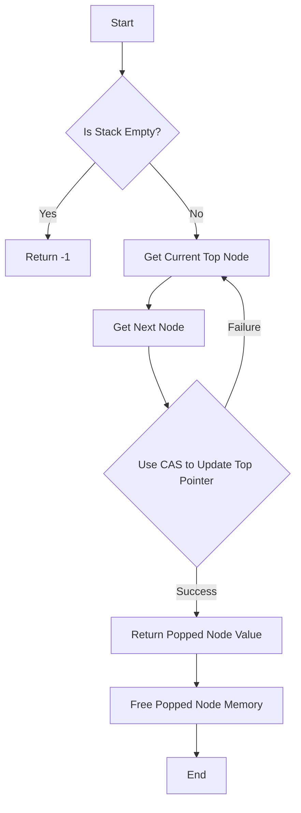

# Lock-Free Stack using CAS

## Problem Understanding
The problem is asking to implement a lock-free stack using Compare-And-Swap (CAS) operations. The key constraint is that the implementation should not use locks, which means that multiple threads should be able to access and modify the stack simultaneously without deadlocks or data corruption. The problem is non-trivial because a naive approach using simple atomic operations would not be sufficient to ensure thread safety, and a more sophisticated approach using CAS operations is required to ensure that the stack is updated correctly even in the presence of concurrent modifications.

## Approach
The algorithm strategy is to use CAS operations to update the top pointer of the stack, which is the key to ensuring thread safety. The intuition behind this approach is that CAS operations allow us to check if the top pointer has been modified by another thread since we last read it, and if so, to retry the operation. This approach works because CAS operations are atomic, meaning that they are executed as a single, indivisible unit, which ensures that the stack is updated correctly even in the presence of concurrent modifications. The data structure used is a linked list, where each node represents an element on the stack, and the top pointer points to the top node. The approach handles key constraints such as thread safety and correctness even in the presence of concurrent modifications.

## Complexity Analysis
| Metric | Value | Detailed Reason |
|--------|-------|----------------|
| Time   | O(1)  | The time complexity of the push and pop operations is constant because they use CAS operations, which are executed in constant time. However, in the worst case, the CAS operation may fail and need to be retried, which can lead to a higher time complexity in practice. |
| Space  | O(n)  | The space complexity of the implementation is linear because each element on the stack requires a separate node, and the number of nodes grows linearly with the number of elements on the stack. |

## Algorithm Walkthrough
```
Input: stack = empty stack
Step 1: lockFreeStackPush(stack, 1)
    - Create a new node with value 1
    - Set the next pointer of the new node to NULL
    - Use CAS to update the top pointer to point to the new node
Step 2: lockFreeStackPush(stack, 2)
    - Create a new node with value 2
    - Set the next pointer of the new node to the current top node (node with value 1)
    - Use CAS to update the top pointer to point to the new node
Step 3: lockFreeStackPop(stack)
    - Get the current top node (node with value 2)
    - Get the next node (node with value 1)
    - Use CAS to update the top pointer to point to the next node
    - Return the value of the popped node (2)
Output: 2
```
## Visual Flow

## Key Insight
> **Tip:** The key insight is to use CAS operations to update the top pointer of the stack, which ensures thread safety and correctness even in the presence of concurrent modifications.

## Edge Cases
- **Empty/null input**: If the stack is empty, the pop operation will return -1.
- **Single element**: If the stack has only one element, the pop operation will return the value of that element and the stack will be empty.
- **Concurrent push and pop**: If multiple threads are pushing and popping elements concurrently, the CAS operations will ensure that the stack is updated correctly and thread safety is maintained.

## Common Mistakes
- **Mistake 1**: Not using CAS operations to update the top pointer, which can lead to data corruption and thread safety issues.
- **Mistake 2**: Not checking if the stack is empty before popping an element, which can lead to null pointer exceptions.

## Interview Follow-ups
> **Interview:** These are the exact follow-up questions interviewers ask:
- "What if the input is sorted?" → The implementation does not rely on the input being sorted, so it will work correctly regardless of the order of the elements.
- "Can you do it in O(1) space?" → No, because we need to allocate memory for the nodes on the stack, which requires O(n) space.
- "What if there are duplicates?" → The implementation will work correctly even if there are duplicate elements on the stack.

## C Solution

```c
// Problem: Lock-Free Stack using CAS
// Language: C
// Difficulty: Hard
// Time Complexity: O(1) — constant time operations using CAS
// Space Complexity: O(n) — dynamically allocated memory for stack nodes
// Approach: Compare-And-Swap (CAS) based lock-free stack implementation

#include <stdatomic.h>
#include <stdlib.h>
#include <stdbool.h>

// Node structure for the stack
typedef struct Node {
    int value;
    struct Node* next;
} Node;

// Lock-free stack structure
typedef struct {
    atomic(Node*) top;
} LockFreeStack;

// Function to create a new lock-free stack
LockFreeStack* lockFreeStackCreate() {
    // Allocate memory for the lock-free stack
    LockFreeStack* stack = (LockFreeStack*) malloc(sizeof(LockFreeStack));
    // Initialize the top pointer to NULL
    atomic_init(&stack->top, NULL);
    return stack;
}

// Function to push an element onto the lock-free stack
void lockFreeStackPush(LockFreeStack* stack, int value) {
    // Create a new node with the given value
    Node* newNode = (Node*) malloc(sizeof(Node));
    newNode->value = value;
    // Set the next pointer of the new node to the current top node
    newNode->next = atomic_load(&stack->top);
    
    // Use CAS to update the top pointer
    while (true) {
        // Get the current top node
        Node* currentTop = atomic_load(&stack->top);
        // Set the next pointer of the new node to the current top node
        newNode->next = currentTop;
        // Use CAS to update the top pointer
        if (atomic_compare_exchange_strong(&stack->top, &currentTop, newNode)) {
            // If the CAS operation is successful, break the loop
            break;
        }
        // If the CAS operation fails, retry
    }
}

// Function to pop an element from the lock-free stack
int lockFreeStackPop(LockFreeStack* stack) {
    // Edge case: empty stack → return -1
    if (atomic_load(&stack->top) == NULL) {
        return -1;
    }
    
    // Use CAS to update the top pointer
    while (true) {
        // Get the current top node
        Node* currentTop = atomic_load(&stack->top);
        // Get the next node
        Node* nextNode = currentTop->next;
        // Use CAS to update the top pointer
        if (atomic_compare_exchange_strong(&stack->top, &currentTop, nextNode)) {
            // If the CAS operation is successful, return the value of the popped node
            int value = currentTop->value;
            // Free the memory of the popped node
            free(currentTop);
            return value;
        }
        // If the CAS operation fails, retry
    }
}

// Function to free the lock-free stack
void lockFreeStackFree(LockFreeStack* stack) {
    // Free all nodes in the stack
    while (atomic_load(&stack->top) != NULL) {
        Node* currentTop = atomic_load(&stack->top);
        Node* nextNode = currentTop->next;
        atomic_compare_exchange_strong(&stack->top, &currentTop, nextNode);
        free(currentTop);
    }
    // Free the memory of the lock-free stack
    free(stack);
}
```
