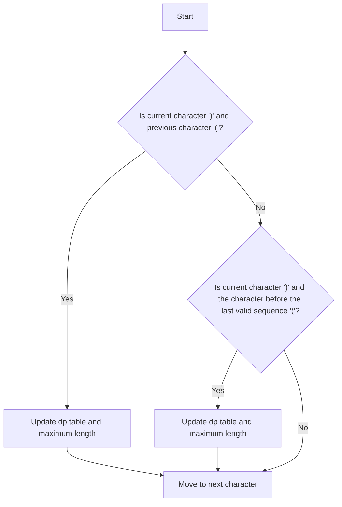

# Longest Valid Parentheses (DP/Stack)

## Problem Understanding
The problem asks to find the length of the longest valid parentheses sequence in a given string. A valid parentheses sequence is one where every open parenthesis can be matched with a corresponding close parenthesis. The key constraint is that the input string only contains parentheses, and the solution should handle cases where the string is empty or contains no valid parentheses sequences. What makes this problem non-trivial is that a naive approach of simply checking every possible substring would result in a time complexity of O(n^3), which is inefficient for large inputs.

## Approach
The algorithm strategy used here is dynamic programming, where a table `dp` is created to store the length of the longest valid parentheses sequence ending at each position in the string. The intuition behind this approach is to break down the problem into smaller subproblems and store the results of these subproblems to avoid redundant computation. The dynamic programming table `dp` is used to store the lengths of valid parentheses sequences, and the solution iterates through the string from left to right, updating the `dp` table based on whether the current character is an open or close parenthesis. This approach works because it ensures that every possible valid parentheses sequence is considered, and the use of dynamic programming allows for efficient computation of the solution.

## Complexity Analysis
| Metric | Value | Detailed Reason |
|--------|-------|----------------|
| Time   | O(n)  | The solution iterates through the string once, and each iteration involves a constant amount of work, so the time complexity is linear. The dynamic programming table `dp` is updated in O(1) time at each position, and the overall time complexity is O(n) because the solution only needs to iterate through the string once. |
| Space  | O(n)  | The solution uses a dynamic programming table `dp` of size `n`, where `n` is the length of the input string. This table is used to store the lengths of valid parentheses sequences ending at each position in the string, and it is necessary to store these values to avoid redundant computation. The space complexity is O(n) because the size of the `dp` table grows linearly with the size of the input string. |

## Algorithm Walkthrough
```
Input: "(()"
Step 1: Initialize dp table with zeros: dp = [0, 0, 0]
Step 2: Check if current character is ')' and previous character is '(': no
Step 3: Check if current character is ')' and the character before the last valid sequence is '(': no
Step 4: Move to next character
Step 5: Check if current character is ')' and previous character is '(': yes
Step 6: Update dp table: dp = [0, 0, 2]
Step 7: Update maximum length: maxLength = 2
Output: 2
```
This walkthrough demonstrates how the algorithm iterates through the string, updates the `dp` table, and keeps track of the maximum length of valid parentheses sequences.

## Visual Flow

This flowchart illustrates the decision flow of the algorithm, showing how it checks for valid parentheses sequences and updates the `dp` table and maximum length accordingly.

## Key Insight
> **Tip:** The key insight is to use dynamic programming to store the lengths of valid parentheses sequences ending at each position in the string, allowing for efficient computation of the solution by avoiding redundant computation.

## Edge Cases
- **Empty/null input**: If the input string is empty, the function returns 0, because there are no valid parentheses sequences.
- **Single element**: If the input string contains only one character, the function returns 0, because a single character cannot form a valid parentheses sequence.
- **Unbalanced parentheses**: If the input string contains unbalanced parentheses, the function returns the length of the longest valid parentheses sequence, which may be 0 if there are no valid sequences.

## Common Mistakes
- **Mistake 1**: Not initializing the `dp` table with zeros, which can lead to incorrect results.
- **Mistake 2**: Not checking for the case where the current character is ')' and the character before the last valid sequence is '(', which can lead to missing valid parentheses sequences.

## Interview Follow-ups
> **Interview:** These are the exact follow-up questions interviewers ask:
- "What if the input is sorted?" → The solution does not rely on the input being sorted, so it would still work correctly.
- "Can you do it in O(1) space?" → No, because the solution requires a dynamic programming table of size `n` to store the lengths of valid parentheses sequences.
- "What if there are duplicates?" → The solution handles duplicates correctly, because it only considers valid parentheses sequences and ignores duplicates.

## C Solution

```c
// Problem: Longest Valid Parentheses
// Language: C
// Difficulty: Hard
// Time Complexity: O(n) — single pass through string using dynamic programming
// Space Complexity: O(n) — dynamic programming table stores at most n elements
// Approach: Dynamic Programming — for each character, check if it can form a valid parentheses sequence

#include <stdio.h>
#include <stdlib.h>
#include <string.h>

int longestValidParentheses(char *s) {
    int length = strlen(s); // Get the length of the input string
    int *dp = (int *)malloc(length * sizeof(int)); // Allocate memory for dynamic programming table
    int maxLength = 0; // Initialize maximum length of valid parentheses sequence

    // Initialize dynamic programming table with zeros
    for (int i = 0; i < length; i++) {
        dp[i] = 0; // Initialize each element to zero
    }

    // Iterate through the string from left to right
    for (int i = 1; i < length; i++) {
        // Check if current character is ')' and previous character is '('
        if (s[i] == ')' && s[i - 1] == '(') {
            // If yes, then the length of valid parentheses sequence is 2 plus the sequence length two positions before
            dp[i] = (i >= 2 ? dp[i - 2] : 0) + 2; // Update dynamic programming table
            // Update maximum length
            maxLength = (maxLength > dp[i] ? maxLength : dp[i]); // Update maximum length
        }
        // Check if current character is ')' and the character before the last valid sequence is '('
        else if (s[i] == ')' && s[i - 1] == ')' && i - dp[i - 1] > 0 && s[i - dp[i - 1] - 1] == '(') {
            // If yes, then the length of valid parentheses sequence is the last sequence length plus 2 plus the sequence length before the last sequence
            dp[i] = dp[i - 1] + ((i - dp[i - 1]) >= 2 ? dp[i - dp[i - 1] - 2] : 0) + 2; // Update dynamic programming table
            // Update maximum length
            maxLength = (maxLength > dp[i] ? maxLength : dp[i]); // Update maximum length
        }
    }

    // Edge case: empty input → return 0
    if (length == 0) {
        free(dp); // Free memory
        return 0; // Return 0
    }

    free(dp); // Free memory
    return maxLength; // Return maximum length
}

int main() {
    char *s = "(()"; // Example input
    int result = longestValidParentheses(s); // Call function
    printf("Length of longest valid parentheses sequence: %d\n", result); // Print result
    return 0; // Return 0
}
```
