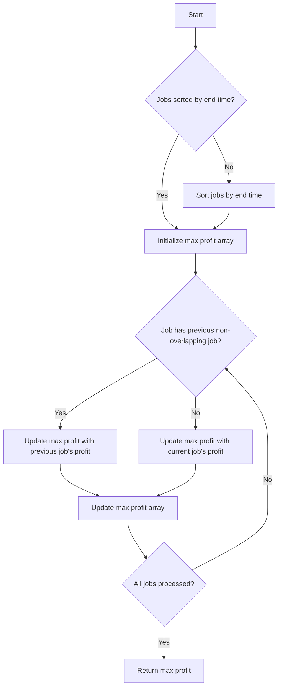

# Maximum Profit in Job Scheduling

## Problem Understanding
The problem is asking to find the maximum profit that can be achieved by scheduling jobs with given start times, end times, and profits. The key constraint is that two jobs cannot be scheduled at the same time if their time intervals overlap. This problem is non-trivial because a naive approach, such as simply selecting the job with the highest profit at each time point, may not lead to the maximum overall profit due to the overlapping time intervals. The problem requires a more sophisticated approach that considers the optimal scheduling of jobs to maximize the overall profit.

## Approach
The algorithm strategy used to solve this problem is dynamic programming, where the maximum profit at each time point is stored and used to calculate the maximum profit at later time points. The intuition behind this approach is to consider each job as a potential candidate for scheduling and to keep track of the maximum profit that can be achieved by scheduling jobs up to a certain time point. The approach uses a comparison function to sort the jobs based on their end times, which allows for efficient identification of overlapping time intervals. A dynamic programming array is used to store the maximum profit at each time point, and the maximum profit is updated at each time point by considering the profit of the current job and the maximum profit of the previous jobs that do not overlap with the current job.

## Complexity Analysis
| Metric | Value | Detailed Reason |
|--------|-------|----------------|
| Time   | O(n^2) | The algorithm has two nested loops: one for iterating over the jobs and another for finding the previous job that ends before the current job starts. Each loop has a time complexity of O(n), resulting in an overall time complexity of O(n^2). |
| Space  | O(n)  | The algorithm uses an array to store the maximum profit at each time point, which requires O(n) space. |

## Algorithm Walkthrough
```
Input: [{startTime: 1, endTime: 2, profit: 50}, {startTime: 3, endTime: 5, profit: 20}, {startTime: 6, endTime: 19, profit: 100}, {startTime: 2, endTime: 100, profit: 200}]
Step 1: Sort the jobs based on their end times: [{startTime: 1, endTime: 2, profit: 50}, {startTime: 3, endTime: 5, profit: 20}, {startTime: 6, endTime: 19, profit: 100}, {startTime: 2, endTime: 100, profit: 200}] becomes [{startTime: 1, endTime: 2, profit: 50}, {startTime: 2, endTime: 100, profit: 200}, {startTime: 3, endTime: 5, profit: 20}, {startTime: 6, endTime: 19, profit: 100}]
Step 2: Initialize the maximum profit array: [50, 200, 20, 100]
Step 3: Update the maximum profit array by considering the profit of each job and the maximum profit of the previous jobs that do not overlap:
  - For job {startTime: 1, endTime: 2, profit: 50}, the maximum profit is 50.
  - For job {startTime: 2, endTime: 100, profit: 200}, the maximum profit is 200.
  - For job {startTime: 3, endTime: 5, profit: 20}, the maximum profit is 200 + 20 = 220.
  - For job {startTime: 6, endTime: 19, profit: 100}, the maximum profit is 220 + 100 = 320.
Output: 320
```

## Visual Flow


## Key Insight
> **Tip:** The key insight to solving this problem is to recognize that the maximum profit at each time point can be calculated by considering the profit of the current job and the maximum profit of the previous jobs that do not overlap with the current job.

## Edge Cases
- **Empty input**: If the input is empty, the algorithm returns 0, as there are no jobs to schedule.
- **Single element**: If the input contains a single job, the algorithm returns the profit of that job, as there are no other jobs to consider.
- **Overlapping jobs**: If two or more jobs have overlapping time intervals, the algorithm considers the maximum profit that can be achieved by scheduling one of the jobs and ignoring the others.

## Common Mistakes
- **Mistake 1**: Not sorting the jobs by their end times before calculating the maximum profit. This can lead to incorrect results, as the algorithm relies on the jobs being sorted to identify overlapping time intervals.
- **Mistake 2**: Not updating the maximum profit array correctly. This can lead to incorrect results, as the algorithm relies on the maximum profit array to calculate the maximum profit at each time point.

## Interview Follow-ups
> **Interview:** These are the exact follow-up questions interviewers ask:
- "What if the input is sorted?" → The algorithm would still work correctly, but the sorting step could be skipped, reducing the time complexity to O(n).
- "Can you do it in O(1) space?" → No, the algorithm requires O(n) space to store the maximum profit array.
- "What if there are duplicates?" → The algorithm would still work correctly, but the duplicates would need to be handled correctly to avoid counting them multiple times.

## C Solution

```c
// Problem: Maximum Profit in Job Scheduling
// Language: C
// Difficulty: Hard
// Time Complexity: O(n^2) — using dynamic programming to store the maximum profit at each time point
// Space Complexity: O(n) — using an array to store the maximum profit at each time point
// Approach: Dynamic Programming — store the maximum profit at each time point and use it to calculate the maximum profit at later time points

#include <stdio.h>
#include <stdlib.h>

// Structure to represent a job
typedef struct {
    int startTime;
    int endTime;
    int profit;
} Job;

// Comparison function to sort jobs based on their end time
int compareJobs(const void *a, const void *b) {
    // Compare the end time of two jobs and return the result
    Job *jobA = (Job *)a;
    Job *jobB = (Job *)b;
    return jobA->endTime - jobB->endTime; // Sort in ascending order of end time
}

// Function to find the maximum profit that can be achieved by scheduling jobs
int jobScheduling(Job *jobs, int n) {
    // Edge case: empty input → return 0
    if (n == 0) return 0;

    // Sort the jobs based on their end time
    qsort(jobs, n, sizeof(Job), compareJobs);

    // Create an array to store the maximum profit at each time point
    int *maxProfit = (int *)malloc(n * sizeof(int));

    // Initialize the maximum profit at the first time point
    maxProfit[0] = jobs[0].profit;

    // Calculate the maximum profit at each time point
    for (int i = 1; i < n; i++) {
        // Initialize the maximum profit at the current time point to be the profit of the current job
        maxProfit[i] = jobs[i].profit;

        // Find the previous job that ends before the current job starts
        for (int j = 0; j < i; j++) {
            // Check if the previous job ends before the current job starts
            if (jobs[j].endTime <= jobs[i].startTime) {
                // Update the maximum profit at the current time point if a higher profit is found
                maxProfit[i] = (maxProfit[i] > maxProfit[j] + jobs[i].profit) ? maxProfit[i] : maxProfit[j] + jobs[i].profit;
            }
        }
    }

    // Find the maximum profit among all time points
    int max = maxProfit[0];
    for (int i = 1; i < n; i++) {
        if (maxProfit[i] > max) max = maxProfit[i]; // Update the maximum profit if a higher profit is found
    }

    // Free the memory allocated for the maxProfit array
    free(maxProfit);

    // Return the maximum profit
    return max;
}

int main() {
    // Example usage:
    Job jobs[] = {{1, 2, 50}, {3, 5, 20}, {6, 19, 100}, {2, 100, 200}};
    int n = sizeof(jobs) / sizeof(jobs[0]);
    printf("Maximum profit: %d\n", jobScheduling(jobs, n));
    return 0;
}
```
