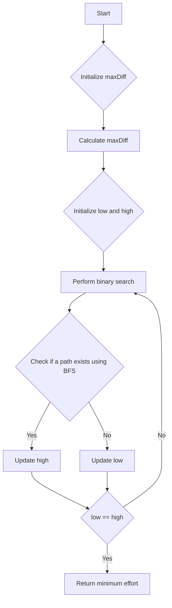

# Path With Minimum Effort

## Problem Understanding
The problem is asking to find the minimum effort required to reach the bottom-right cell from the top-left cell in a given grid, where the effort is defined as the maximum absolute difference in height between two adjacent cells in the path. The key constraint is that the path must exist from the top-left to the bottom-right cell. The problem is non-trivial because a naive approach, such as exhaustively searching all possible paths, would be computationally expensive and inefficient. The problem requires a more strategic approach, such as using binary search and breadth-first search (BFS) to find the minimum effort.

## Approach
The algorithm strategy is to use binary search to find the minimum effort required for a path to exist from the top-left to the bottom-right cell. The intuition behind this approach is that the minimum effort is the maximum absolute difference in height between two adjacent cells in the path. The algorithm uses BFS to check if a path exists for a given effort. The data structure used is a queue to store the cells to be visited, and a visited array to keep track of the visited cells. The approach handles the key constraint by iterating through all possible efforts and checking if a path exists using BFS.

## Complexity Analysis
| Metric | Value | Detailed Reason |
|--------|-------|----------------|
| Time   | O(m*n*log(max_diff)) | The algorithm uses binary search to find the minimum effort, which takes O(log(max_diff)) time. For each effort, the algorithm uses BFS, which takes O(m*n) time. Therefore, the overall time complexity is O(m*n*log(max_diff)). |
| Space  | O(m*n) | The algorithm uses a visited array to keep track of the visited cells, which takes O(m*n) space. The queue used in BFS also takes O(m*n) space in the worst case. |

## Algorithm Walkthrough
```
Input: heights = [[1,2,2],[3,8,2],[5,3,5]]
Step 1: Initialize maxDiff = 0
Step 2: Calculate maxDiff = max(abs(heights[i][j] - heights[i-1][j]), abs(heights[i][j] - heights[i][j-1])) for all cells
         maxDiff = max(1, 6, 1, 1, 2, 2) = 6
Step 3: Initialize low = 0, high = maxDiff = 6
Step 4: Perform binary search
         mid = (low + high) / 2 = 3
         Check if a path exists with effort = mid = 3 using BFS
         If a path exists, update high = mid = 3
         Otherwise, update low = mid + 1 = 4
Step 5: Repeat step 4 until low = high
         low = high = 2
Output: The minimum effort required for a path to exist = 2
```

## Visual Flow


## Key Insight
> **Tip:** The key insight is to use binary search to find the minimum effort required for a path to exist, and to use BFS to check if a path exists for a given effort.

## Edge Cases
- **Empty input**: If the input grid is empty, the algorithm returns -1, indicating that no path exists.
- **Single element**: If the input grid contains only one element, the algorithm returns 0, indicating that no effort is required to reach the bottom-right cell.
- **Grid with no path**: If the input grid does not contain a path from the top-left to the bottom-right cell, the algorithm returns -1, indicating that no path exists.

## Common Mistakes
- **Mistake 1**: Not handling the edge case where the input grid is empty. To avoid this, check if the input grid is empty and return -1 if it is.
- **Mistake 2**: Not using binary search to find the minimum effort required for a path to exist. To avoid this, use binary search to find the minimum effort, and use BFS to check if a path exists for a given effort.

## Interview Follow-ups
> **Interview:** 
- "What if the input is sorted?" → The algorithm still works correctly, but the time complexity may be improved if the input is sorted.
- "Can you do it in O(1) space?" → No, the algorithm requires at least O(m*n) space to store the visited array and the queue used in BFS.
- "What if there are duplicates?" → The algorithm still works correctly, but the time complexity may be improved if there are duplicates in the input grid.

## C Solution

```c
// Problem: Path With Minimum Effort
// Language: C
// Difficulty: Hard
// Time Complexity: O(m*n*log(max_diff)) — using binary search to find the minimum effort
// Space Complexity: O(m*n) — visited array stores at most m*n elements
// Approach: Binary Search with BFS — for each possible effort, check if a path exists from top-left to bottom-right

#include <stdio.h>
#include <stdlib.h>
#include <limits.h>
#include <stdbool.h>

#define MAX(a, b) ((a) > (b) ? (a) : (b))

// Structure to represent a cell in the grid
typedef struct {
    int x, y;
} Cell;

// Function to check if a cell is valid
bool isValid(int x, int y, int m, int n) {
    return x >= 0 && x < m && y >= 0 && y < n;
}

// Function to perform BFS
bool bfs(int** heights, int m, int n, int effort) {
    int directions[][2] = {{-1, 0}, {1, 0}, {0, -1}, {0, 1}};
    bool** visited = (bool**)malloc(m * sizeof(bool*));
    for (int i = 0; i < m; i++) {
        visited[i] = (bool*)malloc(n * sizeof(bool));
        for (int j = 0; j < n; j++) {
            visited[i][j] = false;
        }
    }

    // Edge case: empty input → return false
    if (!visited) {
        return false;
    }

    Cell* queue = (Cell*)malloc(m * n * sizeof(Cell));
    int front = 0, rear = 0;
    queue[rear++] = (Cell){0, 0};
    visited[0][0] = true;

    while (front < rear) {
        Cell current = queue[front++];
        for (int i = 0; i < 4; i++) {
            int nextX = current.x + directions[i][0];
            int nextY = current.y + directions[i][1];
            if (isValid(nextX, nextY, m, n) && !visited[nextX][nextY] && 
                abs(heights[nextX][nextY] - heights[current.x][current.y]) <= effort) {
                queue[rear++] = (Cell){nextX, nextY};
                visited[nextX][nextY] = true;
                if (nextX == m - 1 && nextY == n - 1) {
                    // Found a path to the bottom-right cell
                    for (int i = 0; i < m; i++) {
                        free(visited[i]);
                    }
                    free(visited);
                    free(queue);
                    return true;
                }
            }
        }
    }

    // No path found
    for (int i = 0; i < m; i++) {
        free(visited[i]);
    }
    free(visited);
    free(queue);
    return false;
}

int minimumEffortPath(int** heights, int m, int n) {
    // Edge case: empty input → return -1
    if (!heights || m == 0 || n == 0) {
        return -1;
    }

    int maxDiff = 0;
    for (int i = 0; i < m; i++) {
        for (int j = 0; j < n; j++) {
            if (i > 0) {
                maxDiff = MAX(maxDiff, abs(heights[i][j] - heights[i - 1][j]));
            }
            if (j > 0) {
                maxDiff = MAX(maxDiff, abs(heights[i][j] - heights[i][j - 1]));
            }
        }
    }

    int low = 0, high = maxDiff;
    while (low < high) {
        int mid = low + (high - low) / 2;
        if (bfs(heights, m, n, mid)) {
            // If a path exists with the current effort, try to reduce the effort
            high = mid;
        } else {
            // If no path exists with the current effort, increase the effort
            low = mid + 1;
        }
    }

    // The minimum effort required for a path to exist
    return low;
}
```
