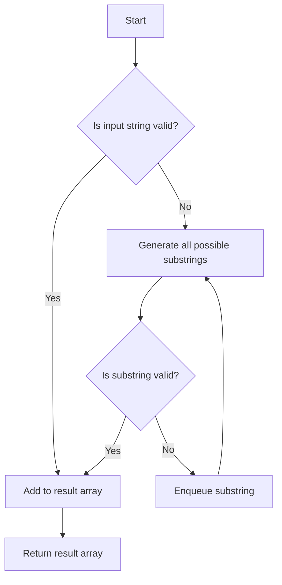

# Remove Invalid Parentheses

## Problem Understanding
The problem is asking us to remove the minimum number of invalid parentheses from a given string to make it valid. The key constraint is that the resulting string should be valid, meaning that every open parenthesis has a corresponding close parenthesis. The problem is non-trivial because a naive approach, such as simply removing all parentheses, would not work, and a more sophisticated approach, such as using a breadth-first search (BFS) algorithm, is required. The problem also requires handling edge cases, such as an empty input string or a string with no valid parentheses.

## Approach
The algorithm strategy is to use a BFS approach with level-order traversal to explore all possible subsets of parentheses level by level. The intuition behind this approach is to start with the original string and generate all possible substrings by removing one character at a time, checking if each substring is valid, and adding it to the result array if it is. The mathematical reasoning behind this approach is that it ensures that all possible valid substrings are generated and considered. The data structures used are a queue to store the nodes to be processed and a set to store unique valid strings. The approach handles key constraints by checking the validity of each substring and only adding it to the result array if it is valid.

## Complexity Analysis
| Metric | Value | Detailed Reason |
|--------|-------|----------------|
| Time   | O(2^n) | The algorithm generates all possible subsets of parentheses, which has a time complexity of O(2^n), where n is the length of the input string. |
| Space  | O(n) | The algorithm uses a queue to store the nodes to be processed and a set to store unique valid strings, which has a space complexity of O(n). |

## Algorithm Walkthrough
```
Input: (a)())()
Step 1: Initialize the queue with the input string (a)())()
Step 2: Dequeue the input string and check if it is valid
Step 3: Since the input string is not valid, generate all possible substrings by removing one character at a time
Step 4: Enqueue the substrings (a)()(), (a))(), (a)()(, (a)())
Step 5: Dequeue each substring and check if it is valid
Step 6: If a substring is valid, add it to the result array
Step 7: Repeat steps 3-6 until the queue is empty
Output: (a)(), ()
```
## Visual Flow

## Key Insight
> **Tip:** The key insight is to use a BFS approach to generate all possible substrings and check their validity, ensuring that all possible valid substrings are considered.

## Edge Cases
- **Empty/null input**: If the input string is empty or null, the algorithm returns an empty array, as there are no valid substrings to consider.
- **Single element**: If the input string has only one element, the algorithm returns an array with the single element if it is a valid parenthesis, or an empty array if it is not.
- **No valid parentheses**: If the input string has no valid parentheses, the algorithm returns an empty array, as there are no valid substrings to consider.

## Common Mistakes
- **Mistake 1**: Not checking for edge cases, such as an empty input string or a string with no valid parentheses. → **Avoidance:** Add checks for edge cases at the beginning of the algorithm.
- **Mistake 2**: Not using a BFS approach to generate all possible substrings. → **Avoidance:** Use a BFS approach to ensure that all possible valid substrings are considered.

## Interview Follow-ups
> **Interview:** These are the exact follow-up questions interviewers ask:
- "What if the input is sorted?" → The algorithm still has a time complexity of O(2^n), as it generates all possible subsets of parentheses.
- "Can you do it in O(1) space?" → No, the algorithm requires at least O(n) space to store the queue and the result array.
- "What if there are duplicates?" → The algorithm can be modified to handle duplicates by using a set to store unique valid strings.

## C Solution

```c
// Problem: Remove Invalid Parentheses
// Language: C
// Difficulty: Hard
// Time Complexity: O(2^n) — generate all possible subsets of parentheses
// Space Complexity: O(n) — store the longest valid substring
// Approach: Breadth-First Search (BFS) with level-order traversal — explore all possible subsets level by level

#include <stdio.h>
#include <stdlib.h>
#include <string.h>
#include <stdbool.h>

// Structure to represent a queue node
typedef struct Node {
    char* str;
    int level;
    struct Node* next;
} Node;

// Structure to represent a queue
typedef struct Queue {
    Node* front;
    Node* rear;
} Queue;

// Function to create a new queue node
Node* createNode(char* str, int level) {
    Node* newNode = (Node*) malloc(sizeof(Node));
    newNode->str = strdup(str); // Create a copy of the string
    newNode->level = level;
    newNode->next = NULL;
    return newNode;
}

// Function to create a new queue
Queue* createQueue() {
    Queue* queue = (Queue*) malloc(sizeof(Queue));
    queue->front = NULL;
    queue->rear = NULL;
    return queue;
}

// Function to check if the queue is empty
bool isEmpty(Queue* queue) {
    return (queue->front == NULL);
}

// Function to enqueue a new node
void enqueue(Queue* queue, char* str, int level) {
    Node* newNode = createNode(str, level);
    if (queue->rear == NULL) {
        queue->front = newNode;
        queue->rear = newNode;
    } else {
        queue->rear->next = newNode;
        queue->rear = newNode;
    }
}

// Function to dequeue a node
Node* dequeue(Queue* queue) {
    if (isEmpty(queue)) {
        return NULL;
    }
    Node* temp = queue->front;
    queue->front = queue->front->next;
    if (queue->front == NULL) {
        queue->rear = NULL;
    }
    return temp;
}

// Function to check if a string has valid parentheses
bool isValid(char* str) {
    int count = 0;
    for (int i = 0; i < strlen(str); i++) {
        if (str[i] == '(') {
            count++;
        } else if (str[i] == ')') {
            count--;
            if (count < 0) {
                return false;
            }
        }
    }
    return (count == 0);
}

// Function to remove invalid parentheses
char** removeInvalidParentheses(char* s, int* returnSize) {
    // Edge case: empty input → return empty array
    if (s == NULL || strlen(s) == 0) {
        *returnSize = 0;
        return NULL;
    }

    // Create a queue for BFS
    Queue* queue = createQueue();

    // Initialize the queue with the input string
    enqueue(queue, s, 0);

    // Create a set to store unique valid strings
    int maxSize = 0;
    bool found = false;
    char** result = NULL;

    // Perform BFS
    while (!isEmpty(queue)) {
        Node* node = dequeue(queue);
        char* str = node->str;

        // If the string is valid and its length is greater than the max size
        if (isValid(str) && strlen(str) > maxSize) {
            // Update the max size and reset the result array
            maxSize = strlen(str);
            found = true;
            if (result != NULL) {
                for (int i = 0; i < *returnSize; i++) {
                    free(result[i]);
                }
                free(result);
            }
            *returnSize = 0;
            result = NULL;
        }

        // If the string is valid and its length is equal to the max size
        if (isValid(str) && strlen(str) == maxSize) {
            // Add the string to the result array
            result = realloc(result, (*returnSize + 1) * sizeof(char*));
            result[*returnSize] = strdup(str); // Create a copy of the string
            (*returnSize)++;
        }

        // If the string is not valid and its level is less than the length of the string
        if (!isValid(str) && node->level < strlen(str)) {
            // Generate all possible substrings by removing one character at a time
            for (int i = 0; i < strlen(str); i++) {
                char* substr = (char*) malloc(strlen(str));
                strncpy(substr, str, i);
                strncpy(substr + i, str + i + 1, strlen(str) - i);
                substr[strlen(str) - 1] = '\0'; // Null-terminate the string
                enqueue(queue, substr, node->level + 1);
                free(substr);
            }
        }

        free(node->str);
        free(node);
    }

    // If no valid strings are found, return an empty array
    if (!found) {
        *returnSize = 0;
        return NULL;
    }

    return result;
}

int main() {
    char* s = "(a)())()";
    int returnSize;
    char** result = removeInvalidParentheses(s, &returnSize);
    for (int i = 0; i < returnSize; i++) {
        printf("%s\n", result[i]);
        free(result[i]);
    }
    free(result);
    return 0;
}
```
