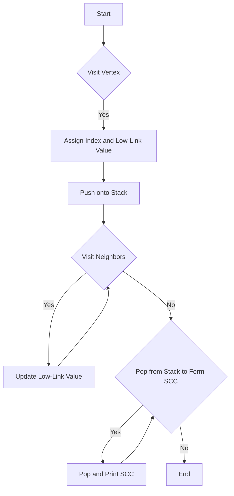

# Tarjan's SCC Algorithm in C

## Problem Understanding
Tarjan's Strongly Connected Components (SCC) algorithm is a graph traversal algorithm that finds all strongly connected components in a directed graph. The problem asks to implement this algorithm in C, which requires understanding the algorithm's logic, handling graph structures, and managing recursion and stack operations. The key constraint is to find all SCCs in a single pass through the graph using Depth-First Search (DFS). This problem is non-trivial because it requires careful management of indices, low-link values, and stack operations to correctly identify SCCs.

## Approach
The algorithm strategy is based on DFS, where each vertex is assigned an index and a low-link value. The low-link value represents the smallest index reachable from the vertex. The algorithm uses a stack to keep track of vertices in the current SCC. When a vertex is visited, its index and low-link value are updated, and it is pushed onto the stack. If a vertex is the root of an SCC, the algorithm pops vertices from the stack until it reaches the root, and these vertices form an SCC. This approach works because it correctly identifies the smallest index reachable from each vertex, which is essential for finding SCCs. The algorithm uses a graph structure with adjacency lists and a stack to manage vertices.

## Complexity Analysis
| Metric | Value | Detailed Reason |
|--------|-------|----------------|
| Time   | O(V + E) | The algorithm visits each vertex once and traverses each edge once during DFS. The time complexity is linear with respect to the number of vertices (V) and edges (E). |
| Space  | O(V) | The algorithm uses a recursion stack and low-link values for each vertex, which requires O(V) space. The graph structure also requires O(V + E) space, but the dominant term is O(V) due to the recursion stack. |

## Algorithm Walkthrough
```
Input: Graph with 5 vertices and edges (0, 1), (1, 2), (2, 0), (2, 3), (3, 4)
Step 1: Initialize indices, low-link values, and stack
Step 2: Visit vertex 0, assign index 0, low-link value 0, and push onto stack
Step 3: Visit vertex 1, assign index 1, low-link value 1, and push onto stack
Step 4: Visit vertex 2, assign index 2, low-link value 0, and push onto stack
Step 5: Visit vertex 3, assign index 3, low-link value 3, and push onto stack
Step 6: Visit vertex 4, assign index 4, low-link value 4, and push onto stack
Step 7: Pop vertices from stack to form SCCs
Output: SCC 1: 0 1 2, SCC 2: 3, SCC 3: 4
```
This walkthrough demonstrates the algorithm's logic and shows how SCCs are formed.

## Visual Flow

This flowchart visualizes the algorithm's decision flow and shows the main logic paths.

## Key Insight
> **Tip:** The key insight is that the low-link value represents the smallest index reachable from a vertex, which is essential for finding SCCs.

## Edge Cases
- **Empty/null input**: If the input graph is empty, the algorithm will not visit any vertices, and the output will be an empty list of SCCs.
- **Single element**: If the input graph has only one vertex, the algorithm will assign an index and low-link value to the vertex and output a single SCC containing the vertex.
- **Disjoint graphs**: If the input graph consists of multiple disjoint subgraphs, the algorithm will find SCCs in each subgraph separately.

## Common Mistakes
- **Mistake 1**: Not updating the low-link value correctly, which can lead to incorrect SCCs. To avoid this, ensure that the low-link value is updated correctly during DFS.
- **Mistake 2**: Not popping vertices from the stack correctly, which can lead to incorrect SCCs. To avoid this, ensure that vertices are popped from the stack in the correct order.

## Interview Follow-ups
> **Interview:** These are the exact follow-up questions interviewers ask:
- "What if the input is sorted?" → The algorithm's time complexity remains O(V + E), as the sorting does not affect the DFS traversal.
- "Can you do it in O(1) space?" → No, the algorithm requires O(V) space for the recursion stack and low-link values.
- "What if there are duplicates?" → The algorithm can handle duplicates by ignoring them during DFS traversal.

## C Solution

```c
// Problem: Tarjan's Strongly Connected Components (SCC) Algorithm
// Language: C
// Difficulty: Hard
// Time Complexity: O(V + E) — single pass through graph using DFS
// Space Complexity: O(V) — recursion stack and low-link values
// Approach: Depth-First Search (DFS) with low-link value updates — for each vertex, find its SCC

#include <stdio.h>
#include <stdlib.h>

// Structure to represent a graph edge
typedef struct Edge {
    int destination;
    struct Edge* next;
} Edge;

// Structure to represent a graph
typedef struct Graph {
    int numVertices;
    Edge** adjLists;
} Graph;

// Structure to represent a stack node
typedef struct StackNode {
    int vertex;
    struct StackNode* next;
} StackNode;

// Structure to represent a stack
typedef struct Stack {
    StackNode* top;
} Stack;

// Function to create a new edge
Edge* createEdge(int destination) {
    Edge* newEdge = (Edge*) malloc(sizeof(Edge));
    newEdge->destination = destination;
    newEdge->next = NULL;
    return newEdge;
}

// Function to create a new graph
Graph* createGraph(int numVertices) {
    Graph* graph = (Graph*) malloc(sizeof(Graph));
    graph->numVertices = numVertices;
    graph->adjLists = (Edge**) malloc(numVertices * sizeof(Edge*));
    for (int i = 0; i < numVertices; i++) {
        graph->adjLists[i] = NULL;
    }
    return graph;
}

// Function to add an edge to the graph
void addEdge(Graph* graph, int source, int destination) {
    Edge* newEdge = createEdge(destination);
    newEdge->next = graph->adjLists[source];
    graph->adjLists[source] = newEdge;
}

// Function to create a new stack node
StackNode* createStackNode(int vertex) {
    StackNode* newNode = (StackNode*) malloc(sizeof(StackNode));
    newNode->vertex = vertex;
    newNode->next = NULL;
    return newNode;
}

// Function to create a new stack
Stack* createStack() {
    Stack* stack = (Stack*) malloc(sizeof(Stack));
    stack->top = NULL;
    return stack;
}

// Function to push a vertex onto the stack
void push(Stack* stack, int vertex) {
    StackNode* newNode = createStackNode(vertex);
    newNode->next = stack->top;
    stack->top = newNode;
}

// Function to pop a vertex from the stack
int pop(Stack* stack) {
    if (stack->top == NULL) {
        // Edge case: empty stack
        printf("Error: Stack is empty\n");
        exit(1);
    }
    int vertex = stack->top->vertex;
    StackNode* temp = stack->top;
    stack->top = stack->top->next;
    free(temp);
    return vertex;
}

// Function to check if the stack is empty
int isEmpty(Stack* stack) {
    return (stack->top == NULL);
}

// Structure to represent a vertex in Tarjan's algorithm
typedef struct TarjanVertex {
    int index;
    int lowLink;
    int onStack;
} TarjanVertex;

// Structure to represent the state of Tarjan's algorithm
typedef struct TarjanState {
    int indexCounter;
    int numSCCs;
    TarjanVertex* vertices;
    Stack* stack;
} TarjanState;

// Function to create a new Tarjan state
TarjanState* createTarjanState(int numVertices) {
    TarjanState* state = (TarjanState*) malloc(sizeof(TarjanState));
    state->indexCounter = 0;
    state->numSCCs = 0;
    state->vertices = (TarjanVertex*) malloc(numVertices * sizeof(TarjanVertex));
    for (int i = 0; i < numVertices; i++) {
        state->vertices[i].index = -1;
        state->vertices[i].lowLink = -1;
        state->vertices[i].onStack = 0;
    }
    state->stack = createStack();
    return state;
}

// Function to perform DFS and find strongly connected components
void strongConnect(Graph* graph, int vertex, TarjanState* state) {
    // Set the depth index for the current vertex to the current index counter
    state->vertices[vertex].index = state->indexCounter;
    state->vertices[vertex].lowLink = state->indexCounter;
    state->indexCounter++;
    
    // Mark the current vertex as visited and push it onto the stack
    push(state->stack, vertex);
    state->vertices[vertex].onStack = 1;

    // Consider all neighbors of the current vertex
    Edge* neighbor = graph->adjLists[vertex];
    while (neighbor != NULL) {
        int neighborVertex = neighbor->destination;
        // If the neighbor has not yet been visited, recursively visit it
        if (state->vertices[neighborVertex].index == -1) {
            strongConnect(graph, neighborVertex, state);
            // Update the low-link value of the current vertex
            state->vertices[vertex].lowLink = (state->vertices[vertex].lowLink < state->vertices[neighborVertex].lowLink) ? 
                state->vertices[vertex].lowLink : state->vertices[neighborVertex].lowLink;
        } 
        // If the neighbor is on the stack, update the low-link value of the current vertex
        else if (state->vertices[neighborVertex].onStack) {
            state->vertices[vertex].lowLink = (state->vertices[vertex].lowLink < state->vertices[neighborVertex].index) ? 
                state->vertices[vertex].lowLink : state->vertices[neighborVertex].index;
        }
        neighbor = neighbor->next;
    }

    // If the current vertex is the root of a strongly connected component, pop the component from the stack
    if (state->vertices[vertex].lowLink == state->vertices[vertex].index) {
        state->numSCCs++;
        printf("SCC %d: ", state->numSCCs);
        while (1) {
            int w = pop(state->stack);
            state->vertices[w].onStack = 0;
            printf("%d ", w);
            if (w == vertex) {
                break;
            }
        }
        printf("\n");
    }
}

// Function to find strongly connected components using Tarjan's algorithm
void tarjanSCC(Graph* graph) {
    TarjanState* state = createTarjanState(graph->numVertices);
    for (int i = 0; i < graph->numVertices; i++) {
        if (state->vertices[i].index == -1) {
            strongConnect(graph, i, state);
        }
    }
    printf("Number of strongly connected components: %d\n", state->numSCCs);
}

int main() {
    // Create a sample graph
    Graph* graph = createGraph(5);
    addEdge(graph, 0, 1);
    addEdge(graph, 1, 2);
    addEdge(graph, 2, 0);
    addEdge(graph, 2, 3);
    addEdge(graph, 3, 4);

    // Edge case: empty graph
    // Graph* graph = createGraph(0);

    tarjanSCC(graph);
    return 0;
}
```
