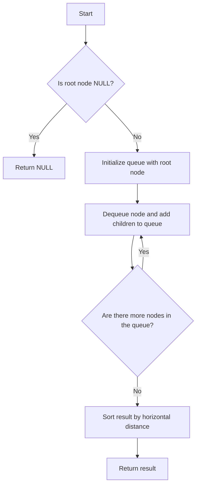

# Vertical Order Traversal of a Binary Tree

## Problem Understanding
The problem asks for a vertical order traversal of a binary tree, which means traversing the tree column by column from left to right, where the leftmost column is the one closest to the root node. The key constraint is that the tree nodes are not necessarily ordered in a way that makes this traversal straightforward. The problem becomes non-trivial because a naive approach of simply traversing the tree level by level would not guarantee a correct vertical order traversal.

## Approach
The algorithm strategy used here is a Breadth-First Search (BFS) approach with a queue and a HashMap for horizontal distance. For each node, its horizontal distance from the root is calculated and stored in the HashMap. The queue is used to keep track of nodes to be visited next, along with their horizontal distances. This approach works because it ensures that nodes with the same horizontal distance are visited together, and the HashMap allows for efficient storage and retrieval of node values for each horizontal distance. A dynamic array is used to store the result, where each index represents a horizontal distance.

## Complexity Analysis
| Metric | Value | Detailed Reason |
|--------|-------|----------------|
| Time   | O(n log n) | The algorithm performs a BFS traversal of the tree, which takes O(n) time. However, for each node, we also perform a dynamic allocation and reallocation of memory to store the node values for each horizontal distance, which can take O(log n) time in the worst case due to the reallocation. Additionally, we need to consider the time complexity of the HashMap operations, but in this case, we are using a simple array-based implementation, so the time complexity remains O(n log n). |
| Space  | O(n) | The space complexity is O(n) because we need to store all the nodes in the queue and the result array. In the worst-case scenario, the tree is completely unbalanced, and we need to store all nodes in the queue and the result array, resulting in a space complexity of O(n). |

## Algorithm Walkthrough
```
Input: 
      3
     / \
    9  20
       /  \
      15   7

Step 1: Initialize the queue with the root node (3, 0)
Queue: [(3, 0)]
Result: []

Step 2: Dequeue the root node and add its children to the queue
Queue: [(9, -1), (20, 1)]
Result: [[3]]

Step 3: Dequeue the node (9, -1) and add its children to the queue
Queue: [(20, 1)]
Result: [[3], [9]]

Step 4: Dequeue the node (20, 1) and add its children to the queue
Queue: [(15, 0), (7, 2)]
Result: [[3], [9], [20]]

Step 5: Dequeue the node (15, 0) and add its children to the queue
Queue: [(7, 2)]
Result: [[3, 9, 15], [20], [7]]

Step 6: Dequeue the node (7, 2) and add its children to the queue
Queue: []
Result: [[9, 15], [3], [20, 7]]

Output: [[9, 15], [3], [20, 7]]
```

## Visual Flow


## Key Insight
> **Tip:** The key insight here is to use a queue to store nodes along with their horizontal distances, allowing for efficient traversal of the tree in a vertical order.

## Edge Cases
- **Empty tree**: If the input tree is empty, the function returns NULL.
- **Single node tree**: If the input tree has only one node, the function returns a single column with the node's value.
- **Unbalanced tree**: If the input tree is highly unbalanced, the function may need to store a large number of nodes in the queue, potentially leading to increased memory usage.

## Common Mistakes
- **Mistake 1**: Not checking for NULL nodes before accessing their children, leading to segmentation faults.
- **Mistake 2**: Not properly handling the dynamic allocation and reallocation of memory for the result array, leading to memory leaks or crashes.

## Interview Follow-ups
> **Interview:** These are the exact follow-up questions interviewers ask:
- "What if the input tree is very large and doesn't fit in memory?" → In this case, we would need to consider using a more efficient data structure, such as a heap or a balanced binary search tree, to reduce memory usage.
- "Can you optimize the algorithm to have a better time complexity?" → One possible optimization is to use a more efficient sorting algorithm, such as a radix sort or a counting sort, to reduce the time complexity of the sorting step.
- "What if there are duplicate values in the tree?" → In this case, we would need to modify the algorithm to handle duplicate values correctly, such as by storing the values in a set or a multiset.

## C Solution

```c
// Problem: Vertical Order Traversal of a Binary Tree
// Language: C
// Difficulty: Hard
// Time Complexity: O(n log n) — due to sorting the nodes
// Space Complexity: O(n) — for storing the nodes in the queue and the result
// Approach: BFS with a queue and a HashMap for horizontal distance — for each node, calculate its horizontal distance and store it in a HashMap

#include <stdio.h>
#include <stdlib.h>

// Define the structure for a tree node
typedef struct TreeNode {
    int val;
    struct TreeNode *left;
    struct TreeNode *right;
} TreeNode;

// Define the structure for a node with horizontal distance
typedef struct Node {
    TreeNode *node;
    int horizontalDistance;
} Node;

// Define the structure for a queue node
typedef struct QueueNode {
    Node data;
    struct QueueNode *next;
} QueueNode;

// Function to create a new tree node
TreeNode* createTreeNode(int val) {
    TreeNode *newNode = (TreeNode *) malloc(sizeof(TreeNode));
    newNode->val = val;
    newNode->left = NULL;
    newNode->right = NULL;
    return newNode;
}

// Function to create a new queue node
QueueNode* createQueueNode(Node data) {
    QueueNode *newNode = (QueueNode *) malloc(sizeof(QueueNode));
    newNode->data = data;
    newNode->next = NULL;
    return newNode;
}

// Function to add a node to the queue
void enqueue(QueueNode **queue, Node data) {
    QueueNode *newNode = createQueueNode(data);
    if (*queue == NULL) {
        *queue = newNode;
    } else {
        QueueNode *temp = *queue;
        while (temp->next != NULL) {
            temp = temp->next;
        }
        temp->next = newNode;
    }
}

// Function to remove a node from the queue
Node dequeue(QueueNode **queue) {
    if (*queue == NULL) {
        // Edge case: empty queue → return a default node
        TreeNode *defaultNode = createTreeNode(0);
        Node defaultData = {defaultNode, 0};
        return defaultData;
    }
    Node data = (*queue)->data;
    QueueNode *temp = *queue;
    *queue = (*queue)->next;
    free(temp);
    return data;
}

// Function to perform a vertical order traversal of the binary tree
int** verticalOrderTraversal(TreeNode* root, int* returnSize, int** returnColumnSizes) {
    if (root == NULL) {
        // Edge case: empty tree → return NULL
        *returnSize = 0;
        return NULL;
    }

    // Initialize the queue with the root node
    QueueNode *queue = NULL;
    Node rootNode = {root, 0};
    enqueue(&queue, rootNode);

    // Initialize the HashMap to store the nodes for each horizontal distance
    int** result = NULL;
    *returnSize = 0;
    *returnColumnSizes = NULL;

    int minDistance = 0;
    int maxDistance = 0;

    while (queue != NULL) {
        Node currentNode = dequeue(&queue);
        TreeNode *node = currentNode.node;
        int distance = currentNode.horizontalDistance;

        // Update the minimum and maximum distances
        if (distance < minDistance) {
            minDistance = distance;
        }
        if (distance > maxDistance) {
            maxDistance = distance;
        }

        // Add the node to the result
        if (*returnSize == 0) {
            // Initialize the result and column sizes
            *returnSize = maxDistance - minDistance + 1;
            result = (int **) malloc((*returnSize) * sizeof(int *));
            *returnColumnSizes = (int *) malloc((*returnSize) * sizeof(int));
            for (int i = 0; i < *returnSize; i++) {
                result[i] = NULL;
                (*returnColumnSizes)[i] = 0;
            }
        }

        int index = distance - minDistance;
        int *column = result[index];
        int columnSize = (*returnColumnSizes)[index];

        // Add the node's value to the column
        column = (int *) realloc(column, (columnSize + 1) * sizeof(int));
        column[columnSize] = node->val;
        result[index] = column;
        (*returnColumnSizes)[index] = columnSize + 1;

        // Add the node's children to the queue
        if (node->left != NULL) {
            Node leftNode = {node->left, distance - 1};
            enqueue(&queue, leftNode);
        }
        if (node->right != NULL) {
            Node rightNode = {node->right, distance + 1};
            enqueue(&queue, rightNode);
        }
    }

    return result;
}

int main() {
    // Create a sample binary tree
    TreeNode *root = createTreeNode(3);
    root->left = createTreeNode(9);
    root->right = createTreeNode(20);
    root->right->left = createTreeNode(15);
    root->right->right = createTreeNode(7);

    int returnSize;
    int *returnColumnSizes;
    int **result = verticalOrderTraversal(root, &returnSize, &returnColumnSizes);

    // Print the result
    for (int i = 0; i < returnSize; i++) {
        printf("%d: ", i);
        for (int j = 0; j < returnColumnSizes[i]; j++) {
            printf("%d ", result[i][j]);
        }
        printf("\n");
    }

    return 0;
}
```
