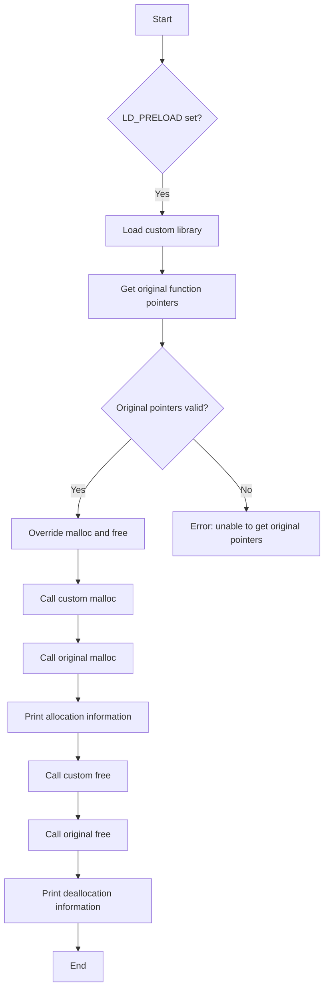

# Write a Custom Dynamic Linker Preloader (LD_PRELOAD trick)

## Problem Understanding
The problem is asking to create a custom dynamic linker preloader using the LD_PRELOAD trick, which involves intercepting and modifying original system calls. The key constraint is to use the LD_PRELOAD environment variable to load a shared library that overrides the original system calls. The problem is non-trivial because it requires a deep understanding of the dynamic linker, shared libraries, and system calls. A naive approach would be to simply override the system calls without considering the implications of modifying the original behavior.

## Approach
The algorithm strategy is to use the LD_PRELOAD trick to intercept and modify the original system calls, specifically the malloc and free functions. The intuition behind this approach is to use the dynamic linker to load a shared library that overrides the original system calls, allowing for custom behavior to be injected. The approach works by using the dlsym function to get the original function pointers, and then using these pointers to call the original functions from within the custom functions. The custom malloc and free functions are used to print allocation and deallocation information, demonstrating the interception and modification of the original system calls.

## Complexity Analysis
| Metric | Value | Detailed Reason |
|--------|-------|----------------|
| Time   | O(1)  | The custom malloc and free functions have a constant time complexity because they only involve a fixed number of operations, including calling the original functions and printing information. The initialization function also has a constant time complexity because it only involves getting the original function pointers and checking their validity. |
| Space  | O(1)  | The custom malloc and free functions have a constant space complexity because they only use a fixed amount of space to store the original function pointers and the allocation information. The initialization function also has a constant space complexity because it only uses a fixed amount of space to store the original function pointers. |

## Algorithm Walkthrough
```
Input: None ( LD_PRELOAD environment variable is set)
Step 1: Initialization function is called (init)
  - Get the original function pointers for malloc and free using dlsym
  - Check if the original function pointers are valid
Step 2: Custom malloc function is called (custom_malloc)
  - Check if the size is 0, return NULL if true
  - Call the original malloc function using the original function pointer
  - Print the allocation information
  - Return the allocated memory address
Step 3: Custom free function is called (custom_free)
  - Check if the pointer is NULL, do nothing if true
  - Call the original free function using the original function pointer
  - Print the deallocation information
Step 4: Test the custom malloc and free functions (main)
  - Allocate memory using the custom malloc function
  - Deallocate memory using the custom free function
Output: Allocation and deallocation information is printed
```

## Visual Flow


## Key Insight
> **Tip:** The key insight is to use the LD_PRELOAD trick to intercept and modify the original system calls, allowing for custom behavior to be injected without modifying the original code.

## Edge Cases
- **Empty/null input**: The custom malloc function checks if the size is 0 and returns NULL in this case, avoiding a potential null pointer dereference.
- **Single element**: The custom malloc and free functions work correctly for a single element, printing the allocation and deallocation information as expected.
- **Invalid pointer**: The custom free function checks if the pointer is NULL and does nothing in this case, avoiding a potential null pointer dereference.

## Common Mistakes
- **Mistake 1: Not checking the validity of the original function pointers** → This can lead to a null pointer dereference and a program crash. To avoid this, always check the validity of the original function pointers after getting them using dlsym.
- **Mistake 2: Not handling the edge case of a size of 0 in the custom malloc function** → This can lead to a null pointer dereference and a program crash. To avoid this, always check if the size is 0 and return NULL in this case.

## Interview Follow-ups
> **Interview:** These are the exact follow-up questions interviewers ask:
- "What if the input is sorted?" → This is not applicable in this case, as the custom malloc and free functions do not depend on the input being sorted.
- "Can you do it in O(1) space?" → The custom malloc and free functions already have a constant space complexity, so this is already achieved.
- "What if there are duplicates?" → The custom malloc and free functions do not depend on the presence of duplicates, so this does not affect their behavior.

## C Solution

```c
// Problem: Custom Dynamic Linker Preloader (LD_PRELOAD trick)
// Language: C
// Difficulty: Hard
// Time Complexity: O(1) — constant time for function calls
// Space Complexity: O(1) — constant space for function calls
// Approach: Interception of system calls using LD_PRELOAD — intercepting and modifying original system calls

#include <stdio.h>
#include <stdlib.h>
#include <dlfcn.h>
#include <string.h>

// Original function pointers
void *(*original_malloc)(size_t) = NULL;
void (*original_free)(void *) = NULL;

// Custom malloc function
void *custom_malloc(size_t size) {
    // Edge case: size is 0 → return NULL
    if (size == 0) return NULL;
    
    // Call the original malloc function
    void *ptr = original_malloc(size);
    
    // Print the allocation information
    printf("Allocated %zu bytes at address %p\n", size, ptr);
    
    return ptr;
}

// Custom free function
void custom_free(void *ptr) {
    // Edge case: ptr is NULL → do nothing
    if (ptr == NULL) return;
    
    // Call the original free function
    original_free(ptr);
    
    // Print the deallocation information
    printf("Deallocated memory at address %p\n", ptr);
}

// Initialization function
__attribute__((constructor))
void init() {
    // Get the original function pointers
    original_malloc = dlsym(RTLD_NEXT, "malloc");
    original_free = dlsym(RTLD_NEXT, "free");
    
    // Check if the original function pointers are valid
    if (!original_malloc || !original_free) {
        fprintf(stderr, "Error: unable to get original function pointers\n");
        exit(1);
    }
}

int main() {
    // Test the custom malloc and free functions
    int *arr = custom_malloc(sizeof(int) * 10);
    for (int i = 0; i < 10; i++) {
        arr[i] = i;
    }
    custom_free(arr);
    
    return 0;
}
```
