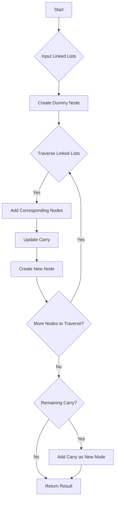

# Add Two Numbers Represented by Linked Lists

## Problem Understanding
The problem requires adding two numbers represented as linked lists, where each node in the list represents a digit in the number. The digits are stored in reverse order, meaning the least significant digit is at the head of the list. The task is to add these two numbers and return the result as a linked list. The key constraint is that the input linked lists can be of varying lengths, and the addition must handle any carry-over from the sum of two digits. This problem is non-trivial because a naive approach might not handle the carry-over correctly, especially when the sum of two digits exceeds 9.

## Approach
The algorithm strategy used here is an iterative node-by-node addition with carry handling. The intuition behind this approach is to traverse both linked lists simultaneously, adding corresponding nodes (digits) together along with any carry from the previous addition. The result of this sum is then used to create a new node in the resulting linked list, with the value being the sum modulo 10 (to get the last digit of the sum), and the carry being updated for the next iteration. A dummy node is used to simplify the handling of the head node of the resulting linked list. This approach works because it correctly handles the carry-over and ensures that the digits in the result are calculated accurately.

## Complexity Analysis
| Metric | Value | Detailed Reason |
|--------|-------|----------------|
| Time   | O(max(m, n)) | The algorithm iterates through both linked lists once. The time complexity is directly proportional to the maximum length between the two lists (m and n), because in the worst case, we might need to traverse every node in both lists. |
| Space  | O(max(m, n)) | The space complexity is also proportional to the maximum length between the two lists because in the worst case, we might need to create a new node for every node in the longer list plus one additional node to handle any remaining carry. |

## Algorithm Walkthrough
```
Input: l1 = [2, 4, 3], l2 = [5, 6, 4]
Step 1: Create a dummy node, current points to it, carry = 0
        current: dummy, l1: 2, l2: 5
Step 2: sum = carry + l1->val + l2->val = 0 + 2 + 5 = 7
        Create new node with sum % 10 = 7, carry = sum / 10 = 0
        current->next = new node (7), current moves to new node
        l1 moves to next (4), l2 moves to next (6)
Step 3: sum = carry + l1->val + l2->val = 0 + 4 + 6 = 10
        Create new node with sum % 10 = 0, carry = sum / 10 = 1
        current->next = new node (0), current moves to new node
        l1 moves to next (3), l2 moves to next (4)
Step 4: sum = carry + l1->val + l2->val = 1 + 3 + 4 = 8
        Create new node with sum % 10 = 8, carry = sum / 10 = 0
        current->next = new node (8), current moves to new node
        l1 becomes NULL, l2 becomes NULL
Step 5: Since carry = 0 and both l1 and l2 are NULL, we stop.
Output: Resulting linked list is [7, 0, 8]
```

## Visual Flow


## Key Insight
> **Tip:** The key insight here is to use a dummy node to simplify the code and avoid special handling for the head of the resulting linked list, making the code more concise and easier to understand.

## Edge Cases
- **Empty/null input**: If both linked lists are empty (NULL), the function returns NULL, as there are no numbers to add.
- **Single element**: If one of the linked lists has only one element, the function still works correctly by adding this single element with the corresponding element(s) in the other list and handling any carry appropriately.
- **Lists of different lengths**: The function correctly handles lists of different lengths by continuing to add nodes from the longer list with the carry until all nodes have been processed.

## Common Mistakes
- **Mistake 1: Not handling carry correctly**: Failing to update the carry after each addition can lead to incorrect results. To avoid this, ensure that the carry is updated after each addition step.
- **Mistake 2: Not checking for NULL pointers**: Not checking if a node is NULL before accessing its value can lead to runtime errors. Always check for NULL before accessing or manipulating a node.

## Interview Follow-ups
> **Interview:** 
- "What if the input is sorted?" → The algorithm does not rely on the input being sorted; it works with linked lists where digits are in reverse order, which is a common representation for numbers in linked lists.
- "Can you do it in O(1) space?" → No, because we need to create a new linked list to store the result, which requires additional space proportional to the length of the input lists.
- "What if there are duplicates?" → The algorithm handles duplicates correctly as it treats each node's value independently during the addition process.

## C Solution

```c
// Problem: Add Two Numbers Represented by Linked Lists
// Language: C
// Difficulty: Medium
// Time Complexity: O(max(m, n)) — where m and n are lengths of linked lists
// Space Complexity: O(max(m, n)) — new linked list with at most max(m, n) + 1 nodes
// Approach: Iterative node-by-node addition with carry handling

// Definition for singly-linked list.
struct ListNode {
    int val;
    struct ListNode *next;
};

// Function to add two numbers represented by linked lists
struct ListNode* addTwoNumbers(struct ListNode* l1, struct ListNode* l2) {
    // Create a dummy node to simplify handling of head node
    struct ListNode* dummy = (struct ListNode*)malloc(sizeof(struct ListNode));
    struct ListNode* current = dummy; // Pointer to current node
    int carry = 0; // Carry from previous addition

    // Edge case: both linked lists are empty
    if (l1 == NULL && l2 == NULL) {
        return NULL; // No nodes to add
    }

    // Traverse both linked lists and add corresponding nodes
    while (l1 != NULL || l2 != NULL) {
        int sum = carry; // Initialize sum with carry
        if (l1 != NULL) {
            sum += l1->val; // Add value of current node in l1
            l1 = l1->next; // Move to next node in l1
        }
        if (l2 != NULL) {
            sum += l2->val; // Add value of current node in l2
            l2 = l2->next; // Move to next node in l2
        }

        // Create new node with sum modulo 10
        current->next = (struct ListNode*)malloc(sizeof(struct ListNode));
        current->next->val = sum % 10; // Value of new node
        current->next->next = NULL; // Initialize next pointer
        current = current->next; // Move to new node

        // Update carry for next iteration
        carry = sum / 10;
    }

    // Edge case: remaining carry after traversing both linked lists
    if (carry > 0) {
        current->next = (struct ListNode*)malloc(sizeof(struct ListNode));
        current->next->val = carry; // Value of new node
        current->next->next = NULL; // Initialize next pointer
    }

    // Return linked list starting from node after dummy node
    struct ListNode* result = dummy->next;
    free(dummy); // Free dummy node
    return result;
}
```
