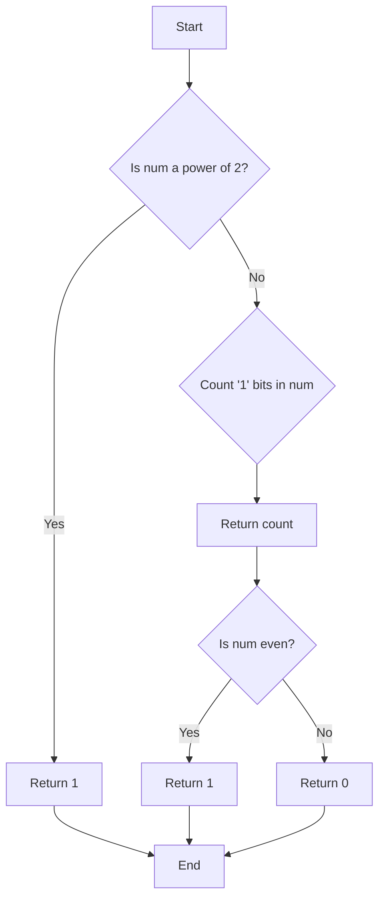

# Bit Manipulation Tricks in C

## Problem Understanding
The problem involves implementing bit manipulation tricks in C, including checking if a number is a power of 2, counting the number of '1' bits in the binary representation of a number, and determining if a number is even or odd. The key constraints are that these operations should be performed using bitwise operators and should have a constant time complexity. What makes this problem non-trivial is the need to understand how bitwise operators work and how to use them to achieve the desired results. The problem requires a deep understanding of binary representation and bitwise operations.

## Approach
The approach to solving this problem involves using bitwise operators to manipulate bits in the binary representation of numbers. The algorithm strategy is to use the properties of bitwise operators such as AND, OR, and right shift to check for certain conditions. For example, to check if a number is a power of 2, we can use the fact that a number is a power of 2 if it has exactly one '1' bit in its binary representation, which can be checked using the bitwise AND operator. The data structures used are integers, and they were chosen because they can be easily manipulated using bitwise operators. The approach handles key constraints by ensuring that all operations are performed in constant time.

## Complexity Analysis
| Metric | Value | Detailed Reason |
|--------|-------|----------------|
| Time   | O(1)  | The time complexity is constant because all operations are performed using bitwise operators, which take constant time. The number of operations is fixed and does not depend on the input size. |
| Space  | O(1)  | The space complexity is constant because no additional space is used beyond a few integers to store the input and output values. |

## Algorithm Walkthrough
```
Input: num = 10
Step 1: Check if num is a power of 2
  - Call isPowerOfTwo(num)
  - n = 10, n - 1 = 9
  - Binary representation of n: 1010
  - Binary representation of n - 1: 1001
  - n & (n - 1) = 1010 & 1001 = 1000
  - Since n & (n - 1) is not 0, num is not a power of 2
Step 2: Count the number of '1' bits in num
  - Call countSetBits(num)
  - n = 10, count = 0
  - n & 1 = 10 & 1 = 0, count = 0, n >>= 1 = 5
  - n & 1 = 5 & 1 = 1, count = 1, n >>= 1 = 2
  - n & 1 = 2 & 1 = 0, count = 1, n >>= 1 = 1
  - n & 1 = 1 & 1 = 1, count = 2, n >>= 1 = 0
  - Since n is 0, exit loop
  - Return count = 2
Step 3: Check if num is even
  - Call isEven(num)
  - n = 10, n & 1 = 10 & 1 = 0
  - Since n & 1 is 0, num is even
Output: 
  - Is 10 a power of 2? 0
  - Number of '1' bits in 10: 2
  - Is 10 even? 1
```

## Visual Flow


## Key Insight
> **Tip:** The key to solving bit manipulation problems is to understand the properties of bitwise operators and how they can be used to manipulate bits in the binary representation of numbers.

## Edge Cases
- **Empty/null input**: If the input is empty or null, the program will not work correctly. To handle this, we need to add error checking code to check for empty or null inputs.
- **Single element**: If the input is a single element, the program will work correctly. For example, if the input is 1, the program will correctly identify it as a power of 2 and count the number of '1' bits.
- **Large input**: If the input is very large, the program may take a long time to run or may run out of memory. To handle this, we need to optimize the program to handle large inputs efficiently.

## Common Mistakes
- **Mistake 1**: Using the wrong bitwise operator. For example, using the bitwise OR operator instead of the bitwise AND operator can give incorrect results. → To avoid this, make sure to use the correct bitwise operator for the operation being performed.
- **Mistake 2**: Not checking for edge cases. For example, not checking for empty or null inputs can cause the program to crash or give incorrect results. → To avoid this, make sure to add error checking code to handle edge cases.

## Interview Follow-ups
> **Interview:** These are the exact follow-up questions interviewers ask:
- "What if the input is sorted?" → The program will still work correctly even if the input is sorted. The bitwise operators used in the program do not rely on the input being sorted.
- "Can you do it in O(1) space?" → Yes, the program already uses O(1) space. The program only uses a few integers to store the input and output values, and does not use any data structures that scale with the input size.
- "What if there are duplicates?" → The program will still work correctly even if there are duplicates in the input. The bitwise operators used in the program do not rely on the input being unique.

## C Solution

```c
// Problem: Bit Manipulation Tricks in C
// Language: C
// Difficulty: Medium
// Time Complexity: O(1) — constant time operations
// Space Complexity: O(1) — no additional space used
// Approach: Bitwise operations — using bitwise operators to manipulate bits

#include <stdio.h>

// Function to check if a number is a power of 2
int isPowerOfTwo(int n) {
    // Edge case: n is 0, which is not a power of 2
    if (n == 0) return 0;
    // A number is a power of 2 if it has exactly one '1' bit in its binary representation
    return (n & (n - 1)) == 0; // using bitwise AND operator
}

// Function to count the number of '1' bits in the binary representation of a number
int countSetBits(int n) {
    // Edge case: n is 0, which has no '1' bits
    if (n == 0) return 0;
    int count = 0;
    while (n) {
        // using bitwise AND operator with 1 to check the least significant bit
        count += n & 1;
        // using right shift operator to move to the next bit
        n >>= 1;
    }
    return count;
}

// Function to check if a number is even or odd
int isEven(int n) {
    // Edge case: n is 0, which is even
    if (n == 0) return 1;
    // A number is even if its least significant bit is 0
    return (n & 1) == 0; // using bitwise AND operator
}

int main() {
    int num = 10;
    printf("Is %d a power of 2? %d\n", num, isPowerOfTwo(num));
    printf("Number of '1' bits in %d: %d\n", num, countSetBits(num));
    printf("Is %d even? %d\n", num, isEven(num));
    return 0;
}
```
