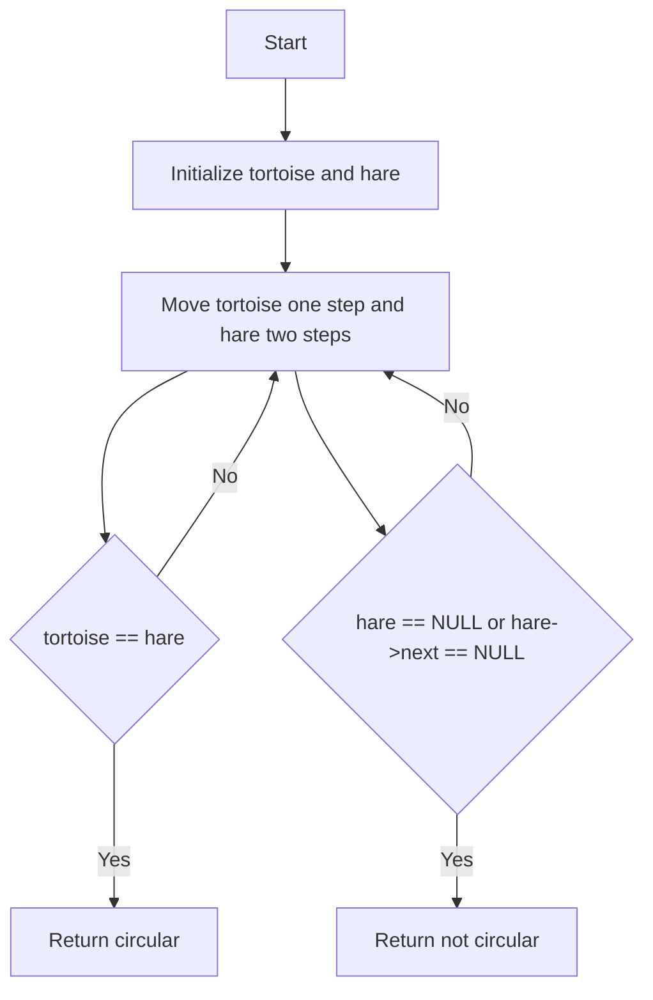

# Circular Linked List

## Problem Understanding
The problem is asking to detect whether a given linked list is circular, meaning it has a cycle where the last node points back to a previous node. The key constraint is that we need to use constant space, making an iterative approach necessary. What makes this problem non-trivial is that a naive approach of traversing the linked list and checking for a cycle by keeping track of visited nodes would require extra space, which is not allowed. The problem requires a clever algorithm that can detect a cycle using a constant amount of space.

## Approach
The algorithm strategy used here is Floyd's Tortoise and Hare algorithm, also known as the slow and fast pointer technique. The intuition behind it is that if a linked list has a cycle, a slow pointer and a fast pointer will eventually meet at some point within the cycle. The slow pointer moves one step at a time, while the fast pointer moves two steps at a time. This approach works because if there is a cycle, the fast pointer will eventually catch up to the slow pointer. We use two pointers, `tortoise` and `hare`, to implement this approach, and we traverse the linked list until the `hare` reaches the end or the two pointers meet.

## Complexity Analysis
| Metric | Value | Detailed Reason |
|--------|-------|----------------|
| Time   | O(n)  | We traverse the linked list at most once, where n is the number of nodes in the linked list. In the worst case, the fast pointer will reach the end of the linked list, and we will have checked all nodes. |
| Space  | O(1)  | We use a constant amount of space to store the two pointers, `tortoise` and `hare`, regardless of the size of the input linked list. |

## Algorithm Walkthrough
```
Input: A circular linked list: 1 -> 2 -> 3 -> 4 -> 1
Step 1: Initialize tortoise and hare to the head of the linked list (node 1)
Step 2: Move tortoise one step (node 2) and hare two steps (node 3)
Step 3: Move tortoise one step (node 3) and hare two steps (node 1)
Step 4: Move tortoise one step (node 4) and hare two steps (node 3)
Step 5: Move tortoise one step (node 1) and hare two steps (node 3)
Step 6: Move tortoise one step (node 2) and hare two steps (node 1)
Step 7: Move tortoise one step (node 3) and hare two steps (node 2)
Step 8: Move tortoise one step (node 4) and hare two steps (node 4)
Step 9: Move tortoise one step (node 1) and hare two steps (node 2)
Step 10: Move tortoise one step (node 2) and hare two steps (node 3)
Step 11: Move tortoise one step (node 3) and hare two steps (node 1)
Step 12: Move tortoise one step (node 4) and hare two steps (node 3)
Step 13: Move tortoise one step (node 1) and hare two steps (node 1)
Output: The linked list is circular (tortoise and hare meet at node 1)
```

## Visual Flow


## Key Insight
> **Tip:** The key insight is that if a linked list has a cycle, the fast pointer will eventually catch up to the slow pointer, allowing us to detect the cycle using a constant amount of space.

## Edge Cases
- **Empty/null input**: If the input linked list is empty or null, the function will return 0, indicating that the linked list is not circular. This is because there are no nodes to traverse, and therefore no cycle can exist.
- **Single element**: If the input linked list has only one node, the function will return 0, indicating that the linked list is not circular. This is because a single node cannot form a cycle.
- **Cycle at the head**: If the cycle starts at the head of the linked list, the function will still detect the cycle correctly. This is because the fast pointer will eventually catch up to the slow pointer, regardless of where the cycle starts.

## Common Mistakes
- **Mistake 1**: Not checking for the `hare` pointer reaching the end of the linked list. This can cause an infinite loop if the linked list is not circular. To avoid this, we need to check if `hare` or `hare->next` is null before moving the pointers.
- **Mistake 2**: Not initializing the `tortoise` and `hare` pointers correctly. This can cause the function to return incorrect results or crash. To avoid this, we need to initialize the pointers to the head of the linked list.

## Interview Follow-ups
> **Interview:** These are the exact follow-up questions interviewers ask:
- "What if the input is sorted?" → The algorithm will still work correctly, as the sorting of the input does not affect the detection of a cycle.
- "Can you do it in O(1) space?" → This is already achieved by the algorithm, as we use a constant amount of space to store the two pointers.
- "What if there are duplicates?" → The algorithm will still work correctly, as the presence of duplicates does not affect the detection of a cycle.

## C Solution

```c
// Problem: Circular Linked List
// Language: C
// Difficulty: Medium
// Time Complexity: O(n) — single pass through linked list
// Space Complexity: O(1) — constant space used
// Approach: Floyd's Tortoise and Hare algorithm — two pointers moving at different speeds

#include <stdio.h>
#include <stdlib.h>

// Define the structure for a linked list node
typedef struct Node {
    int data;
    struct Node* next;
} Node;

// Function to create a new node
Node* createNode(int data) {
    Node* newNode = (Node*) malloc(sizeof(Node));
    if (!newNode) {
        printf("Memory error\n");
        return NULL;
    }
    newNode->data = data;
    newNode->next = NULL;
    return newNode;
}

// Function to insert a node at the end of the linked list
void insertNode(Node** head, int data) {
    Node* newNode = createNode(data);
    if (*head == NULL) {
        *head = newNode;
    } else {
        Node* lastNode = *head;
        while (lastNode->next) {
            lastNode = lastNode->next; // traverse to the last node
        }
        lastNode->next = newNode;
    }
}

// Function to detect whether a linked list is circular
int isCircular(Node* head) {
    if (head == NULL) {
        return 0; // Edge case: empty linked list
    }

    // Initialize two pointers, tortoise and hare
    Node* tortoise = head;
    Node* hare = head;

    while (hare && hare->next) {
        tortoise = tortoise->next; // move one step at a time
        hare = hare->next->next; // move two steps at a time

        if (tortoise == hare) {
            return 1; // if tortoise and hare meet, the list is circular
        }
    }

    return 0; // if hare reaches the end, the list is not circular
}

int main() {
    Node* head = NULL;

    // Create a circular linked list: 1 -> 2 -> 3 -> 4 -> 1
    insertNode(&head, 1);
    insertNode(&head, 2);
    insertNode(&head, 3);
    insertNode(&head, 4);
    head->next->next->next->next = head; // make the list circular

    if (isCircular(head)) {
        printf("The linked list is circular.\n");
    } else {
        printf("The linked list is not circular.\n");
    }

    return 0;
}
```
