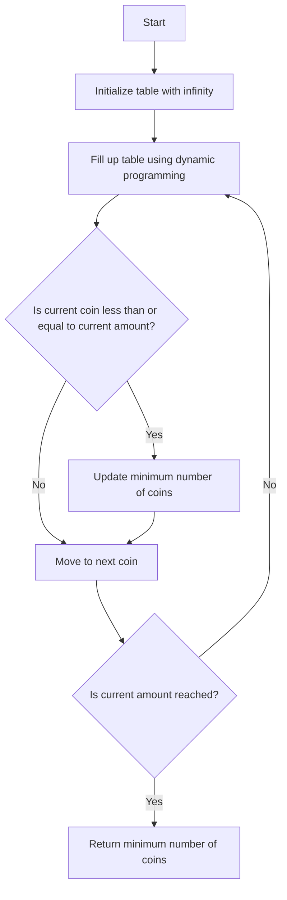

# Coin Change Problem

## Problem Understanding
The Coin Change Problem is asking to find the minimum number of coins required to sum up to a given amount, using a set of available coins with different denominations. The key constraint is that we can use each coin any number of times, and we need to find the combination of coins that results in the minimum number of coins. This problem is non-trivial because a naive approach, such as trying all possible combinations of coins, would result in exponential time complexity due to the large number of possible combinations.

## Approach
The algorithm strategy used to solve this problem is dynamic programming, which involves breaking down the problem into smaller subproblems and building up the solution from the solutions of these subproblems. The intuition behind this approach is to create a table that stores the minimum number of coins required for each amount from 0 to the given amount. We use a bottom-up approach to fill up this table, starting from the base case where the amount is 0 and requires 0 coins. We then iterate through each coin and each amount, updating the minimum number of coins for each amount if a better solution is found. The data structure used is a table of integers, where each element represents the minimum number of coins required for a specific amount.

## Complexity Analysis
| Metric | Value | Detailed Reason |
|--------|-------|----------------|
| Time   | O(amount * numCoins) | The time complexity is O(amount * numCoins) because we need to iterate through each amount from 0 to the given amount, and for each amount, we need to iterate through each coin to check if it can be used to make up the current amount. The number of iterations is proportional to the product of the amount and the number of coins. |
| Space  | O(amount) | The space complexity is O(amount) because we need to store the minimum number of coins required for each amount from 0 to the given amount in a table. The size of the table is proportional to the amount. |

## Algorithm Walkthrough
```
Input: coins = [1, 2, 5], numCoins = 3, amount = 11
Step 1: Initialize the table with infinity, except for 0 which requires 0 coins
  dp = [0, INF, INF, INF, INF, INF, INF, INF, INF, INF, INF, INF]
Step 2: Fill up the table using dynamic programming
  For coin 1:
    dp[1] = min(dp[1], dp[0] + 1) = min(INF, 0 + 1) = 1
    dp[2] = min(dp[2], dp[1] + 1) = min(INF, 1 + 1) = 2
    dp[3] = min(dp[3], dp[2] + 1) = min(INF, 2 + 1) = 3
    ...
  For coin 2:
    dp[2] = min(dp[2], dp[0] + 1) = min(2, 0 + 1) = 1
    dp[4] = min(dp[4], dp[2] + 1) = min(INF, 1 + 1) = 2
    dp[6] = min(dp[6], dp[4] + 1) = min(INF, 2 + 1) = 3
    ...
  For coin 5:
    dp[5] = min(dp[5], dp[0] + 1) = min(INF, 0 + 1) = 1
    dp[10] = min(dp[10], dp[5] + 1) = min(INF, 1 + 1) = 2
    ...
Step 3: Check if a solution was found
  dp[11] = 3
Output: Minimum number of coins = 3
```
## Visual Flow

## Key Insight
> **Tip:** The key insight is to use dynamic programming to build up the solution from smaller subproblems, and to use a table to store the minimum number of coins required for each amount.

## Edge Cases
- **Empty input**: If the input array is empty, the function should return -1 because no combination of coins can sum up to the given amount.
- **Single coin**: If there is only one coin, the function should return the amount divided by the coin value if it is an integer, and -1 otherwise.
- **Amount is 0**: If the amount is 0, the function should return 0 because no coins are needed to sum up to 0.

## Common Mistakes
- **Mistake 1**: Not initializing the table with infinity, which can lead to incorrect results.
- **Mistake 2**: Not checking if the current coin is less than or equal to the current amount, which can lead to incorrect updates of the minimum number of coins.

## Interview Follow-ups
> **Interview:** These are the exact follow-up questions interviewers ask:
- "What if the input is sorted?" → The algorithm still works even if the input is sorted, because we are using dynamic programming to build up the solution from smaller subproblems.
- "Can you do it in O(1) space?" → No, because we need to store the minimum number of coins required for each amount in a table, which requires O(amount) space.
- "What if there are duplicates?" → The algorithm still works even if there are duplicates, because we are using a table to store the minimum number of coins required for each amount, and duplicates do not affect the result.

## C Solution

```c
// Problem: Coin Change Problem
// Language: C
// Difficulty: Medium
// Time Complexity: O(amount * numCoins) — using dynamic programming to fill up table
// Space Complexity: O(amount) — table to store minimum number of coins for each amount
// Approach: Dynamic Programming — building up solution from smaller subproblems

#include <stdio.h>
#include <limits.h>

int coinChange(int* coins, int numCoins, int amount) {
    // Create a table to store the minimum number of coins for each amount
    int* dp = (int*) malloc((amount + 1) * sizeof(int));
    
    // Initialize the table with infinity, except for 0 which requires 0 coins
    for (int i = 0; i <= amount; i++) {
        dp[i] = INT_MAX; // Initialize with infinity
    }
    dp[0] = 0; // Base case: 0 amount requires 0 coins

    // Fill up the table using dynamic programming
    for (int i = 1; i <= amount; i++) {
        // For each coin, check if we can use it to make up the current amount
        for (int j = 0; j < numCoins; j++) {
            // Check if the current coin is less than or equal to the current amount
            if (coins[j] <= i) {
                // Update the minimum number of coins if a better solution is found
                dp[i] = (dp[i] < dp[i - coins[j]] + 1) ? dp[i] : dp[i - coins[j]] + 1;
            }
        }
    }

    // Check if a solution was found (i.e., not infinity)
    if (dp[amount] == INT_MAX) {
        // Edge case: no combination of coins can sum up to the given amount
        return -1;
    }

    // Return the minimum number of coins
    int result = dp[amount];
    free(dp); // Free the allocated memory
    return result;
}

int main() {
    int coins[] = {1, 2, 5};
    int numCoins = sizeof(coins) / sizeof(coins[0]);
    int amount = 11;
    int result = coinChange(coins, numCoins, amount);
    printf("Minimum number of coins: %d\n", result);
    return 0;
}
```
