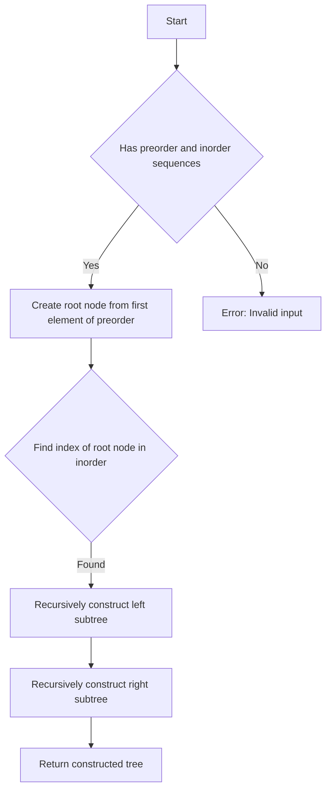

# Construct Binary Tree from Preorder and Inorder Traversal

## Problem Understanding
The problem asks to construct a binary tree from its preorder and inorder traversal sequences. The preorder sequence visits the root node first, then recursively traverses the left subtree, and finally the right subtree. The inorder sequence visits the left subtree, then the root node, and finally the right subtree. The key constraint is that the input sequences must represent a valid binary tree. This problem is non-trivial because a naive approach might try to construct the tree by simply iterating through the sequences, but this would not work due to the recursive nature of tree construction. The problem requires a more sophisticated approach that takes into account the relationships between the preorder and inorder sequences.

## Approach
The algorithm strategy is to recursively construct the binary tree by identifying the root node from the preorder sequence and then finding its corresponding position in the inorder sequence. This allows us to determine the sizes of the left and right subtrees and recursively construct them. The intuition behind this approach is that the preorder sequence provides the root node, while the inorder sequence provides the structure of the left and right subtrees. We use a recursive function to construct the tree, and we use the `createTreeNode` function to allocate memory for new nodes. The approach handles the key constraints by ensuring that the input sequences represent a valid binary tree.

## Complexity Analysis
| Metric | Value | Detailed Reason |
|--------|-------|----------------|
| Time   | O(n)  | The algorithm makes a single pass through both the preorder and inorder sequences, where n is the number of nodes in the tree. The recursive function calls are stacked, and each node is visited once. |
| Space  | O(n)  | The recursion stack can grow up to a depth of n, and we also allocate memory for each node in the tree, which requires O(n) space. |

## Algorithm Walkthrough
```
Input: 
preorder = [3, 9, 20, 15, 7]
inorder = [9, 3, 15, 20, 7]
Step 1: 
Create root node with value 3 (first element of preorder)
Find index of 3 in inorder: 1
Left subtree size: 1
Right subtree size: 3
Step 2: 
Recursively construct left subtree
preorder = [9]
inorder = [9]
Create node with value 9
Step 3: 
Recursively construct right subtree
preorder = [20, 15, 7]
inorder = [15, 20, 7]
Create node with value 20
Find index of 20 in inorder: 1
Left subtree size: 1
Right subtree size: 1
Step 4: 
Recursively construct left subtree of node 20
preorder = [15]
inorder = [15]
Create node with value 15
Step 5: 
Recursively construct right subtree of node 20
preorder = [7]
inorder = [7]
Create node with value 7
Output: 
Root node with value 3
Left child: node with value 9
Right child: node with value 20
Right child of node 20: node with value 7
Left child of node 20: node with value 15
```

## Visual Flow


## Key Insight
> **Tip:** The key insight is to use the preorder sequence to identify the root node and then find its corresponding position in the inorder sequence to determine the sizes of the left and right subtrees.

## Edge Cases
- **Empty/null input**: If the input sequences are empty or null, the function should return NULL, as there is no tree to construct.
- **Single element**: If the input sequences contain only one element, the function should return a tree with a single node, as there are no subtrees to construct.
- **Invalid input**: If the input sequences do not represent a valid binary tree (e.g., the preorder sequence does not match the inorder sequence), the function should return an error, as it is not possible to construct a valid tree.

## Common Mistakes
- **Mistake 1**: Not checking for invalid input sequences, which can lead to incorrect tree construction or errors.
- **Mistake 2**: Not handling the base case of the recursion correctly, which can lead to infinite recursion or incorrect tree construction.

## Interview Follow-ups
> **Interview:** These are the exact follow-up questions interviewers ask:
- "What if the input is sorted?" → The algorithm still works, as it only relies on the relationships between the preorder and inorder sequences, not on the actual values.
- "Can you do it in O(1) space?" → No, as the recursion stack and node allocation require O(n) space.
- "What if there are duplicates?" → The algorithm assumes that the input sequences represent a valid binary tree, so duplicates should not occur. If duplicates are present, the algorithm may not work correctly.

## C Solution

```c
// Problem: Construct Binary Tree from Preorder and Inorder Traversal
// Language: C
// Difficulty: Medium
// Time Complexity: O(n) — single pass through both arrays using recursion
// Space Complexity: O(n) — recursion stack and HashMap store at most n elements
// Approach: Recursive tree construction using preorder and inorder traversal

#include <stdio.h>
#include <stdlib.h>

// Define the structure for a binary tree node
typedef struct TreeNode {
    int val;
    struct TreeNode* left;
    struct TreeNode* right;
} TreeNode;

// Function to create a new binary tree node
TreeNode* createTreeNode(int val) {
    // Allocate memory for the new node
    TreeNode* newNode = (TreeNode*) malloc(sizeof(TreeNode));
    // Initialize the node's value and child pointers
    newNode->val = val;
    newNode->left = NULL;
    newNode->right = NULL;
    return newNode;
}

// Function to construct a binary tree from preorder and inorder traversal
TreeNode* buildTree(int* preorder, int preorderSize, int* inorder, int inorderSize) {
    // Base case: if the preorder array is empty, return NULL
    if (preorderSize == 0) return NULL;

    // Create the root node using the first element of the preorder array
    TreeNode* root = createTreeNode(preorder[0]);
    
    // Find the index of the root node's value in the inorder array
    int rootIndex = 0;
    while (rootIndex < inorderSize && inorder[rootIndex] != preorder[0]) {
        rootIndex++;
    }
    
    // Edge case: if the root node's value is not found in the inorder array
    if (rootIndex == inorderSize) {
        printf("Error: Invalid input\n");
        return NULL;
    }

    // Recursively construct the left subtree
    int leftSize = rootIndex;
    root->left = buildTree(preorder + 1, leftSize, inorder, leftSize);
    
    // Recursively construct the right subtree
    int rightSize = inorderSize - leftSize - 1;
    root->right = buildTree(preorder + leftSize + 1, rightSize, inorder + leftSize + 1, rightSize);
    
    return root;
}

// Function to print the inorder traversal of a binary tree
void printInorder(TreeNode* root) {
    if (root == NULL) return;
    printInorder(root->left);
    printf("%d ", root->val);
    printInorder(root->right);
}

int main() {
    // Example usage
    int preorder[] = {3, 9, 20, 15, 7};
    int inorder[] = {9, 3, 15, 20, 7};
    int preorderSize = sizeof(preorder) / sizeof(preorder[0]);
    int inorderSize = sizeof(inorder) / sizeof(inorder[0]);
    
    TreeNode* root = buildTree(preorder, preorderSize, inorder, inorderSize);
    printf("Inorder traversal: ");
    printInorder(root);
    printf("\n");
    
    return 0;
}
```
