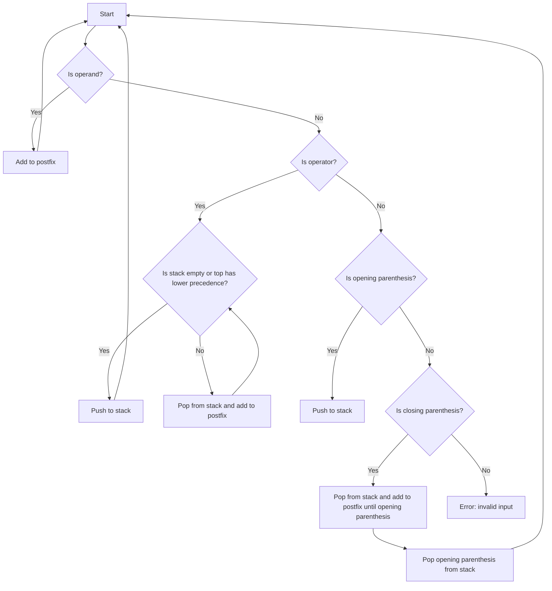

# Convert Infix to Postfix Expression

## Problem Understanding
The problem is asking to convert an infix expression to a postfix expression. An infix expression is a mathematical expression where operators are placed between operands, whereas a postfix expression is a mathematical expression where operators are placed after their operands. Key constraints include handling operator precedence and parentheses. What makes this problem non-trivial is the need to manage operator precedence, which requires a careful approach to ensure the correct order of operations. A naive approach would fail to consider the precedence of operators, leading to incorrect results.

## Approach
The algorithm strategy is to use a stack-based approach to manage operator precedence. The intuition behind this approach is to push operators onto a stack when encountered, and pop them off when the next operator has lower precedence or when a closing parenthesis is encountered. The `getPrecedence` function is used to determine the precedence of each operator, and the `push` and `pop` functions are used to manage the stack. The `infixToPostfix` function iterates through the infix expression, applying the rules for handling operands, operators, and parentheses. This approach works by ensuring that operators are added to the postfix expression in the correct order, based on their precedence.

## Complexity Analysis
| Metric | Value | Detailed Reason |
|--------|-------|----------------|
| Time   | O(n)  | The algorithm iterates through the infix expression once, where n is the length of the infix expression. Each iteration involves a constant amount of work, including pushing and popping operators from the stack. |
| Space  | O(n)  | The algorithm uses a stack to store operators, and in the worst case, the stack can grow to the size of the infix expression. Additionally, the postfix expression can be at most n characters long, requiring O(n) space. |

## Algorithm Walkthrough
```
Input: infix = "A+B*C"
Step 1: Initialize an empty stack and postfix expression
  - stack: empty
  - postfix: empty
Step 2: Encounter operand 'A'
  - stack: empty
  - postfix: "A"
Step 3: Encounter operator '+'
  - stack: "+"
  - postfix: "A"
Step 4: Encounter operand 'B'
  - stack: "+"
  - postfix: "AB"
Step 5: Encounter operator '*'
  - stack: "+", "*"
  - postfix: "AB"
Step 6: Encounter operand 'C'
  - stack: "+", "*"
  - postfix: "ABC"
Step 7: Pop operators from stack and add to postfix expression
  - stack: "+"
  - postfix: "ABC*+"
Step 8: Pop remaining operator from stack and add to postfix expression
  - stack: empty
  - postfix: "ABC*+"
Output: postfix = "ABC*+"
```

## Visual Flow


## Key Insight
> **Tip:** The key insight is to use a stack to manage operator precedence, ensuring that operators are added to the postfix expression in the correct order.

## Edge Cases
- **Empty/null input**: If the input is empty, the algorithm will print an error message and return.
- **Single element**: If the input is a single operand, the algorithm will add it to the postfix expression and return.
- **Unbalanced parentheses**: If the input has unbalanced parentheses, the algorithm will print an error message and return.

## Common Mistakes
- **Mistake 1**: Failing to handle operator precedence correctly, leading to incorrect results.
- **Mistake 2**: Failing to handle parentheses correctly, leading to incorrect results or runtime errors.

## Interview Follow-ups
> **Interview:** These are the exact follow-up questions interviewers ask:
- "What if the input is sorted?" → The algorithm will still work correctly, but the time complexity will remain O(n) because the sorting of the input does not affect the number of operations performed.
- "Can you do it in O(1) space?" → No, the algorithm requires O(n) space to store the postfix expression and the stack.
- "What if there are duplicates?" → The algorithm will handle duplicates correctly, treating each duplicate operand or operator as a separate entity.

## C Solution

```c
// Problem: Convert Infix to Postfix Expression
// Language: C
// Difficulty: Medium
// Time Complexity: O(n) — single pass through the infix expression
// Space Complexity: O(n) — the postfix expression can be at most n characters long
// Approach: Stack-based operator precedence parsing — use a stack to manage operator precedence

#include <stdio.h>
#include <stdlib.h>
#include <string.h>
#include <ctype.h>

// Define the structure for a stack node
typedef struct StackNode {
    char data;
    struct StackNode* next;
} StackNode;

// Define the structure for a stack
typedef struct Stack {
    StackNode* top;
} Stack;

// Function to create a new stack node
StackNode* createStackNode(char data) {
    StackNode* newNode = (StackNode*) malloc(sizeof(StackNode));
    if (!newNode) {
        printf("Memory error\n");
        return NULL;
    }
    newNode->data = data;
    newNode->next = NULL;
    return newNode;
}

// Function to create a new stack
Stack* createStack() {
    Stack* newStack = (Stack*) malloc(sizeof(Stack));
    if (!newStack) {
        printf("Memory error\n");
        return NULL;
    }
    newStack->top = NULL;
    return newStack;
}

// Function to check if the stack is empty
int isEmpty(Stack* stack) {
    return stack->top == NULL;
}

// Function to push an element onto the stack
void push(Stack* stack, char data) {
    StackNode* newNode = createStackNode(data);
    if (stack->top) {
        newNode->next = stack->top;
    }
    stack->top = newNode;
}

// Function to pop an element from the stack
char pop(Stack* stack) {
    if (isEmpty(stack)) {
        printf("Stack is empty\n");
        return '\0';
    }
    char data = stack->top->data;
    StackNode* temp = stack->top;
    stack->top = stack->top->next;
    free(temp);
    return data;
}

// Function to get the top element of the stack
char getTop(Stack* stack) {
    if (isEmpty(stack)) {
        printf("Stack is empty\n");
        return '\0';
    }
    return stack->top->data;
}

// Function to check the precedence of an operator
int getPrecedence(char operator) {
    if (operator == '+' || operator == '-') {
        return 1;
    } else if (operator == '*' || operator == '/') {
        return 2;
    } else if (operator == '^') {
        return 3;
    }
    return 0;
}

// Function to convert infix to postfix expression
void infixToPostfix(char* infix, char* postfix) {
    Stack* stack = createStack();
    int infixIndex = 0;
    int postfixIndex = 0;

    // Edge case: empty input
    if (strlen(infix) == 0) {
        printf("Input is empty\n");
        return;
    }

    while (infix[infixIndex] != '\0') {
        // If the current character is an operand, add it to the postfix expression
        if (isalnum(infix[infixIndex])) {
            postfix[postfixIndex++] = infix[infixIndex++];
        }
        // If the current character is an opening parenthesis, push it onto the stack
        else if (infix[infixIndex] == '(') {
            push(stack, infix[infixIndex++]);
        }
        // If the current character is a closing parenthesis, pop operators from the stack and add them to the postfix expression until an opening parenthesis is found
        else if (infix[infixIndex] == ')') {
            while (getTop(stack) != '(') {
                postfix[postfixIndex++] = pop(stack);
            }
            // Remove the opening parenthesis from the stack
            pop(stack);
            infixIndex++;
        }
        // If the current character is an operator, pop operators from the stack and add them to the postfix expression until an operator with lower precedence is found or the stack is empty
        else {
            while (!isEmpty(stack) && getTop(stack) != '(' && getPrecedence(getTop(stack)) >= getPrecedence(infix[infixIndex])) {
                postfix[postfixIndex++] = pop(stack);
            }
            push(stack, infix[infixIndex++]);
        }
    }

    // Add any remaining operators from the stack to the postfix expression
    while (!isEmpty(stack)) {
        postfix[postfixIndex++] = pop(stack);
    }

    postfix[postfixIndex] = '\0';
}

int main() {
    char infix[100];
    char postfix[100];

    printf("Enter an infix expression: ");
    scanf("%s", infix);

    infixToPostfix(infix, postfix);

    printf("Postfix expression: %s\n", postfix);

    return 0;
}
```
