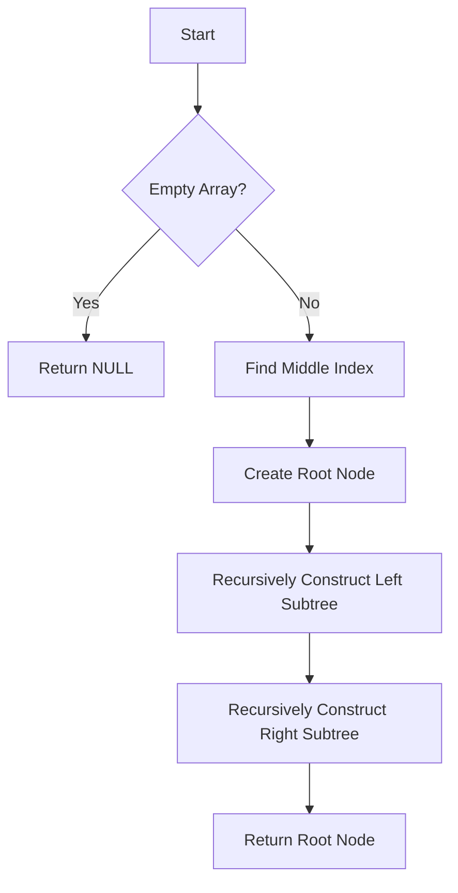

# Convert Sorted Array to Balanced BST

## Problem Understanding
The problem is asking to convert a sorted array into a balanced binary search tree (BST), where the tree is balanced if the height of the two subtrees of every node differs by at most one. The key constraint is that the input array is sorted, which allows for a specific strategy to construct the balanced BST. The problem is non-trivial because a naive approach, such as simply inserting elements into a BST one by one, may not result in a balanced tree. The recursive construction of the balanced BST using the middle element as the root is crucial to ensure the tree remains balanced.

## Approach
The algorithm strategy is to recursively construct the balanced BST by using the middle element of the sorted array as the root. This approach works because the middle element will have roughly equal numbers of elements on its left and right, ensuring the tree is balanced. The mathematical reasoning behind this is that by choosing the middle element, we are essentially dividing the array into two halves, each of which can be recursively divided in the same manner, resulting in a balanced tree. The data structure used is a binary tree node, which is chosen because it naturally represents the structure of a BST. The approach handles the key constraint of the sorted array by using the middle element as the root, ensuring the tree remains balanced.

## Complexity Analysis
| Metric | Value | Detailed Reason |
|--------|-------|----------------|
| Time   | O(n)  | The algorithm makes a single pass through the array, and each element is processed once. The recursive calls to construct the left and right subtrees also have a combined time complexity of O(n), since each element is visited once. |
| Space  | O(log n) | The space complexity is O(log n) due to the recursive call stack. In the worst case, the tree is completely unbalanced, and the recursive call stack will have n levels. However, since we are constructing a balanced BST, the height of the tree is log n, and hence the space complexity is O(log n). |

## Algorithm Walkthrough
```
Input: nums = [-10, -3, 0, 5, 9], numsSize = 5
Step 1: Find the middle index of the array, mid = 2
Step 2: Create a new node with the middle value, root = newNode(0)
Step 3: Recursively construct the left subtree, leftArray = [-10, -3], leftSize = 2
    Step 3.1: Find the middle index of the left array, mid = 1
    Step 3.2: Create a new node with the middle value, leftRoot = newNode(-3)
    Step 3.3: Recursively construct the left subtree of leftRoot, leftLeftArray = [-10], leftLeftSize = 1
        Step 3.3.1: Create a new node with the middle value, leftLeftRoot = newNode(-10)
    Step 3.4: Recursively construct the right subtree of leftRoot, leftRightArray = [], leftRightSize = 0
Step 4: Recursively construct the right subtree, rightArray = [5, 9], rightSize = 2
    Step 4.1: Find the middle index of the right array, mid = 1
    Step 4.2: Create a new node with the middle value, rightRoot = newNode(5)
    Step 4.3: Recursively construct the left subtree of rightRoot, rightLeftArray = [], rightLeftSize = 0
    Step 4.4: Recursively construct the right subtree of rightRoot, rightRightArray = [9], rightRightSize = 1
        Step 4.4.1: Create a new node with the middle value, rightRightRoot = newNode(9)
Output: root = newNode(0), root->left = newNode(-3), root->right = newNode(5)
```
## Visual Flow

## Key Insight
> **Tip:** The key insight is to use the middle element of the sorted array as the root of the balanced BST, ensuring the tree remains balanced by dividing the array into two roughly equal halves.

## Edge Cases
- **Empty input array**: If the input array is empty, the function returns NULL, as there are no elements to construct a BST.
- **Single element array**: If the input array has only one element, the function creates a new node with that element and returns it, resulting in a BST with a single node.
- **Duplicate elements**: If the input array contains duplicate elements, the function will still construct a balanced BST, but the resulting tree may not be a traditional BST, as it can have duplicate values.

## Common Mistakes
- **Mistake 1: Not using the middle element as the root**: If the middle element is not used as the root, the resulting tree may not be balanced, leading to an unbalanced BST.
- **Mistake 2: Not recursively constructing the left and right subtrees**: If the left and right subtrees are not recursively constructed, the resulting tree may not be a valid BST, as some elements may not be in the correct position.

## Interview Follow-ups
> **Interview:** These are the exact follow-up questions interviewers ask:
- "What if the input is not sorted?" → The algorithm assumes the input array is sorted, so if it's not sorted, the resulting tree may not be a valid BST.
- "Can you do it in O(1) space?" → The algorithm uses O(log n) space due to the recursive call stack, so it's not possible to do it in O(1) space.
- "What if there are duplicates?" → The algorithm will still construct a balanced BST, but the resulting tree may not be a traditional BST, as it can have duplicate values.

## C Solution

```c
// Problem: Convert Sorted Array to Balanced BST
// Language: c
// Difficulty: Medium
// Time Complexity: O(n) — single pass through the array
// Space Complexity: O(log n) — recursive call stack for tree construction
// Approach: Recursive construction of balanced BST — using the middle element as the root

// Definition for a binary tree node.
struct TreeNode {
    int val;
    struct TreeNode *left;
    struct TreeNode *right;
};

// Function to insert a new node into the tree
struct TreeNode* newNode(int value) {
    struct TreeNode* node = (struct TreeNode*)malloc(sizeof(struct TreeNode));
    node->val = value; // Set the node's value
    node->left = NULL; // Initialize left child to NULL
    node->right = NULL; // Initialize right child to NULL
    return node; // Return the newly created node
}

// Function to construct a balanced BST from a sorted array
struct TreeNode* sortedArrayToBST(int* nums, int numsSize) {
    // Base case: if the array is empty, return NULL
    if (numsSize == 0) {
        return NULL; // Empty array → return NULL
    }

    // Find the middle index of the array
    int mid = numsSize / 2; // Integer division to get the middle index

    // Create a new node with the middle value
    struct TreeNode* root = newNode(nums[mid]); // Create the root node with the middle value

    // Recursively construct the left and right subtrees
    int* leftArray = nums; // Left array starts from the beginning of the input array
    int leftSize = mid; // Size of the left array
    root->left = sortedArrayToBST(leftArray, leftSize); // Construct the left subtree

    int* rightArray = nums + mid + 1; // Right array starts from the middle + 1
    int rightSize = numsSize - mid - 1; // Size of the right array
    root->right = sortedArrayToBST(rightArray, rightSize); // Construct the right subtree

    return root; // Return the root of the constructed BST
}

// Helper function to print the tree in inorder traversal
void printTree(struct TreeNode* root) {
    if (root == NULL) {
        return; // Base case: empty tree
    }

    printTree(root->left); // Recursively print the left subtree
    printf("%d ", root->val); // Print the current node's value
    printTree(root->right); // Recursively print the right subtree
}

// Example usage
#include <stdio.h>
int main() {
    int nums[] = {-10, -3, 0, 5, 9};
    int numsSize = sizeof(nums) / sizeof(nums[0]);

    struct TreeNode* root = sortedArrayToBST(nums, numsSize);
    printf("Inorder traversal of the constructed BST: ");
    printTree(root);

    return 0;
}
```
