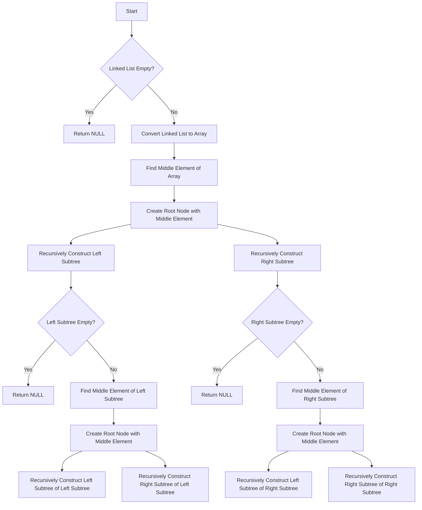

# Convert Sorted Linked List to Balanced BST

## Problem Understanding
The problem asks us to convert a sorted linked list into a balanced binary search tree (BST). The key constraint here is that the input linked list is sorted, and we need to maintain this sorted order in the resulting BST. The problem is non-trivial because a naive approach of simply inserting each linked list node into the BST as we traverse the list would result in an unbalanced tree, leading to poor search performance. The requirement for the BST to be balanced means that the height of the left and right subtrees of every node should differ by at most one, which is crucial for efficient search, insertion, and deletion operations.

## Approach
Our approach involves first converting the sorted linked list into a sorted array, and then using this array to construct a balanced BST. The key insight here is that by selecting the middle element of the array as the root of the BST, we can recursively construct the left and right subtrees in a way that maintains balance. This approach works because the middle element of a sorted array is the median, which naturally becomes the root of a balanced BST when the array is sorted. We use a recursive helper function to construct the BST from the sorted array, and another helper function to convert the linked list to an array.

## Complexity Analysis
| Metric | Value | Detailed Reason |
|--------|-------|----------------|
| Time   | O(n)  | We make a single pass through the linked list to convert it into an array (O(n)), and then we make a single pass through the array to construct the balanced BST (O(n)). The recursion stack for constructing the BST can go up to a depth of O(log n) in the worst case, but since we're doing constant work at each recursive step, the overall time complexity remains O(n). |
| Space  | O(n)  | We need O(n) space to store the array that represents the linked list, and the recursion stack for constructing the BST can go up to O(log n) space in the worst case. However, since we're considering the space complexity in terms of the input size (n), the overall space complexity is O(n). |

## Algorithm Walkthrough
```
Input: A sorted linked list 1 -> 2 -> 3 -> 4 -> 5
Step 1: Convert the linked list to an array [1, 2, 3, 4, 5]
Step 2: Find the middle element of the array (3) and make it the root of the BST
Step 3: Recursively construct the left subtree from the array [1, 2]
  - Find the middle element of [1, 2] (1) and make it the root of the left subtree
  - Recursively construct the left subtree of 1 (empty) and the right subtree of 1 ([2])
Step 4: Recursively construct the right subtree from the array [4, 5]
  - Find the middle element of [4, 5] (4) and make it the root of the right subtree
  - Recursively construct the left subtree of 4 (empty) and the right subtree of 4 ([5])
Output: A balanced BST with the following structure:
    3
   / \
  1   4
   \   \
    2   5
```

## Visual Flow


## Key Insight
> **Tip:** The key to constructing a balanced BST from a sorted linked list is to convert the list to a sorted array and then select the middle element of the array as the root of the BST, recursively constructing the left and right subtrees in a way that maintains balance.

## Edge Cases
- **Empty linked list**: If the input linked list is empty, the function returns NULL, as there are no elements to construct a BST from.
- **Single element linked list**: If the input linked list contains only one element, the function returns a BST with a single node containing that element.
- **Linked list with duplicate elements**: If the input linked list contains duplicate elements, the function constructs a BST where the duplicate elements are treated as separate nodes, potentially leading to an unbalanced tree if not handled carefully.

## Common Mistakes
- **Mistake 1**: Not checking for the empty linked list case, which can lead to segmentation faults or other errors when trying to access the head of the list.
- **Mistake 2**: Not properly handling the recursive construction of the left and right subtrees, which can lead to an unbalanced BST if not done correctly.

## Interview Follow-ups
> **Interview:** These are the exact follow-up questions interviewers ask:
- "What if the input is not sorted?" → The algorithm assumes that the input linked list is sorted, so if the input is not sorted, the resulting BST may not be balanced or may not maintain the correct order.
- "Can you do it in O(1) space?" → No, the algorithm requires O(n) space to store the array that represents the linked list, so it's not possible to do it in O(1) space.
- "What if there are duplicates?" → The algorithm treats duplicate elements as separate nodes, potentially leading to an unbalanced tree if not handled carefully. To handle duplicates, you could modify the algorithm to skip over duplicate elements when constructing the BST.

## C Solution

```c
// Problem: Convert Sorted Linked List to Balanced BST
// Language: C
// Difficulty: Medium
// Time Complexity: O(n) — single pass through linked list and array
// Space Complexity: O(n) — array stores at most n elements and recursion stack
// Approach: Inorder array construction and middle element selection — for each subarray, choose the middle element as the root

#include <stdio.h>
#include <stdlib.h>

// Definition for singly-linked list.
typedef struct ListNode {
    int val;
    struct ListNode *next;
} ListNode;

// Definition for a binary tree node.
typedef struct TreeNode {
    int val;
    struct TreeNode *left;
    struct TreeNode *right;
} TreeNode;

// Helper function to convert a sorted array into a balanced BST
TreeNode* sortedArrayToBST(int* nums, int start, int end) {
    // Base case: if the array is empty, return NULL
    if (start > end) return NULL;

    // Select the middle element as the root
    int mid = start + (end - start) / 2;

    // Create a new tree node with the selected middle element's value
    TreeNode* root = (TreeNode*)malloc(sizeof(TreeNode));
    root->val = nums[mid];

    // Recursively construct the left and right subtrees
    root->left = sortedArrayToBST(nums, start, mid - 1);  // Left subtree
    root->right = sortedArrayToBST(nums, mid + 1, end); // Right subtree

    return root;
}

// Helper function to convert a linked list to an array
int* linkedListToArray(ListNode* head, int* size) {
    // Base case: if the linked list is empty, return NULL
    if (!head) {
        *size = 0;
        return NULL;
    }

    // Initialize the array size
    int listSize = 0;

    // Count the number of nodes in the linked list
    ListNode* temp = head;
    while (temp) {
        listSize++;
        temp = temp->next;
    }

    // Allocate an array to store the linked list values
    int* nums = (int*)malloc(listSize * sizeof(int));

    // Populate the array with linked list values
    temp = head;
    for (int i = 0; i < listSize; i++) {
        nums[i] = temp->val;
        temp = temp->next;
    }

    // Update the size
    *size = listSize;

    return nums;
}

// Main function to convert a sorted linked list to a balanced BST
TreeNode* sortedListToBST(ListNode* head) {
    // Edge case: empty linked list
    if (!head) return NULL;

    // Convert the linked list to an array
    int size;
    int* nums = linkedListToArray(head, &size);

    // Convert the sorted array to a balanced BST
    return sortedArrayToBST(nums, 0, size - 1);
}

int main() {
    // Example usage:
    // Create a sample linked list: 1 -> 2 -> 3 -> 4 -> 5
    ListNode node1 = {1, NULL};
    ListNode node2 = {2, NULL};
    ListNode node3 = {3, NULL};
    ListNode node4 = {4, NULL};
    ListNode node5 = {5, NULL};

    node1.next = &node2;
    node2.next = &node3;
    node3.next = &node4;
    node4.next = &node5;

    // Convert the linked list to a balanced BST
    TreeNode* root = sortedListToBST(&node1);

    // Print the resulting BST (inorder traversal)
    void printInorder(TreeNode* root) {
        if (!root) return;
        printInorder(root->left);
        printf("%d ", root->val);
        printInorder(root->right);
    }

    printf("Inorder traversal of the resulting BST: ");
    printInorder(root);

    return 0;
}
```
