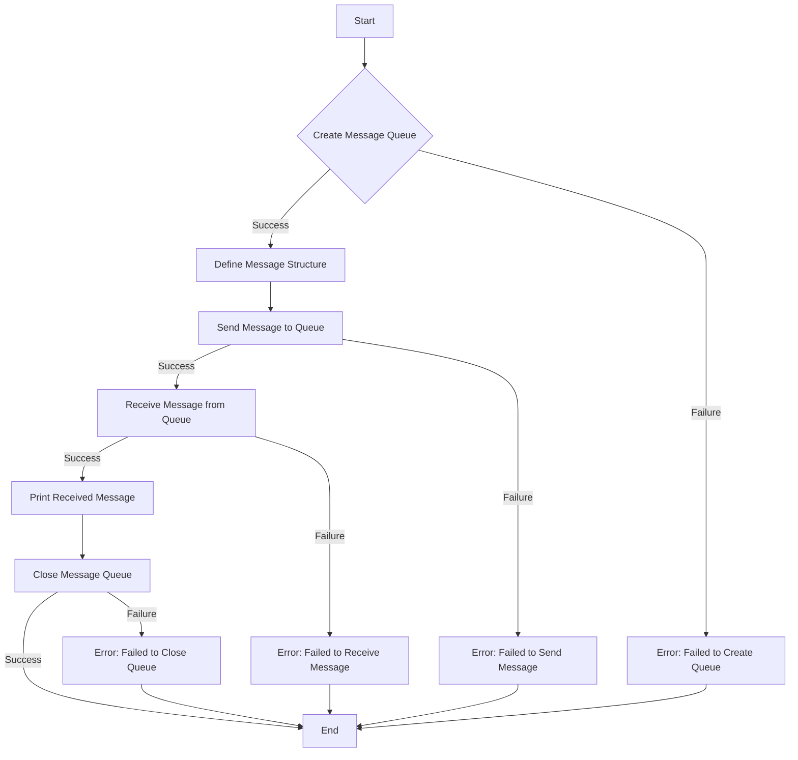

# Demonstrate POSIX Message Queues basics

## Problem Understanding
The problem asks to demonstrate the basics of POSIX Message Queues in C, which involves creating a message queue, sending a message to it, receiving a message from it, and closing the queue. The key constraints include handling potential errors during queue creation, message sending, and message receiving. What makes this problem non-trivial is the need to properly manage system resources, such as the message queue descriptor, and handle potential errors that may occur during these operations. Additionally, understanding the POSIX Message Queue API and its functions is crucial for a successful implementation.

## Approach
The algorithm strategy involves utilizing the POSIX Message Queue API to create, send, receive, and close message queues. The approach works by first creating a message queue using the `mq_open` function, then defining a message structure to be sent and received. The `mq_send` function is used to send a message to the queue, and the `mq_receive` function is used to receive a message from the queue. The message queue descriptor is used to identify the queue for these operations. The approach handles key constraints by checking the return values of these functions for potential errors and taking appropriate action if an error occurs.

## Complexity Analysis
| Metric | Value | Detailed Reason |
|--------|-------|----------------|
| Time   | O(1)  | The time complexity of the POSIX Message Queue operations, such as `mq_open`, `mq_send`, `mq_receive`, and `mq_close`, is constant time because they involve simple system calls that do not depend on the size of the input. |
| Space  | O(1)  | The space complexity is constant because the size of the message queue and the message structure are fixed and do not change with the size of the input. The program uses a fixed amount of memory to store the message queue descriptor and the message structure. |

## Algorithm Walkthrough
```
Input: None (program creates and uses its own message queue)
Step 1: Create a message queue using mq_open with the name "/my_queue"
    - queueDescriptor = mq_open(QUEUE_NAME, O_CREAT | O_RDWR, 0666, NULL)
Step 2: Define the message structure with a long messageType and a char array messageText
    - struct { long messageType; char messageText[MAX_MESSAGE_SIZE]; } message;
Step 3: Send a message to the queue using mq_send
    - message.messageType = 1; strcpy(message.messageText, "Hello, world!");
    - mq_send(queueDescriptor, (char*)&message, sizeof(message), 0)
Step 4: Receive a message from the queue using mq_receive
    - unsigned int priority = 0; unsigned int bufferSize = sizeof(message);
    - mq_receive(queueDescriptor, (char*)&message, bufferSize, &priority)
Step 5: Print the received message
    - printf("Received message: type = %ld, text = %s\n", message.messageType, message.messageText)
Step 6: Close the message queue using mq_close
    - mq_close(queueDescriptor)
Output: The received message with its type and text
```
This walkthrough demonstrates the basic operations of creating, sending to, receiving from, and closing a POSIX Message Queue.

## Visual Flow

This flowchart illustrates the decision flow and error handling for the POSIX Message Queue operations.

## Key Insight
> **Tip:** The key to successfully using POSIX Message Queues is to properly manage the message queue descriptor and handle potential errors that may occur during queue creation, message sending, and message receiving.

## Edge Cases
- **Empty/null input**: The program does not take any input, so this edge case is not applicable. However, if the message queue name is empty or null, the `mq_open` function will fail.
- **Single element**: The program sends and receives a single message. If the message queue is empty, the `mq_receive` function will block until a message is available or an error occurs.
- **Message queue name already in use**: If the message queue name is already in use, the `mq_open` function will fail with an error. The program should check the return value of `mq_open` to handle this edge case.

## Common Mistakes
- **Mistake 1: Not checking the return value of `mq_open`**: Failing to check the return value of `mq_open` can lead to unexpected behavior if the queue creation fails. To avoid this, always check the return value of `mq_open` and handle potential errors.
- **Mistake 2: Not handling errors during message sending and receiving**: Failing to handle errors during message sending and receiving can lead to unexpected behavior or crashes. To avoid this, always check the return values of `mq_send` and `mq_receive` and handle potential errors.

## Interview Follow-ups
> **Interview:** These are the exact follow-up questions interviewers ask:
- "What if the input is sorted?" → This question is not applicable to this problem, as the program does not take any input. However, if the message queue is sorted, the `mq_receive` function will still receive the messages in the order they were sent.
- "Can you do it in O(1) space?" → The program already uses O(1) space, as the size of the message queue and the message structure are fixed.
- "What if there are duplicates?" → If there are duplicate messages in the queue, the `mq_receive` function will receive each message individually. The program does not handle duplicate messages explicitly, but it can be modified to do so if needed.

## C Solution

```c
// Problem: Demonstrate POSIX Message Queues basics
// Language: C
// Difficulty: Medium
// Time Complexity: O(1) — message queue operations are constant time
// Space Complexity: O(1) — message queue size is fixed
// Approach: POSIX message queue API — create, send, receive, and close message queues

#include <stdio.h>
#include <stdlib.h>
#include <sys/mman.h>
#include <fcntl.h>
#include <mqueue.h>
#include <unistd.h>
#include <errno.h>

// Define a constant for the message queue name
#define QUEUE_NAME "/my_queue"

// Define a constant for the maximum number of messages
#define MAX_MESSAGES 10

// Define a constant for the maximum message size
#define MAX_MESSAGE_SIZE 256

int main() {
    // Create a message queue
    mqd_t queueDescriptor = mq_open(QUEUE_NAME, O_CREAT | O_RDWR, 0666, NULL);
    if (queueDescriptor == -1) {
        // Edge case: failed to create message queue
        perror("mq_open");
        return -1;
    }

    // Define the message structure
    struct {
        long messageType;
        char messageText[MAX_MESSAGE_SIZE];
    } message;

    // Send a message to the queue
    message.messageType = 1;  // message type
    strcpy(message.messageText, "Hello, world!");  // message text
    if (mq_send(queueDescriptor, (char*)&message, sizeof(message), 0) == -1) {
        // Edge case: failed to send message
        perror("mq_send");
        mq_close(queueDescriptor);
        return -1;
    }

    // Receive a message from the queue
    unsigned int priority = 0;
    unsigned int bufferSize = sizeof(message);
    if (mq_receive(queueDescriptor, (char*)&message, bufferSize, &priority) == -1) {
        // Edge case: failed to receive message
        perror("mq_receive");
        mq_close(queueDescriptor);
        return -1;
    }

    // Print the received message
    printf("Received message: type = %ld, text = %s\n", message.messageType, message.messageText);

    // Close the message queue
    if (mq_close(queueDescriptor) == -1) {
        // Edge case: failed to close message queue
        perror("mq_close");
        return -1;
    }

    return 0;
}
```
